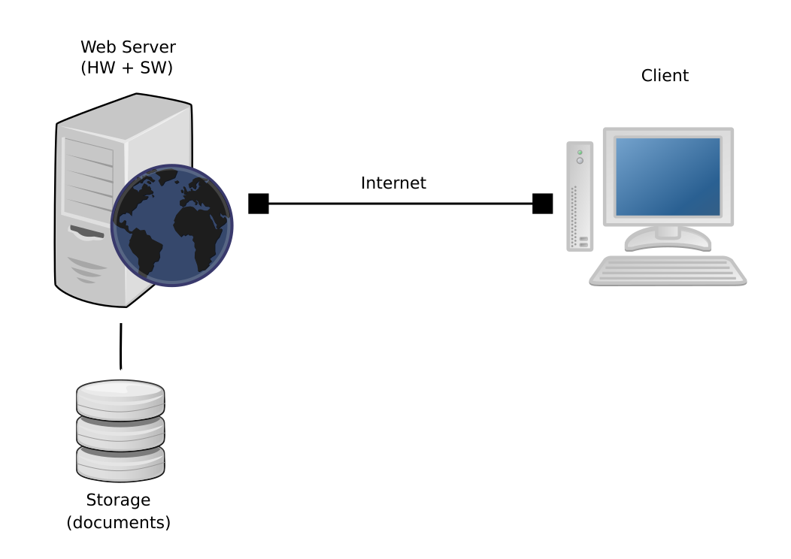
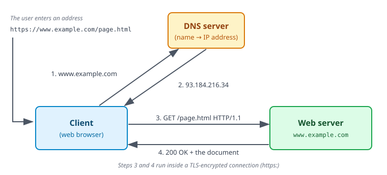

<!-- .slide: class="section" -->

# Principles of the World Wide Web

---

# WWW

  * WWW = _World Wide Web_
  * Main features of the web 
    * **Distributed**
      * Great number of independent units
    * **Heterogeneous**
      * Different platforms
    * **Dynamic**
      * Still changing
    * **Document -- oriented**
      * **Document** is the basic information unit

---

# History -- the Beginnings

  * **1989** \-- Tim Berners-Lee (CERN) publishes a paper _„Information Management: A Proposal”_ -- a proposal of the architecture and use of hypertext 
  * **1990** \-- Start of the „World Wide Web” project, first web browser, first web page
  * **1992** \-- 26 more or less reliable servers
  * **1993** \-- Over 200 servers (mainly academic), first alpha version of the _Mosaic_ browser
  * **1994** \-- The [WWW Consortium (W3C)](https://www.w3.org/) has been founded. The load of the first server `info.cern.ch` is 1000x greater than in the beginning.
  * **1995 -- 1996** \-- JavaScript in Netscape Navigator, first [CSS 1](https://www.w3.org/TR/REC-CSS1/) specification
  * **1997** \-- official HTML 3.2 specification (tables, applets), later the same year HTML 4.0 (frames, scripts, external objects); HTTP/1.1
  * **2000** \-- first XHTML 1.0 specification (XML-based HTML clone)

---

# History -- the Modern Web

  * **2004** \-- foundation of [WHATWG](https://whatwg.org/ "The Web Hypertext Application Technology Working Group") \-- The Web Hypertext Application Technology Working Group
  * **2007** \-- W3C and WHATWG start to cooperate on HTML in a common working group, start of the HTML5 effort
  * **2014** \-- [HTML 5 specification](https://www.w3.org/TR/2014/REC-html5-20141028/) finished
  * **2015** \-- HTTP/2 (transfer efficiency improvements)
  * **2016 -- ...** \-- HTTPS becomes the default (free certificates, [Let's Encrypt](https://letsencrypt.org/))
  * **2019** \-- W3C and WHATWG agreement: the WHATWG [HTML Living Standard](https://html.spec.whatwg.org/) becomes the single version of HTML (and DOM)
    * Continuously updated, no version numbers anymore
  * **2022** \-- HTTP/3 (QUIC), revised HTTP specifications (RFC 9110 -- 9114)
  * ... and further continuous development

---

<!-- .slide: class="centered" -->

# WWW Architecture



---

# WWW Server

  * Software running on the physical server 
    * Accepts requests and sends back the requested documents
    * E.g. nginx, Apache HTTP Server, Caddy, Microsoft IIS (Internet Information Services), ...
    * Frequently hidden behind a reverse proxy or a CDN (Cloudflare, ...)
  * Document storage 
    * Static documents are hierarchically organized in folders
    * E.g. `/products/phones/sony.html`
    * For dynamic sites, the path is just a _route_ processed by an application -- it need not correspond to any folder on the disk

=--

# Other Services on Servers

  * A single physical server may provide multiple services
  * The service is identified by its number (_port_) and a name
  * Examples:

 Port| Name| Protocol  
 ---|---|---  
 21| ftp| FTP  
 22| ssh| SSH  
 25| smtp| SMTP  
 53| domain| DNS  
 **80**| **http**| **HTTP**  
 **443**| **https**| **HTTPS**

HTTP/3 uses the same port 443, but over UDP (QUIC).

---

# WWW Client – a Browser

  * Sends a request to a server and displays the obtained document.
  * Rendering (layout) engines: 
    * Blink (Google) 
      * Chrome, Edge, Opera, Brave, Vivaldi (~70 % of the market)
    * WebKit (Open source, KHTML + Apple) 
      * Safari, formerly Chrome (~20 %)
    * Gecko (Mozilla Foundation) 
      * Firefox (~3 %)
  * Only three engines are left today
    * In the EU, browsers on iOS are no longer restricted to WebKit (DMA, 2024)
    * New attempts: Servo, Ladybird
  * Discontinued
    * Trident (Microsoft) -- Internet Explorer, retired in 2022
    * EdgeHTML (MSHTML) -- old Edge browsers, retired in 2021

[Detailed overview](https://en.wikipedia.org/wiki/List_of_web_browsers) (@Wikipedia)

---

# Documents on the WWW

  * Document (_resource_) = data identified by a URL 
    * Frequently a file stored on the server
    * It may be generated on request as well
  * Different types of documents 
    * Plain text documents
    * **Hypertext documents**
    * Images
    * Multimedia data (sound, music, movies, ...)
    * Programs
    * ...
  * Document type is distinguished using the MIME standard: 
    * A specification of the form **class/type**
    * E.g. `text/plain`, `text/html`, `image/jpeg`, `video/mpeg`, ...

---

# Document Identification -- URI

  * URI = _Uniform Resource Identifier_ ([RFC 3986](https://www.rfc-editor.org/rfc/rfc3986))
  * Uniquely identifies a single resource on the Web
  * Typical format
<div class="codebox">
  <div style="font-size: 1em;">
    <strong>https://www.fit.vut.cz/study/courses/</strong>
    <div style="border-top: 2px solid #ffb200; width: 3.6em; text-align: center;">
          Schema</div>
    <div style="margin-left: 4.8em; width: 8.4em; border-top: 2px solid #ffb200; text-align: center;">
          Hostname</div>
    <div style="margin-left: 13.2em; border-top: 2px solid #ffb200; text-align: center;">
          Document path</div>
    <div style="margin-left: 4.8em; border-top: 2px solid #ffb200; text-align: center;">
          HTTP address</div>
  </div>
</div>

---

# Document Identification -- URI

  * A port may be specified after the server name <div class="codebox">
<strong>https://www.fit.vut.cz:8080/document.html</strong>
</div> 
  * The file name need not be specified <div class="codebox">
<strong>https://www.fit.vut.cz/</strong><br/>
<strong>https://www.fit.vut.cz/study/</strong>
</div> 
  * URL = _Uniform Resource Locator_ \-- a URI that also says how and where to obtain the resource.
  * Both terms are used in technical specifications: URI in RFC 3986, URL in the [WHATWG URL Standard](https://url.spec.whatwg.org/) implemented by the browsers.

---

# Client-Server Communication

The way of the document transfer is defined in many layers:

  * Physical + link - any 
    * ethernet, Wi-Fi, mobile networks (LTE, 5G), ...
  * Network + transport - **TCP/IP** (or **QUIC** over UDP for HTTP/3)
    * Guarantees reliable data transport between two points
    * Defines the form of unique computer address (IP address)
  * Security - **TLS**
    * Encryption and server authentication
    * HTTP over TLS = **HTTPS** -- today the default for practically all web sites
  * Application - mostly **HTTP**
    * HyperText Transfer Protocol
    * Defines the form of requests
    * The form of answer (required document or error)
    * Error codes

---

# HTTP protocol

  * Based on the request - response model
  * No state information is stored 
    * => a **stateless** protocol
  * History 
    * **HTTP/0.9** \-- just the document transport *(obsolete)*
    * **HTTP/1.0** \-- MIME types incorporated *(obsolete)*
    * **HTTP/1.1** (1997) \-- Permanent connections, content negotiation, mandatory `Host` header *(still widely used)*
    * **HTTP/2** (2015) \-- Binary framing, multiplexing, header compression *(standard, supported by all browsers)*
    * **HTTP/3** (2022) \-- Uses QUIC (UDP) instead of TCP for better efficiency *(standard)*
  * The current specifications: RFC 9110 -- 9114 (2022)

---

# HTTP Request

<!-- .slide: class="centered" -->

 <!-- .element: style="width: 80%"  -->

---

# HTTP methods

  * A „command” sent to the server
  * Defines the requested action
  * Server doesn't have to support all methods

  Method | Description  
  --- | ---  
  GET | Request for document (URL)  
  HEAD| As GET, only the response header  
  POST| Additional data in the request  
  PUT | Document upload

---

# HTTP request  
  
  * A request line
  * Header
  * An empty line
  * (Request body)

```http
GET /index.html HTTP/1.1
Host: www.fit.vut.cz
Accept: text/html,application/xhtml+xml,*/*;q=0.8
Accept-Encoding: gzip, br
User-Agent: Mozilla/5.0 (X11; Linux x86_64; rv:140.0) Gecko/20100101 Firefox/140.0

... request body (data), optional ...
```

The `Host` header is mandatory in HTTP/1.1 -- a single server may host many web sites.

---

# Responses

  * Different responses have a code number and a name
  * **1xx** \-- information (rarely used) 
    * **101** Switching protocols (e.g. WebSockets)
    * **103** Early hints
  * **2xx** \-- success 
    * **200** OK
    * ...
  * **3xx** \-- another action required (redirect) 
    * **301** Moved permanently
    * **302** Moved temporarily
    * ...

---

# Responses

  * **4xx** \- bad request 
    * **400** Bad request (server doesn't understand)
    * **401** Unauthorized (authentication is missing or invalid)
    * **403** Forbidden (the request is understood but the client is not allowed to perform it)
    * **404** Not found
    * **406** Not acceptable (requested variant is not available)
    * ...
  * **5xx** \- server-side error 
    * **500** Internal server error
    * **503** Service unavailable (overload, ...)
    * **505** HTTP version not supported
    * ...

---

# Response

  * Status line
  * Header
  * Response body (separated by a blank line)

```http
HTTP/1.1 200 OK
Date: Tue, 15 Sep 2026 13:19:30 GMT
Server: nginx
Content-Type: text/html; charset=utf-8
Content-Language: en
Cache-Control: max-age=3600
ETag: "3f80f-1b6-5e4a1c00"

<!DOCTYPE html>
<html lang="en">
....
```

---

# Document Processing on the Client

  * The client accepts the document and displays it
  * **HTML and XML documents**
    * Interpret and display (rendering)
  * **Plain text file**
    * Displayed directly
  * **Images (JPEG, PNG, GIF, WebP, AVIF, SVG)**
    * Displayed directly
  * **Others**
    * The browser has a built-in support for some of them (PDF, audio, video)
    * Otherwise the document is downloaded and passed to the operating system
    * Browser _plugins_ (Flash, Java applets, ...) are not supported anymore

---

# MIME type

  * The type of the transferred document 
    * Specification in the form **class/type**
    * E.g. `text/plain`, `text/html`, `image/jpeg`, `video/mpeg`, ...
  * The type information is usually sent by the server during the HTTP transfer 
    * The `Content-Type:` header
    * Depends on the server settings
    * Important for processing the document by the client

---

# More Addressing Schemes

  * **https:** \-- secured HTTP (the default on the web)  
`https://www.fit.vut.cz/news`
  * **http:** \-- plain HTTP, without encryption
  * **mailto:** \-- e-mail address  
`mailto:burgetr@fit.vut.cz`
  * **file:** \-- local filesystem  
`file:///home/burgetr/text.html`  
`file:///C:/My%20Documents/text.html`

---

# Cache

  * Integrated in the browser (and in the proxy servers and CDNs on the way)
  * The documents (hypertext, images, ...) are stored once retrieved
  * In case of the new request, we check if the document has been modified on the server 
    * The expiration date is checked first -- a fresh document is used directly
    * Otherwise a _conditional_ request is sent: `If-Modified-Since` or `If-None-Match` (the `ETag` value)
    * An unchanged document is confirmed by the **304 Not Modified** response without any content
  * Only expired or changed documents are transferred again
  * The cache behavior and expiration can be configured for each document

---

# Cache control

  * Some documents don't change often - they can be stored in cache 
    * Manuals, images, icons, ...
  * Some are always changing 
    * Newspaper webs, ...
  * For each document, we can define 
    * An expiration time (till which date it can be stored in cache)
    * Whether to allow / disallow caching
  * This can be set by 
    * HTTP server or application configuration
    * The `Cache-Control` header (e.g. `max-age=3600`, `no-store`) and the `ETag` header
    * The `<meta http-equiv="...">` element in the document is unreliable and not recommended

---

# Dynamic pages

  * Static pages 
    * The content is prepared and stored on the server
    * They are just transferred to the client and displayed
  * Dynamic pages 
    * A part of the document is a product of some program code
    * The code is stored on the server and it's executed 
      * On the server when the request is received
      * On the client (in the browser) when a document containing code is received
    * Some input parameters can be processed
  * Web application 
    * Functionally interconnected set of dynamic pages

---

# Documents generated on the server

  * Based on some input parameters (a query string in the URL or data sent with the POST method)
  * Advantages 
    * No support in client needed
    * All the technology on the server side (databases, ...)
  * Disadvantages 
    * Greater server load
    * When something changes, the whole page must be transferred again (unless a part of it is updated by a script in the browser)
  * Known technologies 
    * PHP (Laravel, WordPress), Node.js (Express, Next.js), Python (Django, Flask), Java (Spring), ASP.NET Core, Ruby on Rails, ...
    * Historically CGI, ASP, JSP, ...

---

# Client generated pages

  * The documents contain code in some language (JavaScript)
  * When displaying the page, the browser executes the code
  * It may react on user activity (mouse, keyboard, ...)
  * The code may load further data from the server on its own (`fetch`, REST APIs)
  * Frameworks: React, Angular, Vue, Svelte, ...; compiled code may be used too (WebAssembly)
  * Advantages 
    * Speed - the page can be modified without transferring the whole document
    * Interactive work
  * Disadvantages 
    * The client has to interpret the code (slow devices, large amount of code)
    * Worse indexability by search engines, accessibility issues
    * Security problems

---

# Where is the Page Generated Today?

  * **Static pages**
    * Prepared in advance, the server just sends them (possibly from a CDN)
  * **Generated on the server** (server-side rendering)
    * The complete document is composed for every request
  * **Generated in the browser** (single-page application, SPA)
    * The server provides data only (a REST or GraphQL API, usually JSON)
  * **Combined approaches**
    * The first view is rendered on the server, the application then continues in the browser
    * Static site generators (Hugo, Astro, Jekyll, ...) prepare the pages during the build

---

# Content Management Systems (CMS)

  * Dynamically generate web pages based on a specification 
    * Document contents
    * Page templates
    * Links among pages (menu, text links)
  * CMS allows a third person to maintain the web
  * Higher requirements on implementation and maintenance
  * Examples 
    * Traditional systems: [WordPress](https://wordpress.org), Drupal, Joomla
    * _Headless_ systems providing the contents through an API: Strapi, Contentful, ...
    * Hosted site builders: Wix, Squarespace, Shopify, ...
