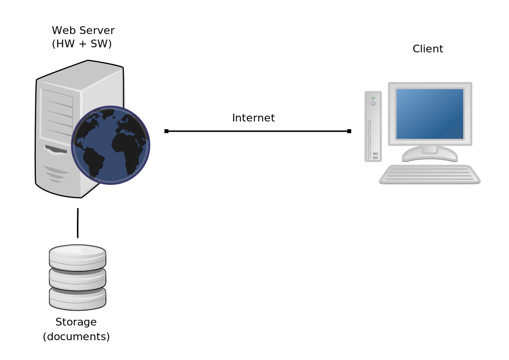
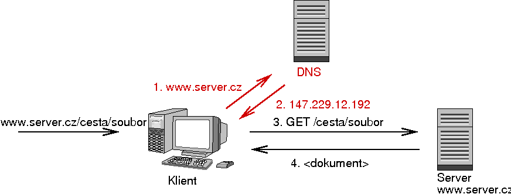

<!-- .slide: class="section" -->

# Principles of the World Wide Web

---

# WWW

  * WWW = _World Wide Web_
  * Main features of the web 
    * **Distributed**
      * Great number of independent units
    * **Heterogenous**
      * Different platforms
    * **Dynamic**
      * Still changing
    * **Document -- oriented**
      * **Document** is the basic information unit

---

# History

  * **1989** \-- Tim Berners-Lee (CERN) publishes a paper _„Information Management: A Proposal”_ -- a proposal of the architecture and use of hypertext 
  * **1990** \-- Start of the „World Wide Web” project, first web browser, first web page
  * **1992** \-- 26 more or less reliable servers
  * **1993** \-- Over 200 servers (mainly academic), first aplha version of the _Mosaic_ browser
  * **1994** \-- The [WWW Consortium (W3C)](http://www.w3.org/) has been founded. The load of the first server `info.cern.ch` is 1000x gerater than in the beginning.
  * **1996** \-- official HTML 3.2 specification (frames, scripts, external objects)
  * **2000** \-- first XHTML 1.0 specification (XML-based HTML clone)
  * **2004** \-- foundation of [WHATWG](http://www.whatwg.org/ "The Web Hypertext Application Technology Working Group") \-- The Web Hypertext Application Technology Working Group
  * **2007** \-- W3C and WHATWG joined to [HTML WG](http://www.w3.org/html/wg/ "Work Group"), start of the HTML5 effort
  * **2014** \-- [HTML 5 specification](http://www.w3.org/TR/html5/) finished
  * ... and further continuous development

---

<!-- .slide: class="centered" -->

# WWW Architecture



---

# WWW Server

  * Document storage 
    * Hierarchically organized documents in folders
    * E.g. `/products/phones/sony.html`
  * Software running on the physical server 
    * Sends an arbitrary document on request
    * E.g. Apache, Microsoft IIS (Internet Information Services) server, ...

=--

# Other Services on Servers

  * A single physical server may provide multiple services
  * The service is identified by its number (_port_) and a name
  * Examples:

 Port| Name| Protocol  
 ---|---|---  
 21| ftp| FTP  
 22| ssh| SSH  
 23| telnet| -  
 25| smtp| SMTP  
 **80**| **www**| **HTTP**  
 **443**| **https**| **HTTPS**

---

# WWW Client – a Browser

  * Sends a request to a server and displays the obtained document.
  * Rendering (layout) engines: 
    * Gecko (Mozilla Foundation) 
      * Firefox
    * WebKit (Open source, KHTML + Apple) 
      * Safari, formerly Chrome
    * Blink (Google) 
      * Chromium (Chrome), Opera, New Edge
  * Discontinued
    * Trident (Microsoft) 
      * Internet Explorer
    * Edge HTML (MSHTML)
      * Old Edge browsers

[Detailed overview](http://en.wikipedia.org/wiki/List_of_web_browsers) (@Wikipedia)

---

# Documents on the WWW

  * Document = a single file stored on the server
  * Different types of documents 
    * Plain text documents
    * **Hypertext documents**
    * Images
    * Multimedia data (sound, music, movies, ...)
    * Programs
    * ...
  * Document type is distinguished using the MIME standard: 
    * A specification of the form **class/type**
    * E.g. `text/plain`, `text/html`, `image/jpeg`, `video/mpeg`, ...

---

# Document Identification -- URI

  * URI = _Unified Resource Identifier_
  * Uniquely identifies a single document on the Web
  * Typical format
<div class="codebox">
  <div style="font-size: 1em;">
    <strong>http://www.fit.vutbr.cz/units/UIFS/index.php</strong>
    <div style="border-top: 2px solid #ffb200; width: 3em; text-align: center;">
          Schema</div>
    <div style="margin-left: 4em; width: 9em; border-top: 2px solid #ffb200; text-align: center;">
          Hostname</div>
    <div style="margin-left: 14em; border-top: 2px solid #ffb200; text-align: center;">
          Document path</div>
    <div style="margin-left: 4em; border-top: 2px solid #ffb200; text-align: center;">
          HTTP address</div>
  </div>
</div>

---

# Document Identification -- URI

  * A port may be specified after the server name <div class="codebox">
<strong>http://www.fit.vutbr.cz:8080/document.html</strong>
</div> 
  * The file name need not be specified <div class="codebox">
<strong>http://www.fit.vutbr.cz/</strong><br/>
<strong>http://www.fit.vutbr.cz/study/</strong>
</div> 
  * URL = _Unified Resource Locator_ \-- unofficial but frequently used.
  * URI is used in technical specifications.

---

# Client-Server Communication

The way of the document transfer is defined in many layers:

  * Physical + link - any 
    * ethernet, ATM, wifi, ...
  * Network + transport - **TCP/IP**
    * Guarantees reliable data transport between two points
    * Defines the form of unique computer address (IP address)
  * Application - mostly **HTTP**
    * HyperText Transfer Protocol
    * Defines the form of requests
    * The form of answer (required document or error)
    * Error codes

---

# HTTP protocol

  * Based on the request - response model
  * No state information is stored 
    * => a **stateless** protocol
  * History 
    * **HTTP 0.9** \-- just the document transport *(obsolete)*
    * **HTTP 1.0** \-- MIME types incorporated *(obsolete)*
    * **HTTP 1.1** \-- Permanent connections, content negotiation, more extensions *(standard)*
    * **HTTP 2** \-- Transfer efficiency improvements *(upcoming standard)*
    * **HTTP 3** \-- Use QUIC (UDP) instead of TCP for efficienct *(upcoming standard)*

---

# HTTP Request

<!-- .slide: class="centered" -->

 <!-- .element: style="width: 80%"  -->

---

# HTTP methods

  * A „command” sent to the server
  * Defines the requested action
  * Server doesn't have to support all methods

  Method | Description  
  --- | ---  
  GET | Request for document (URL)  
  HEAD| As GET, only the response header  
  POST| Additional data in the request  
  PUT | Document upload

---

# HTTP request  
  
  * A request line
  * Header
  * An empty line
  * (Request body)

```http
GET /index.html HTTP/1.0
Accept: text/html
Accept: image/gif
User-Agent: Mozilla/4.0 (compatible; MSIE 6.0; Windows NT 5.1)
```

---

# Responses

  * Different responses have a code number and a name
  * **1xx** \-- information (not used yet)
  * **2xx** \-- success 
    * **200** OK
    * ...
  * **3xx** \-- another action required (redirect) 
    * **301** Moved permanently
    * **302** Moved temporarily
    * ...

---

# Responses

  * **4xx** \- bad request 
    * **400** Bad request (server doesn't understand)
    * **401** Unauthorized (user is not authorized)
    * **403** Forbidden (server is not authorized)
    * **404** Not found
    * **406** Not acceptable (requested variant is not available)
    * ...
  * **5xx** \- server-side error 
    * **500** Internal server error
    * **503** Service unavailable (overload, ...)
    * **505** HTTP version not supported
    * ...

---

# Response

  * Status line
  * Header
  * Response body (separated by a blank line)

```http
HTTP/1.1 200 OK
Date: Wed, 08 Sep 2004 13:19:30 GMT
Server: Apache/1.3.31 Ben-SSL/1.55 (Unix)
Pragma: no-cache
Connection: close
Content-Type: text/html; charset=iso-8859-2
Content-Language: cs

<html>
....
```

---

# Document Processing on the Client

  * The client accepts the document and displays it
  * **HTML and XML documents**
    * Interpret and display (rendering)
  * **Plain text file**
    * Displayed directly
  * **Bitmap images (JPG, PNG, GIF)**
    * Displayed directly
  * **Others**
    * An external program is called
    * Can have a form of a _plugin_

---

# MIME type

  * The type of the transferred document 
    * Specification in the form **class/type**
    * E.g. `text/plain`, `text/html`, `image/jpeg`, `video/mpeg`, ...
  * The type information is usually sent by the server during the HTTP transfer 
    * The `Content-Type:` header
    * Depends on the server settings
    * Important for processing the document by the client

---

# More Addressing Schemes

  * **http:** \-- use the HTTP protocol (www service)  
`http://www.fit.vutbr.cz/news`
  * **https:** \-- secured HTTP
  * **mailto:** \-- e-mail address  
`mailto:burgetr@fit.vutbr.cz`
  * **file:** \-- local filesystem  
`file:///home/burgetr/text.html`  
`file://C:\My Documents\text.html`

---

# Cache

  * Integrated in the browser
  * The documents (hypertext, images, ...) are stored once retrieved
  * In case of the new request, we check if the document has been modified on the server 
    * HEAD request
    * The expiration date is checked
  * Only expired or changed documents are transfered again
  * The cache behavior and expiration can be configured in each document

---

# Cache control

  * Some document don't change often - they can be stored in cache 
    * Manuals, images, icons, ...
  * Some are always changing 
    * Newspaper webs, ...
  * For each document, we can define 
    * An expiration time (till which date it can be stored in cache)
    * Whether to allow / disallow caching
  * This can be set by 
    * HTTP server configuration
    * In some document directly in their contents

---

# Dynamic pages

  * Static pages 
    * The content is prepared and stored on the server
    * They are just transferred to the client and displated
  * Dynamic pages 
    * A part of the document is a product of some program code
    * The code is stored on the server and it's executed 
      * On the server when the request is received
      * On the client (in the browser) when a document containing code is received
    * Some input parametres can be processed
  * Web apllication 
    * Functionally interconected set of dynamic pages

---

# Documents generated on the server

  * Based on some input parametres (HTTP method POST)
  * Advantages 
    * No support in client needed
    * All the technology on the server side (databases, ...)
  * Disadvantages 
    * Greater server load
    * When something changes, the whole page must be transfered again
  * Known technologies 
    * CGI, PHP, ASP(.NET), JSP, ...

---

# Client generated pages

  * The documents contain code in some language (JavaScript)
  * When displaying the page, the browser executed the code
  * It may react on user activity (mouse, keyboard, ...)
  * Advantages 
    * Speed - the page can be modified without transferring data
    * Interactive work
  * Disadvantages 
    * The client has to interpret the code
    * Compatibility problems
    * Security problems

---

# Content Management Systems (CMS)

  * Dynamically generate web pages based on a specification 
    * Document contents
    * Page templates
    * Links among pages (menu, text links)
  * CMS allows a third person to maintain the web
  * Higher requirements on implementation and maintenance
  * E.g. [WordPress](https://wordpress.org)
