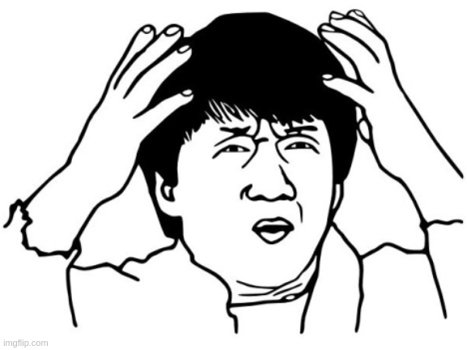
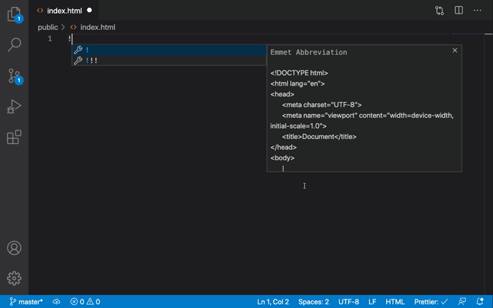
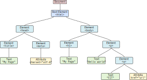

<!-- .slide: class="section" -->

<header>
  <h1>HTML Language</h1>
  <p>Introduction, Principles</p>
</header>

---

# HTML

- HTML = <i>Hypertext Markup Language</i>
- *standard* language for creating hypertext documents

<br>

- **1994**: ***W3C*** is founded (<i>[World Wide Web Consortium](https://www.w3.org/)</i>) -- main organization for web standards
  - **[HTML 4.01](https://www.w3.org/TR/html401/)** -- insufficient (multimedia, semantics, inconsistent implementation, ...)
- **2000–2004**: W3C promotes XHTML -- impractical for the common web (strict syntax, complexity, ...)
- **2004**: ***WHATWG*** is founded (<i>[Web Hypertext Application Technology Working Group](https://whatwg.org/)</i>)
  - reaction to stagnation in HTML development 
  - develops ***HTML5*** in parallel --> confusion
- **2014**: WHATWG introduces **[HTML Living Standard](https://html.spec.whatwg.org/)**
  - unnumbered, continuously updated HTML
- **2019** 🥳 : Agreement between W3C and WHATWG
  - WHATWG becomes the official maintainer of HTML and DOM
  - W3C focuses on CSS, accessibility, and other technologies

---

# HTML Document

- text document
  - MIME type *text/html*
  - usually with extension *.html* or *.htm*
- character encoding: ***UTF-8***
  - old: ISO-8859-2, windows-1250, ...
- popular editors, IDEs: **[VSCode](https://code.visualstudio.com/)**, **[WebStorm](https://www.jetbrains.com/webstorm/)**, ...

<div style="display:flex; align-items: center; justify-content: space-around;">


</div>

<span class="note"><a href="https://code.visualstudio.com/docs/languages/emmet">VS Code Emmet</a><span>

---

# HTML Document: Basic Structure

- contains *text*, *embedded tags*, and *character entities*

```html
<!DOCTYPE html>
<html lang="en">
  <head>
    <meta charset="UTF-8">
    <title>Document</title>
  </head>
  <body>
    <!-- Let's greet the new students -->
    <p>Hello! You shall not pass! &#x1F9D9;</p>
    <a href="https://www.fit.vut.cz/study/course/ITW/">ITW</a>
  </body>
</html>
```

- result:

<pre class="code-render">
  <!-- Let's greet the new students -->
  <p>Hello! You shall not pass! &#x1F9D9;</p>
  <a href="https://www.fit.vut.cz/study/course/ITW/">ITW</a>
</pre>

<span class="note"><a href="http://www.quickmeme.com/meme/3657cw">.</a><span>

---

# HTML Document: Basic Structure

- ***`DOCTYPE`*** -- instruction for the browser, document type declaration

```html
<!DOCTYPE html> 

<!DOCTYPE HTML PUBLIC "-//W3C//DTD HTML 4.01//EN"
  "http://www.w3.org/TR/html4/strict.dtd">

<!DOCTYPE html PUBLIC "-//W3C//DTD XHTML 1.0 Strict//EN"
  "http://www.w3.org/TR/xhtml1/DTD/xhtml1-strict.dtd">
```

- ***`<html lang="en">`*** -- root element and document language

- ***`<head>`*** -- document header, metadata for the browser
  - *`<meta charset="UTF-8">`* -- character encoding
  - *`<title>Document</title>`* -- page title shown in browser tab
  - ... (see further)

- ***`<body>`*** -- document body, content shown to the user

---

# HTML Document: DOM

- document forms an ***tree*** consisting of ***nodes*** (element, attribute, comment, text, ...)

<div style="text-align: center">
  
</div>

- *CTRL+SHIFT+I* / *Inspector/Elements* tab
- right-click on element / *Inspect element*

<span class="note"><a href="https://dom.spec.whatwg.org/">DOM</a>,<span>
<span class="note"><a href="https://dom.spec.whatwg.org/#node">Node</a>,<span>
<span class="note"><a href="https://dom.spec.whatwg.org/#interface-document">Document</a>,<span>
<span class="note">client-side JavaScript lecture...<span>

---

# HTML Element

- part of a document delimited by ***tags*** (opening and closing)

```html
<p>Element content</p>

<div class="menu" id="mainmenu">
  Element content<br> More element content.
</div>

<div>Some <em>emphasized</em> text.</div> 
```

- consists of *name*, *attributes*, and *content*

<br>

- some elements may have only a start tag *`<li>`*, *`<p>`* (× XHTML)
- some elements may also lack content *`<br>`*, *``* (so-called <a href="https://html.spec.whatwg.org/multipage/syntax.html#void-elements">void element</a>) 
- ***case insensitive*** -- letter case does not matter (× XHTML)

<span class="note"><a href="https://html.spec.whatwg.org/multipage/semantics.html#semantics">WHATWG</a></span>

---

# HTML Element: Definition

<iframe src="https://html.spec.whatwg.org/multipage/grouping-content.html#the-li-element"
  style="width: 40%; height: 500px; zoom: 1.5" class="img-right box">
</iframe>

- HTML specification defines existing elements and their properties:
  - semantics (meaning, what it represents)
  - context where it can be used
  - allowed content (other elements, text)
  - allowed attributes
  - possibility to omit closing tag

<br>

- example definition of the *`<li>`* element: **[WHATWG](https://html.spec.whatwg.org/multipage/grouping-content.html#the-li-element)**

<br>

- document validity: **[online W3C validator](https://validator.w3.org/)**

---

# HTML Attribute

- so-called <i>***content attributes***</i> -- written in HTML as *`name="value"`*
  - express the *initial* state of elements 
  - defined in element specifications
- ***global attributes*** -- usable in every element
  - **`id`** -- unique identifier (*unique* in document)
  - **`class`** -- class
  - **`style`** -- CSS inline styles
  - **`title`** -- tooltip
  - **`lang`** -- content language
  - **`hidden`** -- hidden element
  - **`tabindex`** -- tab activation order
  - [more...](https://developer.mozilla.org/en-US/docs/Web/HTML/Reference/Attributes)
- custom attributes ***`data-*`*** (extensibility)

<span class="note"><a href="https://developer.mozilla.org/en-US/docs/Web/HTML/Reference/Attributes">MDN reference</a>,</span>
<span class="note">Global attributes: <a href="https://html.spec.whatwg.org/#global-attributes">WHATWG</a>,</span>
<span class="note"><a href="https://developer.mozilla.org/en-US/docs/Web/HTML/Reference/Attributes">MDN</a></span>

---

# HTML Document: Comments

- **notes in the HTML document** not meant to be displayed by the browser
  - author comments
  - ***remain in the source code!***

```html
<!-- this is my plagiarized project -->
<html>
```

- **(server side includes)**
  - simple server-side scripting mechanism
  - inserting content from other files, running commands when generating the page on the server
  - must be supported on the server (e.g. Apache, nginx)

```html
<!--#include file="header.html" -->
```

<span class="note"><a href="https://httpd.apache.org/docs/current/mod/mod_include.html">Apache</a>,</span>
<span class="note"><a href="https://nginx.org/en/docs/http/ngx_http_ssi_module.html">nginx</a></span>

---

# HTML Document: Text, Whitespace

- merged into one, lines are wrapped dynamically when rendering

```html
<body>
  Hello!
  You shall not pass!
   
  &#x1F9D9;

  One Ring to rule them all, One Ring to find them, One Ring to bring them all and in the darkness bind them.
</body>
```

<pre class="code-render" default-style="" resizable="true">
Hello!
   You shall not pass!
   
   &#x1F9D9;

   One Ring to rule them all, One Ring to find them, One Ring to bring them all and in the darkness bind them.
</pre>

<br>

- force whitespace: *`<br>`*, *`&nbsp;`*
- preserve whitespace: *`<pre>`* <i>(see further...)</i>

<span class="note"><a href="http://www.quickmeme.com/meme/3657cw">.</a><span>

---

# HTML Document: Character Entities

- for inserting special characters: ***`&code`***

<iframe src="https://html.spec.whatwg.org/multipage/named-characters.html#named-character-references-table"
  style="width: 40%; height: 350px; zoom: 2" class="img-right box">
</iframe>

<br>

| Entity      | Character                         |
|-------------|-----------------------------------|
| `&lt;`      | &lt;                              |
| `&gt;`      | &gt;                              |
| `&amp;`     | &amp;                             |
| `&reg;`     | &reg;                             |
| `&copy;`    | &copy;                            |
| `&euro;`    | &euro;                            |
| `&nbsp;`    | "&nbsp;" (non-breaking space)     |
| `&#x1F9D9;` | &#x1F9D9;                         |


<span class="note"><a href="https://html.spec.whatwg.org/multipage/named-characters.html">WHATWG</span>

---

# HTML Document: Appearance

- ***HTML language is not intended for defining appearance!*** (× older HTML versions)

<br>

- ***CSS language*** (<i>Cascading Style Sheets</i>)
  - visual appearance of elements using ***CSS properties*** (`color`, `font-weight`, `margin`, ...)

```html
<h2>ITW</h2>
<p>Hello! <b>You</b> shall <span style="color: red">not</span> pass! &#x1F9D9;</p>
```

<pre class="code-render" default-style="" resizable="true" style="height: 250px">
<h2>ITW</h2>
<p>Hello! <b>You</b> shall <span style="color: red">not</span> pass! &#x1F9D9;</p>
</pre>

  - browser provides *default appearance* for known HTML elements (`<h2>`, `<b>`, `<p>`, ...)
  - can be overridden *with custom style rules* (e.g. `<span style="color: red">`, ***...***)

<span class="note">More in the next lecture: [CSS -- Introduction to Cascading Style Sheets](https://gitshow.net/gh/DIFS-Teaching/slides@main/en/itwe/p03_css)</span>

---

# HTML Document: Purpose

- present ***content*** along with ***structure*** and ***meaning***

<br>

- it is linked with other HTML documents via *hypertext links* -- forms the web

<br>

- defines *relationships with other document types*
  - images, multimedia, style sheets, fonts, JavaScript

