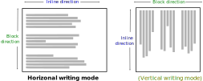

<!-- .slide: class="section" -->

<header>
  <h1>Document Content</h1>
  <p>block, inline, and inline-block elements</p>
</header>

---

# Document Content

- consists of the *`<body>`* element and its nested elements

- we create *content* and describe the *structure* and *meaning* of document parts

<br>

<div style="font-size: 2rem">

|   Type   |   Selected Example Elements   |
|---------|-------------------------------|
|   Sections & Containers  |   `div`, `section`, `article`, `nav`, `aside`   |
|   Headings  |   `h1` -- `h6`   |
|   Lists  |   `ul`, `ol`, `li`, `dl`, `dt`, `dd`   |
|   Tables  |   `table`, `tr`, `td`, `th`, `thead`, `tbody`, `tfoot`   |
|   Text Elements  |   `p`, `span`, `strong`, `em`, `br`   |
|   Multimedia  |   `img`, `audio`, `video`, `svg`, `canvas`   |
|   Forms  |   `form`, `input`, `label`, `textarea`, `button`, `select`   |
|   Interactive  |   `a`, `button`, `details`, `summary`   |
|   Scripting  |   `script`, `template`   |

</div>

<span class="note"><a href="https://developer.mozilla.org/en-US/docs/Web/HTML/Reference/Elements">MDN</a>,</span>
<span class="note"><a href="https://www.w3schools.com/TAGS/default.asp">W3Schools</a></span>

---

# Flow Content

- various types of elements -- according to specification, so-called <i>***flow content***</i>
  - content elements, <i>“most elements used in the body of documents and applications”</i>

<iframe src="https://html.spec.whatwg.org/images/content-venn.svg" alt="Elements"
  style="width: 100%; height: 80px; zoom: 10; position: absolute; bottom: 0; left: 0; z-index: -1">
</iframe>

<span class="note"><a href="https://html.spec.whatwg.org/multipage/dom.html#kinds-of-content">WHATWG</a></span>

---

# Normal Flow (CSS)

- normal flow in the document
- *default way of laying out elements on the page*, unless specified otherwise by styles

- formatting contexts:
  - <span style="color: green">**block**</span> (<i><span style="color: green">block</span> formatting context</i>) -- stacked vertically
  - <span style="color: blue">**inline**</span> (<i><span style="color: blue">inline</span> formatting context</i>) -- placed side by side
- for some Asian languages, the direction is reversed (so-called <span style="color: #8B8000">vertical writing mode</span>)

<div class="block-center">
  
</div>

<span class="note"><a href="https://developer.mozilla.org/en-US/docs/Web/CSS/CSS_display/Block_and_inline_layout_in_normal_flow">MDN</a></span>

---

# Block Elements

  - so-called <i>**block-level content**</i> (e.g. `h2` or `p`)
  - elements are stacked *vertically*, affect text flow and cause line breaks
  - *take up the full width of the parent* (unless styled otherwise -- see CSS lecture)
  - width, height, margins (`margin`, `padding`) can be changed

```html
Hello! <h2>You</h2> shall <p style="width: 200px;">not</p> pass! &#x1F9D9;
```

<pre class="code-render" default-style="
h2, p {
  border: 2px solid green;
  background-color: lightgreen;
}" resizable="true" style="height: 450px">
Hello! <h2>You</h2> shall <p style="width: 300px;">not</p> pass! &#x1F9D9;
</pre>

---

# Inline Elements

  - so-called <i>**inline-level content**</i> (e.g. `b` or `i`)
  - elements are placed *side by side*, do not affect text flow, do not cause line breaks
  - *width is usually determined by content*
  - width and height *cannot* be changed

```html
Hello! <b>You</b> shall <i style="width: 200px;">not</i> pass! &#x1F9D9;
```

<pre class="code-render" default-style="
b, i {
  border: 2px solid blue;
  background-color: lightblue;
}

" resizable="true" style="height: 150px">
<p>Hello! <b>You</b> shall <i style="width: 200px;">not</i> pass! &#x1F9D9;
</pre>

<br>

  - margins (`margin`, `padding`) can be changed, but *vertical margins do not affect surrounding lines*

=--

<!-- .slide: class="editor" -->

# Block vs. Inline Elements

<div data-iframe="assets/examples/inline/inline.html"></div>

<div class="note"><a href="assets/examples/inline/inline.html">source</a></div>

---

# Inline-block Elements
- a special type of inline element, called <i>**inline-block**</i>
- behave like inline (can be *in a line with text*)
- but *respect dimensions* (width, height) and have *block box model* (`margin`, `padding`)

- mainly used for elements that should be in a line but also have fixed size
  - images, multimedia, forms
  - `img`, `svg`, `canvas`, `video`, `iframe`, `input`, `button`, ...


```html
<p>
  Hello! 
  You shall not pass!. 
</p>
```

<pre class="code-render" default-style="" resizable="true" style="height: 200px">
<p>
<p>Hello! 
You shall not pass!. </p>
</p>
</pre>

=--

<!-- .slide: class="editor" -->

# Inline-block Elements

<div data-iframe="assets/examples/inline/inline2.html"></div>

<div class="note"><a href="assets/examples/inline/inline2.html">source</a></div>

---

# Comparison

<br>

<div class="block-center">
<table class="matrix-table center-table" style="text-align: center;">
  <tr><th></th><th style="color: green">block</th><th style="color: blue">inline</th><th style="color: #0096FF">inline-block</th></tr>
  <tr><th>element arrangement</th><td>stacked vertically</td><td>side by side</td><td>side by side</td></tr>
  <tr><th>width</th><td>🟢</td><td>🔴</td><td>🟢</td></tr>
  <tr><th>height</th><td>🟢</td><td>🔴</td><td>🟢</td></tr>
  <tr><th>margin</th><td>🟢</td><td>⚪*</td><td>🟢</td></tr>
  <tr><th>padding</th><td>🟢</td><td>⚪*</td><td>🟢</td></tr>
</table>
</div>

<br>

`*` vertical margins do not affect surrounding lines

<span class="note">more in the CSS lecture...</span>

---

# Nesting Elements

- **<span style="color: green">block</span> elements**
  - can contain **selected** block elements -- according to the **[specification](https://html.spec.whatwg.org/multipage/index.html)**
  - can contain any inline (inline-block) elements
- **<span style="color: blue">inline</span> (<span style="color: #0096FF">inline-block</span>) elements**
  - **cannot** contain block elements
```html
In <b>bold text <p>paragraph</p> cannot be here</b>.
```
  - can contain any inline (inline-block) elements
```html
<b>y = <i>e</i><sup>2<i>x</i></sup></b> 
```
<pre class="code-render" default-style="" resizable="true" style="height: 100px">
<b>y = <i>e</i><sup>2<i>x</i></sup></b> 
</pre>

---

# Meaning of Elements

- **<span style="color: green">block</span> elements**
  - usually represent the basic building blocks of a page
  - `header`, `footer`, `section`, `nav`, `h1`, `p`, *`div`*, ...
- **<span style="color: blue">inline</span> (<span style="color: #0096FF">inline-block</span>) elements**
  - usually represent the actual content in the document -- text highlighting, images, multimedia, ...
  - `b`, `i`, `a`, `img`, `svg`, `video`, *`span`*, ...

<br>

- **generic element** (*`div`*, *`span`*)
  - has no implicit meaning
  - used for grouping content, usually with a *`class`* attribute
- **semantic element** (e.g. *`nav`*, *`time`*, ...)
  - its name clearly expresses its meaning and purpose for the content it wraps
  - recommended to use if available (*accessibility*, *SEO*)

<span class="note">see Accessibility lecture</span>

=--

<!-- .slide: class="editor" -->

# HTML Elements Demo

<div data-iframe="assets/examples/html/html-elements-cs.html"></div>

<div class="note"><a href="assets/examples/html/html-elements-cs.html">source</a></div>
