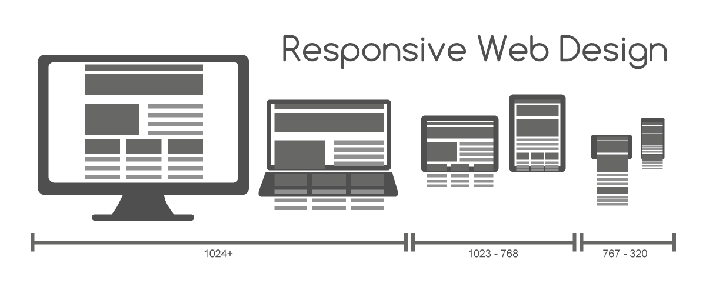

# Motivation

- adjust the document to devices with different resolutions
  - mobile devices, tablets, laptops, standard monitors, ...
  - [statistics...](https://gs.statcounter.com/screen-resolution-stats)

  

fixed × fluid × adaptive × ***responsive*** layout

<a href="https://commons.wikimedia.org/wiki/File:Responsive_Web_Design_for_Desktop,_Notebook,_Tablet_and_Mobile_Phone.png">image source</a>

=--

# Fluid layout

- width expressed in percentages

 

  

[Image source](https://product-alpaca.medium.com/so-what-exactly-is-the-difference-between-fixed-fluid-adaptive-and-responsive-layouts-and-why-3773272d8481)

=--

# Adaptive layout

- contains so-called *breakpoints*

 

  

[Image source](https://product-alpaca.medium.com/so-what-exactly-is-the-difference-between-fixed-fluid-adaptive-and-responsive-layouts-and-why-3773272d8481)

=--

# Responsive layout

- combination of fluid and adaptive layout

 

  

[Image source](https://product-alpaca.medium.com/so-what-exactly-is-the-difference-between-fixed-fluid-adaptive-and-responsive-layouts-and-why-3773272d8481)