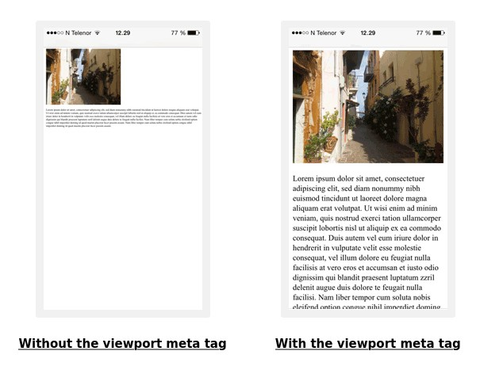

<!-- .slide: class="section" -->
 
<header>
  <h1>Introduction, Terms</h1>
  <p>Viewport, Media Queries, Breakpoints, Grid System</p>
</header>

---

# Viewport

- the visible part of the document, generally depends on the browser window size

<div style="text-align: center;">
  
</div>

- we are particularly interested in the ***available width*** (horizontal scrolling is not user-friendly)

---

# Viewport: Mobile Devices

- mobile device browsers have a viewport width larger than their resolution
  - an issue for responsive design

<div class="img-right box" style="width: 900px;">
  
</div>

<br>

- it is necessary to adjust the HTML document header:

```html
<head>
  <meta name="viewport"
    content="width=device-width,
         initial-scale=1">
</head>
```

<span class="note"><a href="https://www.w3schools.com/css/css_rwd_viewport.asp">source of the image</a></span>

---

# Design Process

1. design the layout (visual element arrangement) of the document<br> ***starting with mobile devices:*** (approach <i>*mobile first*</i>)
   - the document usually consists of a single column made up of blocks whose width
is relative (usually 100% – full width, possibly with some padding/margin)
   - avoid large fixed-width elements

<br>

2. design the document layout ***for higher resolutions:***
  - *dynamically rearrange* blocks into multiple columns (*floats*, *flex*, *grid*, ...) at higher resolutions
  - ***CSS3 Media Queries***

---

# Media Queries

- use the ***`@media`*** rule for conditional style definitions
- CSS3 Media Queries (W3C recommendation)

```css
@media not|only mediatype and (expressions) {
  /* CSS rules */
}
```

- ***`not`***: negates the entire rule
- ***`only`***: older browsers will ignore the construction
- ***`mediatype`***: type of media/device
   - *`screen`*, `print`, `speech`, `all`, ...
- ***`expressions`***: conditions for the rule (screen size, ...)

---

# Media Queries: Conditions and Breakpoints

- ***`min-width`***, ***`max-width`***, `orientation`, other expressions...

- Media Queries allow limiting (so-called ***breakpoints***) the application of rules to specific screen resolutions:

```css
/* extra small screen rules */

@media only screen and (min-width: 576px) {
  /* small screen rules */
}

@media only screen and (min-width: 768px) {
  /* medium screen rules */
}

@media only screen and (min-width: 992px) {
  /* large screen rules */
}

/* etc... */
```

<span class="note"><a href="https://getbootstrap.com/docs/5.3/layout/breakpoints/">Bootstrap breakpoints</a></span>

---

# Bootstrap Breakpoints

<br><br>

<div style="display: flex; justify-content: center;">

| Breakpoint          | Class Prefix | Width    |
|---------------------|--------------|----------|
| Extra small         | none         | <576px   |
| Small               | `sm`         | ≥576px   |
| Medium              | `md`         | ≥768px   |
| Large               | `lg`         | ≥992px   |
| Extra large         | `xl`         | ≥1200px  |
| Extra extra large   | `xxl`        | ≥1400px  |

</div>

<span class="note"><a href="https://getbootstrap.com/docs/5.3/layout/breakpoints/">source</a></span>

---

# Grid System

- a technique for organizing elements into a grid consisting of ***<i>n</i> columns***
  - often ***12*** -- easily divisible, but generally any number

<div class="img-right" style="width: 1000px;">
  
</div>

<br>

- easier design
- easier implementation
- better organization of elements on the page
- content is perceived better by users

---

# Grid System: Implementation

- it is necessary to address the problem of horizontal positioning of blocks:
  - ***floats*** (used, for example, in Bootstrap 3)
  - ***Flexbox*** (used, for example, in Bootstrap 4)
  - ***CSS Grid*** -- an advanced method for creating layouts

<br>

- it is ***recommended to combine*** approaches depending on the specific problem
  - positioning elements in a single row vs. into a grid, etc.

<span class="note">The principles of different block positioning methods were covered in the lecture: [CSS -- Page Layout](https://gitshow.net/gh/DIFS-Teaching/slides@main/en/itwe/p06_page_layout)</span>
