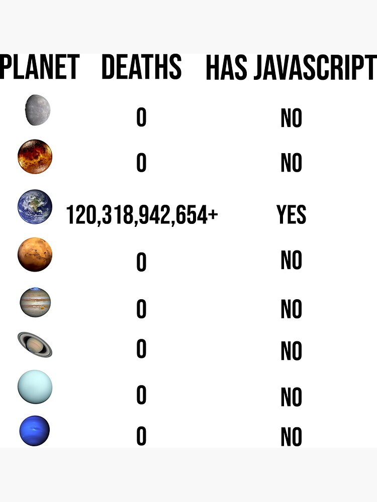

<!-- .slide: class="section" -->
 
<header>
  <h1>Language</h1>
  <p>concepts</p>
</header>

---

# JavaScript

- high-level programming language for the web
- runs directly *in the browser* (client-side)


- **language characteristics:**
  - *dynamic* – types are determined at runtime
  - *weakly typed* -- automatic type conversions
  - *scripting language* -- executed directly without compilation
  - *interpreted / JIT compiled* -- runs immediately in the browser
  - *multi-paradigm* -- supports *procedural*, *object-oriented* and *functional styles*
  - *prototype-based* -- objects inherit from other objects
  - *first-class functions* -- functions can be passed and returned like values
  - *event-driven* -- reacts to user and browser events

---

# History



- **1995** -- the language created (Netscape, Brendan Eich): Mocha → LiveScript → *JavaScript*
  - the final name chosen to leverage Java’s popularity at the time
  - <i>Java and JavaScript are like car and carpet</i> (just a joke, no offense)
- **1997** -- [ECMAScript standard](https://ecma-international.org/publications-and-standards/standards/ecma-262/)
- **2009** -- Node.js (server-side JS)
- **2015** ([ES6](https://262.ecma-international.org/6.0/)) -- modern JavaScript (modules, classes, arrow functions, …)
- **Today** -- most widely used *web* language

<br>

- ***ECMAScript (ES) standard***
  - defines the language syntax, types, and core behavior
  - ensures compatibility across browsers and environments
  - browsers implement ECMAScript as JavaScript
  - new versions add modern features regularly

---

# Terminology

- **ECMAScript** -- language specification (the standard), grammar rules

<br>

- **JavaScript** -- ECMAScript implementation in web browsers

<br>

- **Runtime** -- environment providing APIs and execution context (*browser* or *Node.js*)
  - Browser runtime -- DOM, events, fetch, window
  - Node.js runtime -- file system, network, process

<br>

- **Engine** -- program that executes JavaScript code
  - parses and executes code 
    - code is compiled during execution (JIT compilation -- Just in Time) -- optimization
  - *V8* (Chrome, Node.js), *SpiderMonkey* (Firefox), *JavaScriptCore*/*WebKit* (Safari)

---

# Event Loop

- JavaScript is *single-threaded* -- only one task runs at a time
- long operations must be *asynchronous*
- the Event Loop coordinates task execution -- it keeps the application responsive

---

# Link JS to HTML

- **inline JavaScript**

```html
<button onclick="alert('Hello!')">Click me</button>
```

- **internal script**

```html
<script>
/* some JS code */
</script> 
```

- **external script**

```html
<script src="program.js" defer></script> 
```

- *`defer`* -- to run after HTML is parsed
- *`async`* -- for parallel loading (executes as soon as ready)

---

# Script Execution

- executed *immediately* when the browser encounters the *`<script>`* tag

```html
<body>
  <p>Now the script is going to be executed.</p>
  <script>
    document.write("<p><em>The script is running.</em></p>");
  </script>
  <p>The script has been executed. We process the remaining document.</p>
</body>
```

<pre class="code-render" default-style="
em {
  color: blue;
  font-weight: bold;
}
" resizable="true" style="height: 300px;">

<p>Now the script is going to be executed.</p>
<script>
  document.write("<p><em>The script is running.</em></p>");
</script>
<p>The script has been executed. We process the remaining document.</p>

</pre>

---

# Syntax

```js
// Characters array
const characters = [
  { name: "Jon Snow", house: "Stark", alive: true },
  { name: "Daenerys Targaryen", house: "Targaryen", alive: false },
  { name: "Tyrion Lannister", house: "Lannister", alive: true }
];

/* Function to greet characters */
function greetAlive(characters) {
  for(let char of characters){
    if(char.alive){
      console.log(`Hello, ${char.name} of House ${char.house}!`);
    } else {
      console.log(`${char.name} is no longer with us.`);
    }
  }
}

// Run function
greetAlive(characters);
```
---

# Key Language Constructs

🟢 **Variables & Constants:** [`let`](https://developer.mozilla.org/en-US/docs/Web/JavaScript/Reference/Statements/let), [`const`](https://developer.mozilla.org/en-US/docs/Web/JavaScript/Reference/Statements/const), [`var`](https://developer.mozilla.org/en-US/docs/Web/JavaScript/Reference/Statements/var)

🔢 **[Data Types](https://developer.mozilla.org/en-US/docs/Web/JavaScript/Data_structures):** number, string, boolean, null, undefined, object, array, function

➕➖ **[Operators](https://developer.mozilla.org/en-US/docs/Web/JavaScript/Reference/Operators):** arithmetic, comparison, logical, assignment

🔄 **Control Flow:** [`if...else`](https://developer.mozilla.org/en-US/docs/Web/JavaScript/Reference/Statements/if...else), [`switch`](https://developer.mozilla.org/en-US/docs/Web/JavaScript/Reference/Statements/switch), ternary [`? :`](https://developer.mozilla.org/en-US/docs/Web/JavaScript/Reference/Operators/Conditional_Operator)

🔁 **Loops:**  [`for`](https://developer.mozilla.org/en-US/docs/Web/JavaScript/Reference/Statements/for), [`for...of`](https://developer.mozilla.org/en-US/docs/Web/JavaScript/Reference/Statements/for...of), [`for...in`](https://developer.mozilla.org/en-US/docs/Web/JavaScript/Reference/Statements/for...in), [`while`](https://developer.mozilla.org/en-US/docs/Web/JavaScript/Reference/Statements/while), [`do...while`](https://developer.mozilla.org/en-US/docs/Web/JavaScript/Reference/Statements/do...while)

⚡ **[Functions](https://developer.mozilla.org/en-US/docs/Web/JavaScript/Reference/Functions):** declarations, expressions, arrow functions, first-class functions

🗂️ **[Objects & Arrays](https://developer.mozilla.org/en-US/docs/Web/JavaScript/Reference/Global_Objects/Object):** key/value pairs, methods, indexing

✨ **[Template Literals](https://developer.mozilla.org/en-US/docs/Web/JavaScript/Reference/Template_literals):** `${}` for string interpolation

🖱️ **[Events & DOM](https://developer.mozilla.org/en-US/docs/Web/API/Event):** selecting, modifying, listening to HTML elements

⏱️ **Asynchronous:** [`setTimeout`](https://developer.mozilla.org/en-US/docs/Web/API/WindowOrWorkerGlobalScope/setTimeout), [`setInterval`](https://developer.mozilla.org/en-US/docs/Web/API/WindowOrWorkerGlobalScope/setInterval), [Promises](https://developer.mozilla.org/en-US/docs/Web/JavaScript/Reference/Global_Objects/Promise), [`async/await`](https://developer.mozilla.org/en-US/docs/Web/JavaScript/Reference/Statements/async_function)

📦 **Modules:** [`import`](https://developer.mozilla.org/en-US/docs/Web/JavaScript/Reference/Statements/import) / [`export`](https://developer.mozilla.org/en-US/docs/Web/JavaScript/Reference/Statements/export)

<span class="note">[MDN JS Guide](https://developer.mozilla.org/en-US/docs/Web/JavaScript/Guide), 
[W3Schools JS Tutorial](https://www.w3schools.com/js/)</span>