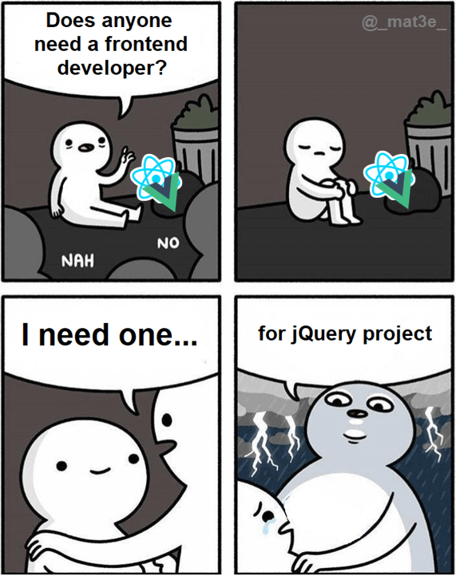
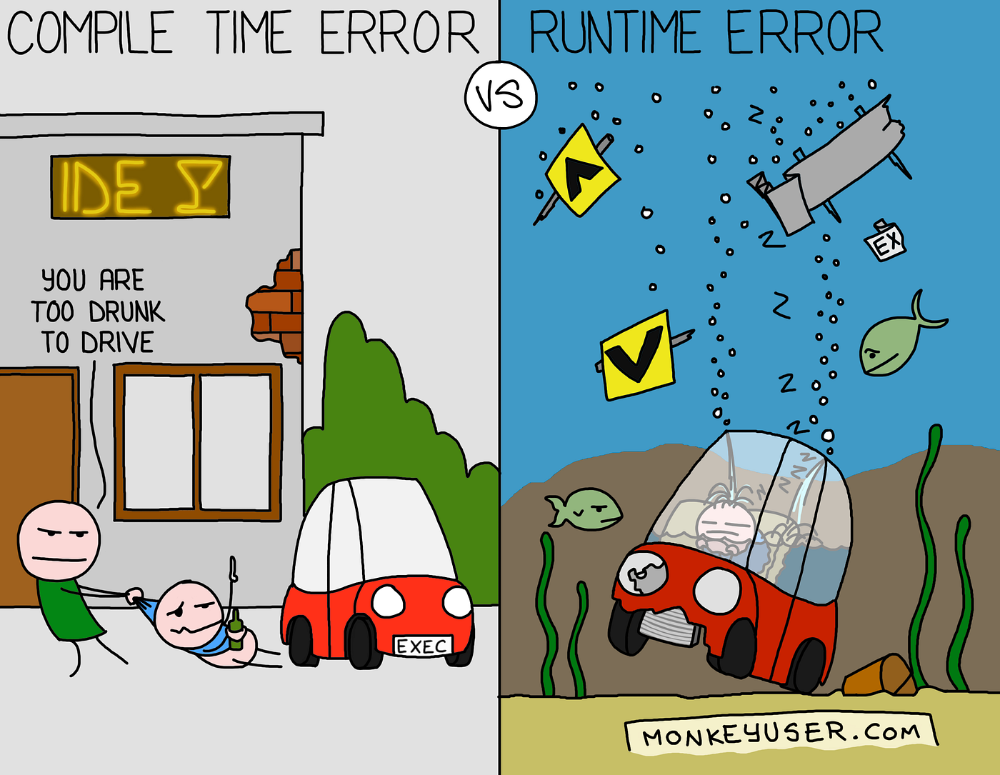

<!-- .slide: class="section" -->
 
<header>
  <h1>Libraries & Frameworks</h1>
  <p>CDN, npm, JQuery, Lodash, D3.js, React, TypeScript</p>
</header>

---

# Motivation

- simplify development by providing reusable components and utilities
- abstract away browser inconsistencies and low-level details


<br>

- ***libraries***: focused on specific tasks (e.g., DOM manipulation, AJAX)
  - e.g., [jQuery](https://jquery.com/), [Lodash](https://lodash.com/), [D3.js](https://d3js.org/)

<br>

- ***frameworks***: provide a structured approach to building applications
  - e.g., [React](https://reactjs.org/), [Angular](https://angular.io/), [Vue.js](https://vuejs.org/)
  - often include features like component-based architecture, state management, routing, etc.

---

# CDN

- ***Content Delivery Network*** -- distributed servers that deliver content based on user location
- allows loading libraries/frameworks without hosting them locally
- [jsDelivr](https://www.jsdelivr.com/), [CDNJS](https://cdnjs.com/), [Google Hosted Libraries](https://developers.google.com/speed/libraries), etc.

```html
<script src="https://code.jquery.com/jquery-3.6.1.min.js"
        integrity="sha256-o88AwQnZB+VDvE9tvIXrMQaPlFFSUTR+nldQm1LuPXQ="
        crossorigin="anonymous">
</script>
```

```html
<script src="https://cdn.jsdelivr.net/npm/lodash@4.17.21/lodash.min.js"></script>
```

```html
<script src="https://d3js.org/d3.v7.min.js"></script>
```

- *.min.js* -- minified version, smaller file size for faster loading
- *integrity* -- Subresource Integrity (SRI) for security, ensures the file hasn't been tampered with
- *crossorigin* -- CORS settings for SRI, usually set to "anonymous"

---

# npm

- **[Node Package Manager](https://www.npmjs.com/)** -- package manager for JavaScript, used for managing dependencies in projects
- allows installing libraries/frameworks locally in a project


```bash
# create js project
npm init -y
npm install jquery
npm install lodash
npm install react
``` 

- creates a *package.json* file with project metadata and dependencies
- creates a *node_modules* directory with the installed packages
- can be used with build tools like [Webpack](https://webpack.js.org/), [Babel](https://babeljs.io/), [Vite](https://vitejs.dev/), etc. for bundling and transpiling code

---

# JQuery

- [jQuery](http://jquery.com/), [jQuery UI](https://jqueryui.com/), MIT license
- older popular JavaScript library for DOM manipulation, event handling, and AJAX
- simplifies common tasks and provides cross-browser compatibility



```html
<script>
  $(document).ready(function() {
    $("#myButton").click(function() {
      $("ul > li").css("color", "blue");
    });
  });
</script>

<button id="myButton">Winter is Coming</button>

<ul>
  <li class="item">Jon Snow</li>
  <li class="item">Arya Stark</li>
  <li class="item">Tyrion Lannister</li>
</ul>
```

=--

<!-- .slide: class="editor" -->

# Example

<div data-iframe="assets/examples/js/jquery.html"></div>

<div class="note"><a href="assets/examples/js/jquery.html">source</a></div>

---

# Lodash

- [Lodash](https://lodash.com/), MIT license
- utility library for JavaScript, provides functions for common programming tasks
- includes functions for arrays, objects, strings, etc.

```js
_.chunk(['a', 'b', 'c', 'd'], 2);
// => [['a', 'b'], ['c', 'd']]
_.shuffle([1, 2, 3, 4]);
// => [4, 1, 3, 2] (example output)
_.merge({ 'a': 1 }, { 'b': 2 }, { 'a': 3 });
// => { 'a': 3, 'b': 2 }
```

---

# D3.js

- [D3.js](https://d3js.org/), BSD license, Data Driven Documents
- library for data visualization, allows creating complex and interactive visualizations in the browser
- uses SVG, HTML, and CSS for rendering

<pre class="code-render" default-style="
body {
  display: flex;
  justify-content: center;
  align-items: center;
}

svg {
  border: 1px solid black;
}
" resizable="true" style=" width: 40%; height: 600px; float: right; margin-left: 20px; position: relative; z-index: 1;">
<script src="https://d3js.org/d3.v7.min.js"></script>
<script>
  let data = [ 4, 8, 15, 16, 23, 42 ];

  d3.select("body")
  .append("svg")
  .attr("width", 500)
  .attr("height", 500)
  .selectAll("rect")
  .data(data)
  .enter()
  .append("rect")
  .attr("x", (d, i) => i * 80)
  .attr("y", d => 500 - d * 10)
  .attr("width", 40)
  .attr("height", d => d * 10)
  .style("fill", "steelblue");
</script>
</pre>

```js
let data = [ 4, 8, 15, 16, 23, 42 ];

d3.select("body")
  .append("svg")
  .attr("width", 500)
  .attr("height", 500)
  .selectAll("rect")
  .data(data)
  .enter()
  .append("rect")
  .attr("x", (d, i) => i * 80)
  .attr("y", d => 500 - d * 10)
  .attr("width", 40)
  .attr("height", d => d * 10)
  .style("fill", "steelblue");
```

<span class="note">More in the <a href="https://www.fit.vut.cz/study/course/PIS/.en">Advanced Information Systems course</a></span>

=--

<!-- .slide: class="editor" -->

# Example

<div data-iframe="assets/examples/js/d3.html"></div>

<div class="note"><a href="assets/examples/js/d3.html">source</a></div>

---

# React

- [React](https://reactjs.org/), MIT license, developed by Facebook
- JavaScript framework for building user interfaces, particularly single-page applications
- uses a *component-based architecture*, reusable UI components written in JSX (JavaScript XML)
- virtual DOM for efficient updates and rendering

```jsx
import React from 'react';
import ReactDOM from 'react-dom';
import Counter from './Counter'; // another component in a separate file

function App() {
  return (
    <div>
      <h1>Hello, React!</h1>
      <p>This is a simple React component.</p>
      <Counter initialCount={0} />
    </div>
  );
}

ReactDOM.render(<App />, document.getElementById('root'));
```

---

# React

```jsx
// Example of a functional component with state and event handling
import React, { useState } from 'react';

function Counter({ initialCount = 0 }) {
  const [count, setCount] = useState(initialCount);

  return (
    <div>
      <h1>Counter: {count}</h1>
      <button onClick={() => setCount(count + 1)}>Increment</button>
      <button onClick={() => setCount(count - 1)}>Decrement</button>
    </div>
  );
}
```

- alternative frameworks: [Angular](https://angular.io/), [Vue.js](https://vuejs.org/), [Svelte](https://svelte.dev/), etc.

---

# TypeScript

- [TypeScript](https://www.typescriptlang.org/), MIT license, developed by Microsoft
- language, superset of JavaScript that adds *static typing* and other features
- helps catch errors at compile time and improves code maintainability



```ts
function add(a: number, b: number): number {
  return a + b;
}

let result: number = add(5, 3);
console.log(result);

 // compile-time error
let result2: number = add("5", "3");
```

- transpiled to JavaScript
  - [tsc](https://www.typescriptlang.org/docs/handbook/compiler-options.html)
  - tools like [Webpack](https://webpack.js.org/), [Babel](https://babeljs.io/), [Vite](https://vitejs.dev/) etc. for bundling and transpiling large projects