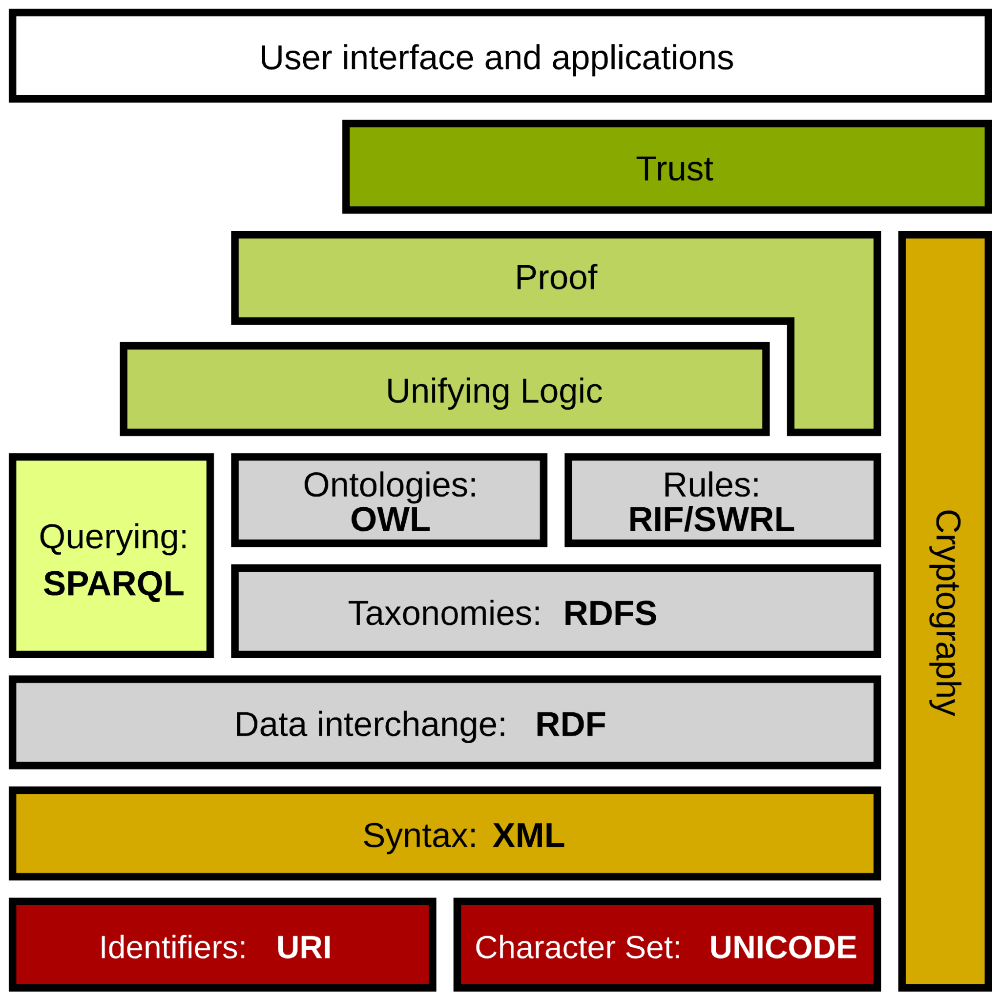

# Semantic Web

- A vision of *web of data* (as opposed to the *web of documents*)
	- Publishing machine-readable (or machine-understandable) data
- Basic concepts:
	- Knowledge representation -- Resource description framework (RDF)
	- Shared conceptualization -- ontologies
	- Agents -- service producers and consumers  

Berners-Lee, Tim, Hendler, James, et al. &ldquo;The Semantic Web : a new form of Web content that is meaningful to computers will unleash a revolution of new possibilities&rdquo; <em>Scientific American</em> 284 (2001) : 34-43

---

# Technical solution
- Developing appropriate data representation technologies
	- Possibility of sharing data together with its semantics
	- Applicable technologies have long been available
- Integration with the existing web
	- Annotation in web pages
	- Somewhat slow, but improving

---

# Web and the Semantic web
- World Wide Web (the Web)
	- Document as a basic unit
	- *Web of documents*
- Semantic Web
	- Data as a basic unit
	- *Web of Data*, *Linked data*

---

# Semantic web technology
- Standard web technology
	- HTTP, URI
- Means for knowledge representation
	- Data representation (facts)
		- XML, RDF, …
	- Sharing semantics
		- Ontologies
		- Languages for their explicit representation

---

# Semantic Web Stack

<!-- .slide: class="normal centered fullspace" -->
 <!-- .element: style="height:750px;margin:0;" -->
