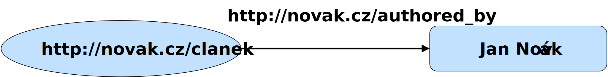
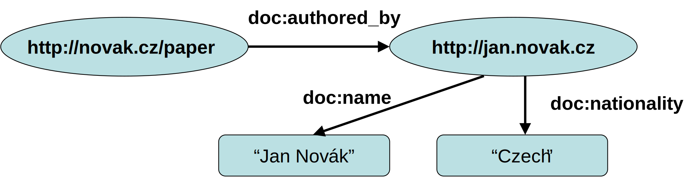

<!-- .slide: class="section" -->

<header>
	<h1>Semantic web data model – RDF</h1>
	<p>Facts representation and exchange</p>
</header>

---

# Objectives and means
- Objectives
	- Representation of structured data and its meaning (semantics)
	- Ability to share data and its semantics across applications
- Common data representation in IS:
	- Relational/object/NoSQL databases - bound to particular application
	- Public API + serialization (JSON, XML) - no semantics formally defined

---

# Data exchange - example

```xml
<flats>
	<item>
		<size>3 rooms + kitchen</size>
		<locality>Brno-střed</locality>
		<price currency="czk">8 200 000</price>
	</item>
	<item>
		<size>3 rooms</size>
		<locality>Valladolid</locality>
		<price currency="eur">342 500</price>
	</item>
</flats>
```

---

# Problems
- The meaning of the elements is specific to the application
	- It is defined in the program code that generates or reads serialized data
	- Similar to columns in a relational database
- Other applications may assign a different meaning to the same elements
	- E.g. `<size>2 rooms<size>` vs. `<size>55 sqm</size>`
- Data is machine readable but not machine understandable
- We need a more formal way of representing **facts** and their **semantics** (meaning)

---

# Representation of semantics
- Differentiating tags among applications
	- E.g. XML namespaces
	- Resolves tag collisions -- a syntactic problem
- Separate definition of tag meaning
	- E.g. an accompanying document explaining meaning and use cases
- We need to define semantic relationships
	- E.g. a flat is a thing that has location, size and price
- **Ontology**
	- Formal definition of *concepts* and their *relationships*.

---

# Representation of facts
- XML
	- Mapping elements to ontological concepts
	- Hierarchical structure only - restrictive
- RDF
	- A W3C standard
	- Abstract model
	- Graph structure
	- Can be written using XML or other languages

---

# RDF triple
- A **RDF triple** is a basic unit

**subject** – **predicate** – **object**

- a single *statement*.

---

# RDF triple – a statement
- **document X** *is authored by* **Mr. Y**  
	- Subject: **document X**
	- Predicate: *is authored by*
	- Object: **Mr. Y**
 
- The individual components *(resources)* are represented by **URIs** or **literals**.

---

# RDF statement (II)

<!-- .slide: class="normal centered fullspace" -->
 

---

# RDF Graph

 <!-- .element: style="height:300px;margin:1em auto;display:block" -->

- The RDF graph can be decomposed into subject - predicate - object triples 
- Subject and predicate are always **URIs**
	- `doc:` is a *URI prefix* that is expanded
	- E.g. `doc:name` => `http://my.docs.com/#name` 
- The object is a **URI** or **literal** (of different data types)

---

# Schema – an Ontology 

 <!-- .element: style="height:300px;margin:1em auto;display:block" -->

- RDF data can be linked to metadata (ontology, schema)
	- Using the `rdf:type` predicate
- Metadata definition using RDF again
	- It is possible (but not necessary) to combine data and metadata into a single graph.

---

# RDF data storage and transfer
- Saving to an RDF repository (e.g. RDF4J)
	- Decomposing into triples and storing in an internal structure
	- Possible querying (e.g. SPARQL language)
- Serialization and deserialization - several variants
	- RDF/XML (W3C standard)
	- N-triples (N3)
	- Turtle (subset of N3)

---

# Turtle serialization

```turtle
@prefix doc: <http://dokumenty.cz/def#> .
@prefix foaf: <http://xmlns.com/foaf/0.1/> . 

<http://novak.cz/paper>
	doc:authored-by <http://jan.novak.cz> .

<http://jan.novak.cz>
	doc:name "Jan Novák" ;
	doc:nationality "Czech" ;
	a foaf:Person .
```

 <!-- .element: style="height:200px;margin:1em auto;" -->
 <!-- .element: style="height:200px;margin:1em auto;" -->

---

# XML serialization

```xml
<rdf:RDF
    xmlns:rdf="http://www.w3.org/1999/02/22-rdf-syntax-ns#"
    xmlns:doc="http://dokumenty.cz/def#">
  
    <rdf:Description rdf:about="http://novak.cz/paper">
        <doc:authored-by
            rdf:resource="http://jan.novak.cz" />
    </rdf:Description>

    <rdf:Description rdf:about="http://jan.novak.cz">
        <doc:name>Jan Novák</doc:name>
        <doc:nationality>Czech</doc:nationality>
  	    <rdf:type
            rdf:resource="http://xmlns.com/foaf/0.1/Person" />
    </rdf:Description>

</rdf:RDF>
```

---

# RDF as a database
- Repository - RDF triples repository
- Querying - SPARQL language
- Local repository:
	- Virtuoso http://virtuoso.openlinksw.com/ 
	- RDF4J (formerly Sesame) http://rdf4j.org/ 
	- Blazegraph https://www.blazegraph.com/product/ 
- Global *knowledge bases*
	- DBPedia http://dbpedia.org
	- http://dbpedia.org/resource/Berlin
	- http://dbpedia.org/sparql 

---

# Querying – SPARQL 
- The query result may be
	- CSV (a table) – SELECT query
	- or a new RDF graph – CONSTRUCT query


```sparql
PREFIX rdf: <http://www.w3.org/1999/02/22-rdf-syntax-ns#>
PREFIX yago: <http://dbpedia.org/class/yago/>
PREFIX dbpedia-owl: <http://dbpedia.org/ontology/>
PREFIX dbprop: <http://dbpedia.org/property/>
SELECT ?place ?name ?label WHERE {
    ?place rdf:type dbpedia-owl:Country .
    ?place dbprop:commonName ?name .
    ?place rdfs:label ?label .
   OPTIONAL {?place dbprop:yearEnd ?yearEnd}
   FILTER (!bound(?yearEnd))
}
```

---

# Public knowledge bases
- DBPedia http://dbpedia.org
	- http://dbpedia.org/resource/Berlin
	- http://dbpedia.org/sparql 
- Wikidata http://wikidata.org 
	- http://wikidata.org/entity/Q42 
- Many others
	- Can be linked together using URIs
	- *Linked open data*
	- http://lod-cloud.net/
