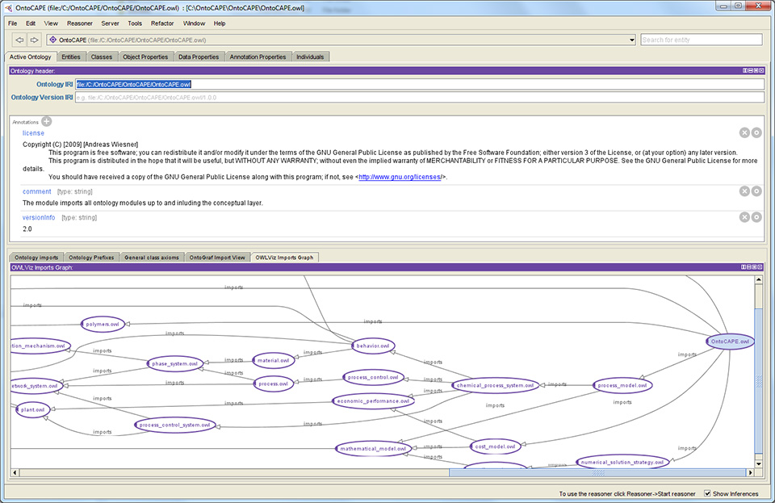

<!-- .slide: class="section" -->

<header>
	<h1>Ontologies</h1>
	<p>Dictionaries for the semantic web</p>
</header>

---

# The notion of ontology
- Originally, more general meaning (philosophy)
- A means of sharing the meaning of concepts that occur in the target domain
- _"Formal, explicit specification of a shared conceptualization"_
- Defines the basic concepts of the modeled world and the relationships among them
- **Shared** and **reusable**

---

# Purpose of ontologies
- Understanding between people (experts)
- **Understanding between computer applications**
	- **Giving meaning to individual URIs in the Semantic Web**
	- Ability to **integrate** data from different sources
- Design of knowledge-based applications

---

# Types of ontologies
- Terminological (lexical)
	- Concepts and their relationships (taxonomy)
	- E.g. _WordNet_
- Generic ontologies
	- Regularities and relationships between generic concepts
	- ``Upper ontology'', e.g. SUMO
- Domain ontologies
	- Domain specific (e.g. enterprise, medical, ...)
- Application ontologies
	- For a specific application

---

# Ontology members
- **Classes (concepts)**
- **Individuals (objects, instances)**
- **Properties (roles, attributes)**
- Meta-slots (facets)
- Primitive data types
- Axioms (rules)

---

# Concepts -- classes
- Sets of specific objects
- No procedural methods
- Inheritance of classes (often multiple)

---

# Individuals – objects – instances
- Concrete real world objects
- An individual is not necessarily an instance of a class
- Due to the purpose of ontologies, they are not used often
	- They represent specific data

---

# Relations – attributes – slots – properties
- Property = relation
	- A separately defined element
	- Usually a binary relation
- Possible inheritance of relations (has father, has ancestor)
	- Parent relation contains all elements of the child relation
- A function -- a specific relation
	- Value of argument _n_ uniquely determined by the previous _n-1_ arguments

---

# Primitive values, data types
- The relation argument can be a _primitive value_ (not an object)
	- Number, string, enumeration value, ...
	- *Datatype property* vs. *object property*
- We can consider datatype classes (data types) and datatype instances (values)
- We usually declare datatype slots as functional (they have only one value)

---

<!-- .slide: class="section" -->

<header>
	<h1>Ontological languages</h1>
	<p>RDF Schema, OWL</p>
</header>

---

# RDF Schema
- Provides basic elements for the description of ontologies
	- Actually a (meta) **ontology**
- Provides a vocabulary for defining
	- Classes
	- Binary relations (domain, range)
	- Class and property hierarchy
- RDF statements are used for defining the ontology
	- Containing the concepts and properties from RDFS
- Namespace (usually the **rdfs** prefix)\
`http://www.w3.org/2000/01/rdf-schema#` 

---

# Classes
- A class is assigned to a resource using `rdf:type`
	- `school:Person rdf:type rdfs:Class`
- Sub-classes
	- E.g. `school:Student rdfs:subClassOf school:Person`

---

# Properties in RDFS
- Properties are instances of `rdfs:Property`
	- `school:hasRegistered rdf:type rdfs:Property`
- **rdfs:Range** – object range
	- `school:hasRegistered rdfs:range school:Course`
- **rdfs:Domain** – subject range (domain)
	- `school:hasRegistered rdfs:domain school:Student`
- `rdfs:subPropertyOf`
	- a sub-property

---

# OWL
- Additional properties in addition to RDFS
- Complete ontology definitions
- Namespace `http://www.w3.org/2002/07/owl#` 

---

# Classes in OWL
- Possible combinations with RDFS
- A class can be defined using
	- Class identifier (no elements)
	- An enumeration of elements (instances)
	- By restricting properties
	- Unification or intersection of two or more classes
	- Complement

---

# Class definition by identifier

Turtle
```turtle
foaf:Person rdf:type owl:Class .
```

---

# In Turtle (icluding prefixes)

```turtle
@prefix rdf: <http://www.w3.org/1999/02/22-rdf-syntax-ns#> .
@prefix owl: <http://www.w3.org/2002/07/owl#> .
@prefix foaf:<http://xmlns.com/foaf/0.1/>.

foaf:Person rdf:type owl:Class .
foaf:Person a owl:Class .
```

---

# Definition by complement

```xml
<owl:Class>
  <owl:complementOf>
    <owl:Class rdf:about="#Student"/>
  </owl:complementOf>
</owl:Class>
```

---

# Other class operators
- `owl:equivalentClass`
	- An equivalent class (e.g. from another ontology)
- `owl:disjointWith`
	- Disjoint class třída

---

# Property definition
- RDFS constructors
	
```xml
<owl:ObjectProperty rdf:ID="studies">
  <rdfs:domain rdf:resource="#Student"/>
  <rdfs:range rdf:resource="#Branch"/>
</owl:ObjectProperty>
```

- Property relationships
	- `owl:equivalentProperty` – same values
	- `owl:inverseOf` – inverse property

```xml
<owl:ObjectProperty rdf:ID="hasStudent">
	<owl:inverseOf rdf:resource="#studies"/>
</owl:ObjectProperty>
```

---

# Data-type properties
- RDF Literals
- XSD (XML Schema) data types
	- Namespace `http://www.w3.org/2001/XMLSchema` 

- `xsd:string`, `xsd:normalizedString`, `xsd:boolean`, `xsd:decimal`,  `xsd:float`, `xsd:double`, `xsd:integer`, `xsd:nonNegativeInteger`  `xsd:positiveInteger`, `xsd:nonPositiveInteger`, `xsd:negativeInteger`, `xsd:long`, `xsd:int`, `xsd:short`, `xsd:byte`,   `xsd:unsignedLong`, `xsd:unsignedInt`, `xsd:unsignedShort`, `xsd:unsignedByte`, `xsd:hexBinary`, `xsd:base64Binary`, `xsd:dateTime`, `xsd:time`, `xsd:date`, `xsd:gYearMonth`, `xsd:gYear`, `xsd:gMonthDay`, `xsd:gDay`, `xsd:gMonth`, `xsd:anyURI`, `xsd:token`, `xsd:language`, `xsd:NMTOKEN`, `xsd:Name`, `xsd:NCName`
<!-- .element style="font-size: 80%"  -->


---

# Protegé editor
	
http://protege.stanford.edu/




---

# Existing ontologies
- Emphasis on maximum use of existing ontologies
	- It is possible to combine concepts and properties from different ontologies
- Overview
	- https://lov.linkeddata.es/dataset/lov/

---

# Dublin core
- Document metadata
- Defines the properties of documents:

```xml
<rdf:Description rdf:about="http://www.w3schools.com">
   <dc:description>W3Schools</dc:description>
   <dc:publisher>Refsnes Data as</dc:publisher>
   <dc:date>2008-09-01</dc:date>
   <dc:type>Web Development</dc:type>
   <dc:format>text/html</dc:format>
   <dc:language>en</dc:language>
 </rdf:Description>
```

---

# Friend-of-a-friend (FOAF)
- Ontology for describing persons and their relationships http://www.foaf-project.org/
- Classes for describing persons
	- `foaf:Agent`, `foaf:Person`, ...
- Properties
	- `foaf:name`, `foaf:knows`, ...

---

# FOAF example

```turtle
@prefix foaf:<http://xmlns.com/foaf/0.1/>.
@prefix dbr:<http://dbpedia.org/resource>.

dbr:Luke_Skywalker foaf:knows dbr:Han_Solo .
dbr:Luke_Skywalker foaf:name "Luke Skywalker" .
```

---

# SKOS
- Simple Knowledge Organization System
- Allows the organization of concepts in a domain
	- Concept definition
	- Relationships between them: broader, narrower, related, ...
	- ...

---

# Schema.org
- Primarily for web page annotation
	- https://schema.org
- Basic dictionaries for different domains
	- https://schema.org/docs/gs.html#schemaorg

---

# Other ontologies
- Music ontology
	- http://musicontology.com/
- Event ontology
	- http://motools.sourceforge.net/event/event.html 
- Time ontology
	- http://www.w3.org/TR/2006/WD-owl-time-20060927/ 
- Geo ontology
	- http://www.w3.org/2003/01/geo/

---

# Ontologies and RDF knowledge bases
- DBPedia.org
	- Its own ontology + reusing the existing ones
	- http://dbpedia.org/resource/Berlin
	- http://dbpedia.org/page/Novak_Djokovic 
- E.g.
	- [Birth place property](http://dbpedia.org/ontology/birthPlace)
	- [Wikidata equivalent](https://www.wikidata.org/wiki/Property:P19) 

