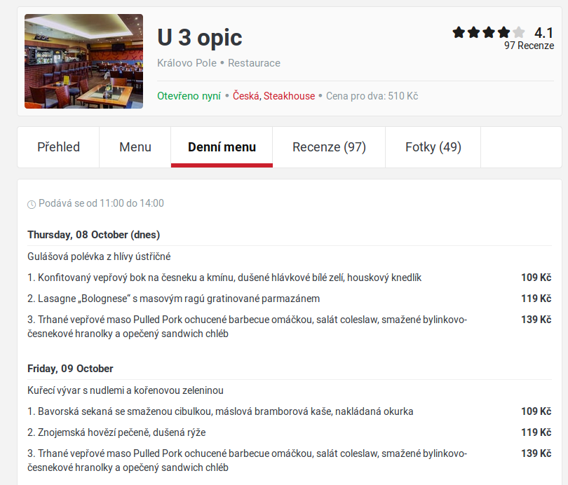

# Motivation

- **There's a lot of data on the web** ||burried in web pages||
- ?? We need to further process this data in computer applications
	- ??Linking to your own data
	- ??Aggregation -- combining results from different sources
	- ??Analysis -- statistics, knowledge discovery
	- ??... and many more
- ?? We need **structured data**
	- That can be stored in relational database tables
	- or at least XML, JSON, etc. *with a fixed structure*

---

# Data on the Web
- Web pages are not strongly structured
- Mostly in HTML
	- *Visual presentation* is the primary goal
	- The code is secondary, *only implements the primary goal*
	- Not intended for further processing (only for browsing)

---

# The presentation and the code
 <!-- .element: style="height:700px;float:left;margin-right:2em" -->

[Source page](https://www.zomato.com/cs/brno/u-3-opic-kr%C3%A1lovo-pole-brno-sever/denn%C3%AD-menu)

@@div class="fragment" style="position: absolute; font-size: 50%; top: 0; right: 0; width: 50em; max-height: 50%;"@@
```html
<div class="restab_wrap">

                    <div id="tabtop" class="tabcontent-wrapper brstd  daily-menu ">
                <div class="ui segment"><div id="menu-container" class="relative">            <div class="clear"></div>
                <div id="daily-menu-container" data-supertab-menu-type = "daily-menu" class="supertab-data-container ">
                <div class="menu-preview  mt10" id="menu-preview">
                                                
                                                        <div class="dm-serving-time mbot0" data-icon="c">Podává se od 11:00 do 14:00</div>
                
                <div class="tmi-groups">
                                                                                                                                                            
                                                                                                                                                                
                                                
                                                <div class="tmi-group  mtop">
                                                            <div class="tmi-group-name bold fontsize3 pb5 bb">
                                    Thursday, 08 October (dnes)
                                </div>
                            
                                                                            
                                                        
                            <div class="tmi tmi-daily pb5 pt5  ">
                                <div class="tmi-text-group col-l-14 col-s-14">
                                    <div class="row">
                                        <div class="tmi-name">
                                            Gulášová polévka z hlívy ústřičné
                                        </div>
                                                                            </div>
                                </div>
                                <div class="tmi-price ta-right col-l-2 col-s-2 bold600">
                                    <div class="row">
                                        
                                    </div>
                                </div>
                                <div class="clear"></div>
                            </div>
                                                    
                                                        
                            <div class="tmi tmi-daily pb5 pt5  ">
                                <div class="tmi-text-group col-l-14 col-s-14">
                                    <div class="row">
                                        <div class="tmi-name">
                                            1. Konfitovaný vepřový bok na česneku a kmínu, dušené hlávkové bílé zelí, houskový knedlík
                                        </div>
                                                                            </div>
								</div>
```
@@/div@@

---

# More data sources

- Commercial
	- e-shops||, real estate servers||||, flight tickets||||, sports results||||, competition monitoring||
- ?? Search results
	- E.g. position monitoring
- ?? Public registers
	- time tables
	- trade register
	- websites of municipal councils
- ?? Advertisement monitoring
- ?? @@span class="large" style="line-height:0.5; vertical-align:top;" @@ &#8734; @@/span@@ more

---

# Partial problems

- Source data acquisition
	- How to download the necessary documents from the WWW (so that they contain what they are supposed to?)
	- Parallelization
- **Data identification and extraction**
	- Identification of the requested data in the page
- Storage of results <!-- .element: class="grey" -->
	- There can be **a lot** of them. 

---

# Architecture

Basic architecture

 <!-- .element: width="100%" -->
