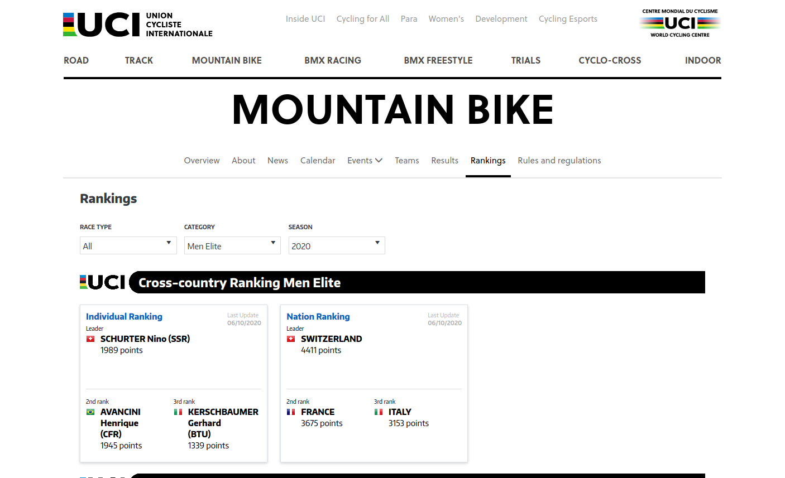
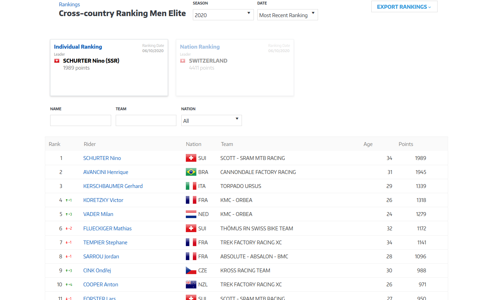

# Shell is your friend

Motivation: [Evolution of a programmer](https://cgg.mff.cuni.cz/~semancik/cvika/programmer.html)

Before we start programming:
- `wget`, `curl`
- `cat`, `grep`, `sed`, `cut`
- `awk` (for true geeks :-)

```bash
wget https://www.fit.vut.cz/study/courses/ -O out.html
cat out.html | grep 'list-links__link' | sed 's/<[^<>]*>/;/g' | sed 's/;;*/;/g' >data.csv
cat data.csv | cut -f2 -d';'
```

```bash
wget https://www.fit.vut.cz/study/courses/ -O - | grep 'list-links__link' | sed 's/<[^<>]*>/;/g' | sed 's/\;;*/;/g' | cut -f2 -d';'
```

---

# The same in python3

```python
import urllib.request
import re

fid = urllib.request.urlopen('https://www.fit.vut.cz/study/courses/')
webpage = fid.read().decode('utf-8')
for line in webpage.split('\n'):
    if ('list-links__link') in line:
        line = re.sub(r"<[^<>]*>", ";", line);
        line = re.sub(r";;*", ";", line);
        print(line)
```

---

# Java

```java
import java.io.*;
import java.net.*;

public class Courses {
	
	public static void main(String[] args) {
		try {
			URL url = new URL("https://www.fit.vut.cz/study/courses/");
			HttpURLConnection con = (HttpURLConnection) url.openConnection();
			
			BufferedReader in = new BufferedReader(
					  new InputStreamReader(con.getInputStream()));
			
			String line;
			while ((line = in.readLine()) != null) {
			    if (line.contains("list-links__link")) {
			    	line = line.replaceAll("<[^<>]*>", ";");
			    	line = line.replaceAll(";;*", ";");
			    	System.out.println(line);
			    }
			}
			in.close();
		} catch (Exception e) {
			e.printStackTrace();
		}
	}
}
```

---

# Limitations of the simple approach

 <!-- .element: style="height:600px" -->

[Source page](https://www.zomato.com/cs/brno/u-3-opic-kr%C3%A1lovo-pole-brno-sever/denn%C3%AD-menu) -- regex?!

---

# Limitations of the simple approach

 <!-- .element height="60%" width="60%" -->

[https://www.uci.org/mountain-bike/rankings](https://www.uci.org/mountain-bike/rankings) -- where is the data?

---

# Limitations of the simple approach

 <!-- .element height="60%" width="60%" -->

[https://www.uci.org/mountain-bike/rankings](https://www.uci.org/mountain-bike/rankings) -- always the same URL

---

# Limitations of the simple approach

 <!-- .element: style="display: block; margin: auto" -->

- A login form with a redirect (and possible protection against machine filling)
- Manageable but complicated
