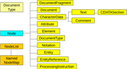

# Models of HTML documents

- Strings of characters
	- Easy implementation, speed, scalability
	- Regular expressions, HLRT wrappers
- Strings of tokens
	- A lexical analyzer recognizes tags, entities, text, etc.
	- HLRT wrappers
- Hierarchical models
	- Mostly DOM
	- Or its ``lightweight'' variants

---

# Wrapper

- Let us consider *n* data fields to be extracted from the document
- Different wrapper classes: LR, HLRT, ...
- HLRT wrapper:
	- **H**ead -- a substring before the data block
	- **L**eft -- left separator (for each data field)
	- **R**ight -- right separator (for each data field)
	- **T**tail -- a substring after the data block

`$$ wrapper = (h, t, l_1, r_1, l_2, r_2, \dots, l_n, r_n ) $$`

<p class="cite">
Nicholas Kushmerick:
<em>Wrapper induction: Efficiency and expressiveness,</em>
Artificial Intelligence,
Volume 118, Issues 1–2,
2000,
Pages 15-68,
ISSN 0004-3702
</p>

---

# Token strings

- Event-driven parsers, e.g. `html.parser` in python

```python
from html.parser import HTMLParser

class MyHTMLParser(HTMLParser):
    def handle_starttag(self, tag, attrs):
        print("Encountered a start tag:", tag)

    def handle_endtag(self, tag):
        print("Encountered an end tag :", tag)

    def handle_data(self, data):
        print("Encountered some data  :", data)

parser = MyHTMLParser()
parser.feed('<html><head><title>Test</title></head>'
            '<body><h1>Parse me!</h1></body></html>')
```

https://docs.python.org/3/library/html.parser.html

---

# Document Object Model

- HTML code is represented as a **tree of objects**
- Different object types

 <!-- .element: height="600px" -->

---

# HTML Element

- A section of a document content delimited by *tags*

```html
<p>Element content</p>

<div class="menu" id="mainmenu">
Element content<br> another content.
</div>

<div>Some <em>emphasized</em> text.</div>
```

- Always a single *root element*

---

# A DOM tree

- The root node of type `Document`
- It has a single `Element` child node ~ the Document element (root)
- Elements can have child nodes of different types
	- `Element` -- nested elements
	- `text` -- text content (leaf nodes)
	- other types in some cases (e.g. `Entity`)

---

# DOM navigation

- Standard methods of the `Document` and `Element` DOM classes
	- Element lookup: `getElementById()`, `getElementsByTagName()`
	- Tree navigation: `parentNode`, `childNodes`, ...
	- Reading the content: `textContent`
- CSS selectors
	- They address a *set of elements*
	- `#main header .info`
- XPath
	- They address a *set of elements* too
	- `*[@id="main"]//table/tr[position() > 3]`

---

# XPath

- Originally for XML documents, but also supported by some HTML libraries
- More complex syntax than CSS, but more options:
	- A generic expression for element properties in `[]` including attribute values, element order, and more
	- Navigation in different directions (``axis'')
- See e.g. [MDN Documentation](https://developer.mozilla.org/en-US/docs/Web/XPath/Introduction_to_using_XPath_in_JavaScript)

```javascript
var res = document.evaluate('//head/title', document.documentElement,
	null, XPathResult.ANY_TYPE, null);
console.log(res.iterateNext().textContent);

```

---

# Practical use of DOM

- A full-featured HTML 5 DOM parser is hard to find
	- Basically only in the web browser
- In practice, often simplified parsers with their own interface
	- Python: [BeautifulSoup](https://www.crummy.com/software/BeautifulSoup/bs4/doc/)
	- Java: [jSoup](https://jsoup.org/)
	- JavaScript: [cheerio](https://cheerio.js.org/)

---

# BeautifulSoup

```python
from bs4 import BeautifulSoup
from urllib.request import urlopen

page = urlopen("https://www.fit.vut.cz/study/courses/")
html = page.read().decode("utf-8")
soup = BeautifulSoup(html, "html.parser")
rows = soup.select("#list")[0].find_all("tr")
for row in rows:
    cells = row.find_all('td')
    out = "";
    for cell in cells:
        out = out + cell.text + ";"
    print(out)
```

---

# jSoup

```java
Document doc = Jsoup.connect("https://en.wikipedia.org/").get();
log(doc.title());
Elements newsHeadlines = doc.select("#mp-itn b a");
for (Element headline : newsHeadlines) {
  log("%s\n\t%s", 
    headline.attr("title"), headline.absUrl("href"));
}
```

- It also provides a subset of the standard DOM interface

---

# cheerio

```javascript
const cheerio = require('cheerio');
const request = require('request');

request({
    method: 'GET',
    url: 'https://www.fit.vut.cz/study/courses/'
}, (err, res, body) => {
    let $ = cheerio.load(body);

    let rows = $('#list tr');
    rows.each(function(i, tr) {
        let line = '';
        $(this).children().each(function(j, td) {
            line += $(this).text() + ';';
        })
        console.log(line);
    });
});
```
