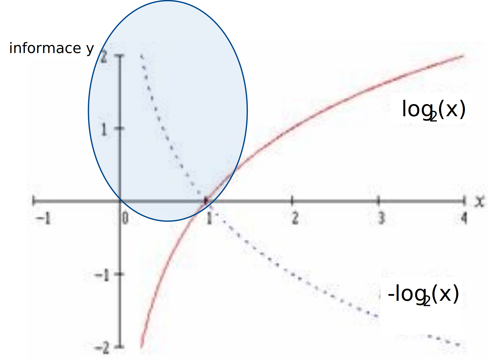
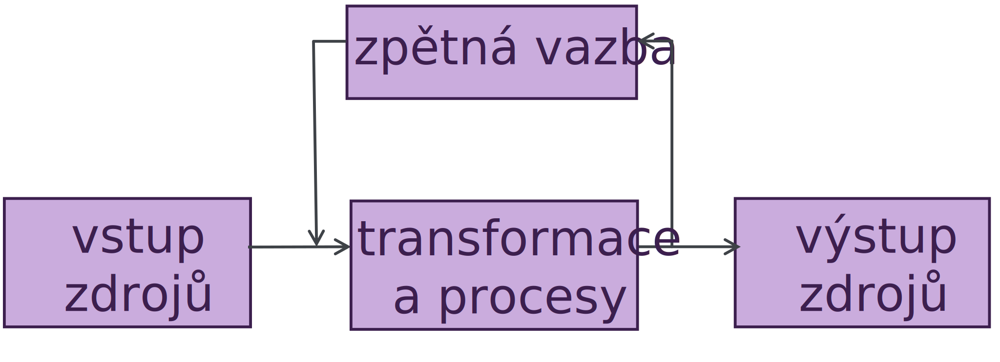
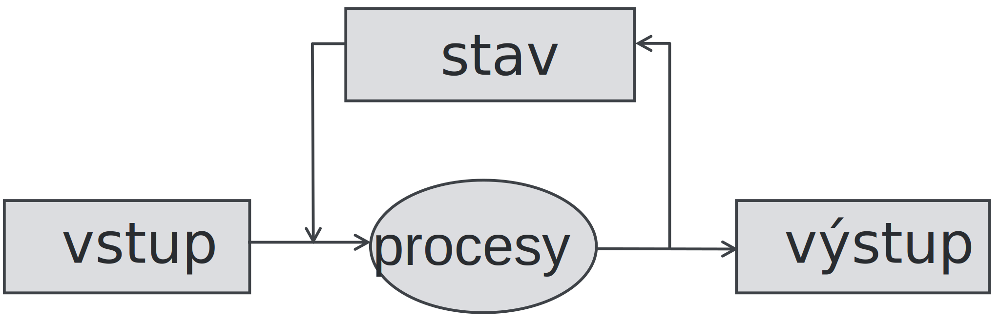
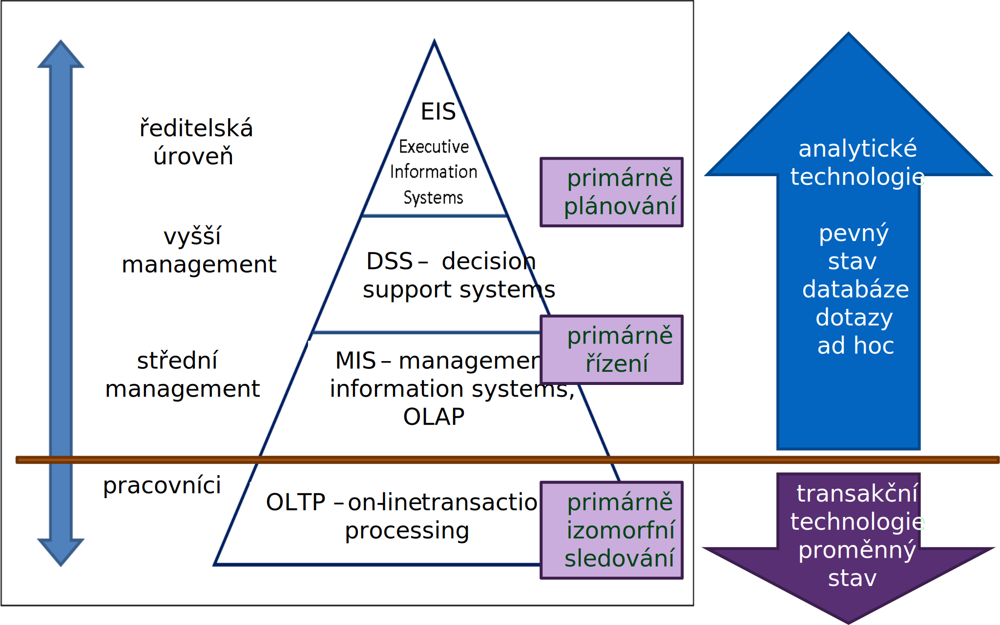

<!-- .slide: class="section" -->

<header>
	<h1>Informační systém</h1>
	
Systémy, informace a jak to souvisí

</header>

---
# Pojmy v názvu informační systém
- Informační
	- Abychom název vůbec pochopili, bylo by dobré si ujasnit a definovat, co je to _informace_
- Systém 
	- Z podobných důvodů by tedy bylo dobré si definovat systém

---

<!-- .slide: class="section" -->

<header>
	<h1>Pojem informace</h1>
</header>

---

# Informace z hlediska kybernetiky
- Zpráva o objektivní realitě, která funguje jako zpětná vazba systému 
- Proces, kdy určitý systém předává jinému systému pomocí signálů zprávu, která nějakým způsobem mění stav přijímacího systému 

---

# Informace z hlediska přírodních věd
- Energetická veličina, jejíž hodnota je úměrná _zmenšení entropie_ systému 
- Poznatek, který omezuje nebo _odstraňuje nejistotu_ týkající se výskytu určitého jevu z dané množiny možných jevů 
- Teorie informace – Claude Shannon
	- $H = -\sum p_i \log_2 p_i $
	- $I = H(výchozí\ stav) - H(cílový\ stav)$

---

# Příklad: hod kostkou
- Padne jakékoliv číslo:
	- $p_i = 0,1666$
	- $H = -6 \times (0,1666 \times \log_2 0,1666) = 2,58$ bitu
	- (tzn. tři bity nám bohatě stačí na zakódování informace o výsledku hodu)
- Padne číslo dělitelné třemi:
	- $p_i = 0,5$
	- $H = -2 \times (0,5 \times \log_2 0,5) = 1$ bit
- Informace $I = 2,58 - 1 = 1,58$ bitu

---

# Graf funkce -log2(x)
<!-- .slide: class="normal centered fullspace" -->
 <!-- .element: style="height:800px;margin:0;" -->

---

# Informace z hlediska IT
- Za informaci se považuje _interpretované_ kvantitativní vyjádření obsahu zprávy 
- Jednotkou informace je interpretované rozhodnutí mezi dvěma alternativami (0, 1) a vyjadřuje se jednotkou nazvanou _bit_

---

<!-- .slide: class="section" -->

<header>
	<h1>Data -- informace -- znalosti</h1>
</header>

---

# Data
- Hodnota schopná přenosu, uchování, interpretace či zpracování
- Z hlediska IT jde o _hodnoty_ různých _datových typů_
- Data sama o sobě _nemají sémantiku_ (význam), jsou to věty nějakého formálního jazyka
	- Viz pojem _databáze_
- Hodnoty dat obvykle udávají _stav_ nějakého systému

---

# Informace
- _Informace_ jsou interpretovaná data
- Mají _sémantiku_ (význam)
- Transformaci dat na informace neprovádí informační systém, ale _uživatel_
	- Systém ukládá a transformuje _data_
	- Pro uživatele výsledek znamená _informaci_
- Je nezbytné zajistit shodnou interpretaci dat u všech uživatelů informace
	- Vzdělání, školení, zavedení konvencí

---

# Příklad rozdílné interpretace dat
- Údaj 10-12-2005
	- V Evropě informace 10. prosince 2005
	- V USA informace 12. října 2005

- Pro totožná data vznikne _rozdílná informace_ jinou _interpretací_ dat
- Podobně např. jméno a příjmení

---

# Znalost
- Informace zařazená do souvislostí
- Jejich interpretace je však ještě hůře definovatelná, neboť může jít o celé shluky informací
- Znalosti chápeme často jako _sekundární odvozené_ _informace_ 
- Některé informační systémy se zabývají pouze _informacemi (transakční)_, některé pracují se _znalostmi (pro podporu rozhodování a plánování)_
- Problematika _získávání znalostí z dat_ (knowledge discovery, data mining)
	- Předmět [Získávání znalostí z databází](https://www.fit.vut.cz/study/course/ZZN/) (ZZN)

---

# Příklad: jízdní řád

<!-- .slide: class="normal centered fullspace" -->
 <!-- .element: style="height:800px;margin:0;" -->

---

<!-- .slide: class="section" -->

<header>
	<h1>Systém</h1>
</header>

---

# Systém
- _Systém_ lze chápat jako množinu prvků a vazeb mezi nimi, které jsou definovány na nějakém _nosiči_
- Nosičem je tedy _množina_ _prvků_ _systému_ ve vzájemných vztazích 
- Prvky nosiče nazýváme _zdroje_

---

# Obecné schéma systému
<!-- .slide: class="normal centered fullspace" -->
 <!-- .element: style="height:400px;margin:0;" -->

---

# Stav systému
- Zpětná vazba může reprezentovat _stav systému_ (sekvenční systémy), výstup pak záleží na vstupu a stavu systému
- _Stavem systému_ jsou _hodnoty_ _zdrojů_

---

# Typické nosiče
- _Fyzické_ (materiální)
	- osoby (HR- Human Resources),
	- materiál,
	- stroje včetně zařízení a energie,
	- finance a
- _Konceptuální_ (pojmové)
	- _informace_

---

# Dělení systémů podle typů nosiče
- _Fyzické_ --  s nosičem s fyzickými zdroji (např. obchodní firma),
- _Informační_ -- s nosičem s konceptuálními zdroji, tedy _informacemi_ (zde se poprvé dostáváme k tomu, co je to _informační systém_)
- Informační systém obvykle modeluje (reprezentuje) nějaký fyzický systém

---

<!-- .slide: class="section" -->

<header>
	<h1>Informační systém</h1>
</header>

---

# Schéma informačního systému

 <!-- .element: style="height:350px;margin:1em auto;display:block" -->

- Modifikované schéma obecného systému 
- Data uchovávající _stav_ systému a
- _Procesy_ realizující transformace často ve formě _transakcí_

---

# Stav informačního systému
- Stavem informačního systému jsou hodnoty dat (typicky reprezentované pomocí nějakého _modelu_) a musíme se zabývat jejich 
	- _Persistencí_ (přetrváváním), 
	- _Konzistencí_ (splňování jistých pravidel o možných kombinacích hodnot údajů ve stavu) apod.

---

# Shrnutí pojmu informační systém
- Informační systém je _otevřený_ systém, jehož _nosič_ používá _konceptuální_ zdroje -- _informace_ 
- Nakládá s _nehmotnými zdroji_
- Nakládáním rozumíme provádění různých _transformací_ nad stavem na základě _vstupu_ a poskytování _výstupu_

---

# Informační systém jako model
- Informace _modelují skutečné zdroje jiného –_ obvykle _fyzického systému_ (např. podniku) 
- Informační systém tedy na nehmotné – virtuální úrovni _modeluje_ svůj fyzický vzor, pro jehož řízení je obvykle vytvářen. Vzhledem k tomu, že model nikdy _nemůže postihnout veškeré chování a vlastnosti svého vzoru_, je virtuální kopie pořizována vždy na vhodné úrovni _abstrakce_
 

---

# Návrh informačního systému

 <!-- .element: style="height:350px;margin:150px auto;display:block" -->

<ul>
<li><strong>S jakými daty pracujeme?</strong></li>
<li>Analýza domény, model, persistence, konzistence, …</li>
</ul>

<ul>
<li><strong>Jaké jsou k dispozici vstupy?</strong></li>
<li>Jak se informace pořizují, kdo je zadává?</li>
</ul>

<ul>
<li><strong>Jak mají vypadat výstupy?</strong></li>
<li>Aby to odpovídalo účelu systému?</li>
</ul>

<ul>
<li><strong>Jak je třeba data transformovat?</strong></li>
<li>Jaké jsou procesy a postupy v cílové doméně?</li>
</ul>

---

<!-- .slide: class="section" -->

<header>
	<h1>Klasifikace informačních systémů</h1>
</header>

---

# Podle podobnosti nosičů
- Existuje více podobných modelovaných fyzických nosičů, tj. existují podobné informační systémy. To vede k vzniku _typových projektů_:
	- **_geografie a zeměměřičství_** (spojení s počítačovou grafikou),
	- knihovna,
	- účetnictví zejména podvojné,
	- banka pokladna a platby,
	- mzdy a správa lidských zdrojů
	- majetek a odpisy,
	- pacienti a styk se zdravotními pojišťovnami.
- Takto členěné typové projekty bývají často i předmětem odděleného prodeje ve formě _modulů_ dodávaných jako části většího informačního systému

---

# Podle režimu činnosti
- Zpracování požadavků _v reálném čase_:
	- **_transakční zpracování_** (dnes nejobvyklejší, rezervace letenek, knihovny, pokladní systémy s platbou kartami),
	- technologické procesy (řízení výroby, diagnostika),
- _Dávkové_ zpracování dat (tradiční na střediskových počítačích, v bankovním sektoru tradičně přetrvávalo nejdéle) nyní spíše ustupuje.

---

# Podle datového typu dat
- _Číselné a textové_ (většina ekonomických i technologických informačních systémů, postupně se přidávají i multimediální údaje),
- _Speciální_ údaje – např. _geografické informační systémy_

---

# Podle úrovně rozhodování
- Klasické _pyramidové schéma_
- Odráží hierarchii úrovně rozhodování v organizaci:
	- Systém pro zpracování transakcí
	- Management information systems
	- Decision support systems
	- Executive information systems

---

# Pyramidové schéma

<!-- .slide: class="normal centered fullspace" -->
 <!-- .element: style="height:800px;margin:0;" -->

---

# OLTP – On-Line Transaction Processing
- Třída informačních systémů, které zpracovávají transakčně orientované aplikace
- Termín transakční je dvojznačný:
	- _databázové transakce_
	- _komerční (business) transakce_
- (mohou se ovšem překrývat)

---

# MIS - Management Information Systems
- Překládáme _Informační systémy pro podporu řízení_
- Poskytují informace, které jsou potřebné pro efektivní řízení organizace
- MIS je obecně užívány pro skupinu metod zpracování informací určených k automatizaci a podpoře rozhodování
- Nemusejí nutně pracovat nad aktuálním modelem fyzického systému (povoleno zpoždění)
- Nejčastěji jde o:
	- Systémy pro podporu rozhodování (DSS)
	- Expertní systémy (ES)
	- Informační systémy pro exekutivu (EIS)
	- OLAP (Online Analytical Procesing)

---

# A co dál?

 <!-- .element: style="height:350px;margin:150px auto;display:block" -->

<ul>
<li><strong>Databázové modely</strong>
	<ul>
	<li>Relační (SQL)</li>
	<li>Alternativní modely</li>
	</ul>
</ul>

<ul>
<li>HTML, XML, XSLT, JSON, …</li>
<li>HTTP, REST, …</li>
<li>PHP, transakce</li>
</ul>

