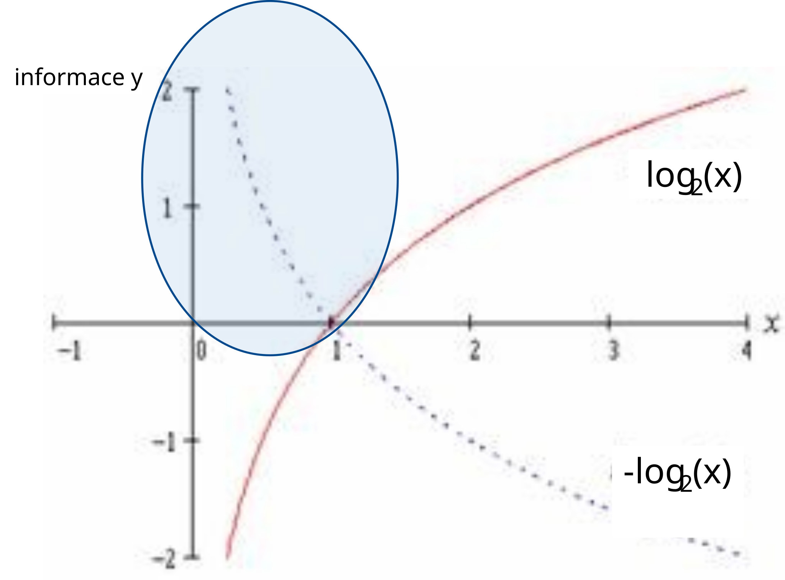
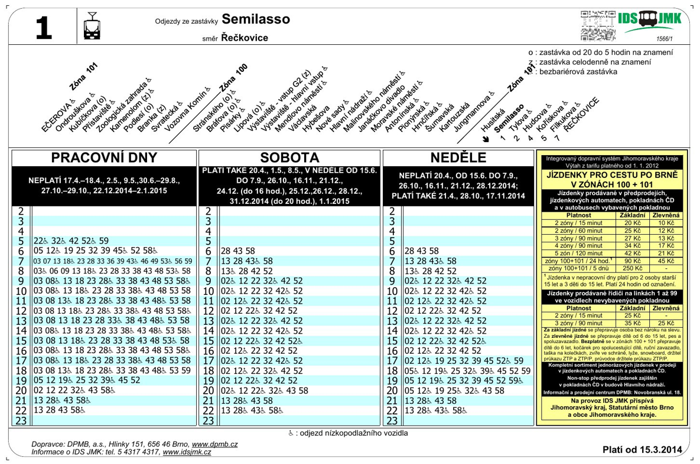
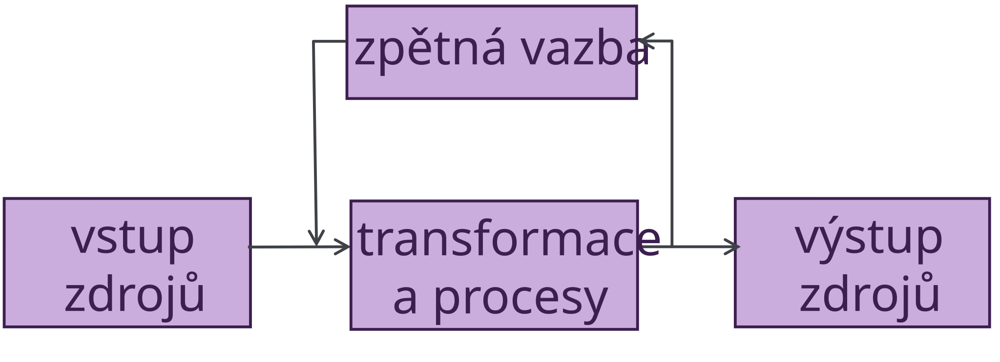
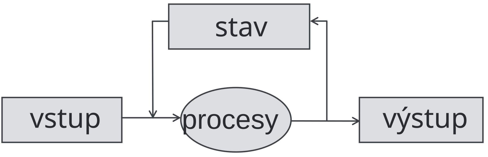
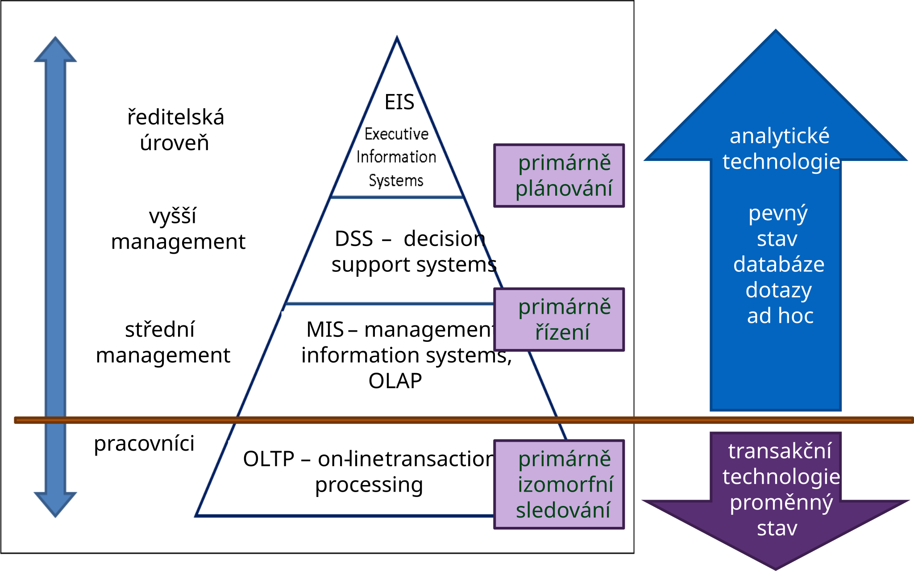

<!-- .slide: class="section" -->

<header>
	<h1>Informační systém</h1>
	
Systémy, informace a jak to souvisí

</header>

---

# Pojmy v názvu informační systém
- Informační
	- Abychom název vůbec pochopili, bylo by dobré si ujasnit a definovat, co je to _informace_
- Systém 
	- Z podobných důvodů by tedy bylo dobré si definovat systém

---

<!-- .slide: class="section" -->

<header>
	<h1>Pojem informace</h1>
</header>

---

# Informace z hlediska kybernetiky
- Zpráva o objektivní realitě, která funguje jako zpětná vazba systému 
- Proces, kdy určitý systém předává jinému systému pomocí signálů zprávu, která nějakým způsobem mění stav přijímacího systému 

---

# Informace z hlediska přírodních věd
- Veličina úměrná **zmenšení entropie** (neuspořádanosti) systému 
- Poznatek, který omezuje nebo **odstraňuje nejistotu** týkající se výskytu určitého jevu z dané množiny možných jevů 
- Teorie informace – Claude Shannon
	- $H = -\sum p_i \log_2 p_i $
	- $I = H(výchozí\ stav) - H(cílový\ stav)$

---

# Příklad: hod kostkou
- **Výchozí stav** -- může padnout libovolné z 6 čísel:
	- $p_i = 1/6 \doteq 0,167$
	- $H = -6 \times (0,167 \times \log_2 0,167) = 2,58$ bitu
	- (tzn. tři bity nám bohatě stačí na zakódování informace o výsledku hodu)
- **Cílový stav** -- víme, že padlo číslo dělitelné třemi (zbývají možnosti 3 a 6):
	- $p_i = 0,5$
	- $H = -2 \times (0,5 \times \log_2 0,5) = 1$ bit
- Získaná informace $I = 2,58 - 1 = 1,58$ bitu

---

# Graf funkce $-\log_2 x$
<!-- .slide: class="normal centered fullspace" -->
 <!-- .element: style="height:800px;margin:0;" -->

---

# Informace z hlediska IT
- Za informaci se považuje _interpretované_ kvantitativní vyjádření obsahu zprávy 
- Jednotkou informace je interpretované rozhodnutí mezi dvěma alternativami (0, 1) a vyjadřuje se jednotkou nazvanou **bit**

---

<!-- .slide: class="section" -->

<header>
	<h1>Data -- informace -- znalosti</h1>
</header>

---

# Data
- Hodnota schopná přenosu, uchování, interpretace či zpracování
- Z hlediska IT jde o hodnoty různých datových typů
- Data sama o sobě **nemají sémantiku** (význam), jsou to věty nějakého formálního jazyka
	- Viz pojem _databáze_
- Hodnoty dat obvykle udávají _stav_ nějakého systému

---

# Informace
- Informace jsou **interpretovaná data**
- Mají sémantiku (význam)
- Transformaci dat na informace neprovádí informační systém, ale **uživatel**
	- Systém ukládá a transformuje _data_
	- Pro uživatele výsledek znamená _informaci_
- Je nezbytné zajistit shodnou interpretaci dat u všech uživatelů informace
	- Vzdělání, školení, zavedení konvencí

---

# Příklad rozdílné interpretace dat
- Údaj 10-12-2005
	- V Evropě informace 10. prosince 2005
	- V USA informace 12. října 2005

- Pro totožná data vznikne **rozdílná informace** jinou _interpretací_ dat
- Podobně např. jméno a příjmení
- Řešením je dohodnutá konvence, např. ISO 8601: `2005-12-10`

---

# Znalost
- Informace zařazená do souvislostí
- Její interpretace je však ještě hůře definovatelná, neboť může jít o celé shluky informací
- Znalosti chápeme často jako _sekundární odvozené informace_ 
- Některé informační systémy se zabývají pouze _informacemi_ (transakční), některé pracují se _znalostmi_ (pro podporu rozhodování a plánování)
- Problematika získávání znalostí z dat (_knowledge discovery_, _data mining_)
	- Předmět [Získávání znalostí z databází](https://www.fit.vut.cz/study/course/ZZN/) (ZZN)

---

# Příklad: jízdní řád

<!-- .slide: class="normal centered fullspace" -->
 <!-- .element: style="height:800px;margin:0;" -->

---

<!-- .slide: class="section" -->

<header>
	<h1>Systém</h1>
</header>

---

# Systém
- **Systém** lze chápat jako množinu prvků a vazeb mezi nimi, které jsou definovány na nějakém **nosiči**
- Nosičem je tedy množina prvků, na nichž jsou vztahy definovány 
- Prvky nosiče nazýváme **zdroje**

---

# Obecné schéma systému
<!-- .slide: class="normal centered fullspace" -->
 <!-- .element: style="height:400px;margin:0;" -->

---

# Stav systému
- Zpětná vazba může reprezentovat _stav systému_ (sekvenční systémy), výstup pak záleží na vstupu a stavu systému
- **Stavem systému** jsou hodnoty zdrojů

---

# Typické nosiče
- **Fyzické** (materiální)
	- osoby (HR -- Human Resources),
	- materiál,
	- stroje včetně zařízení a energie,
	- finance
- **Konceptuální** (pojmové)
	- informace

---

# Dělení systémů podle typů nosiče
- **Fyzické** -- s nosičem s fyzickými zdroji (např. obchodní firma),
- **Informační** -- s nosičem s konceptuálními zdroji, tedy informacemi (zde se poprvé dostáváme k tomu, co je to _informační systém_)
- Informační systém obvykle modeluje (reprezentuje) nějaký fyzický systém

---

<!-- .slide: class="section" -->

<header>
	<h1>Informační systém</h1>
</header>

---

# Schéma informačního systému

 <!-- .element: style="height:350px;margin:1em auto;display:block" -->

- Modifikované schéma obecného systému 
- **Data** uchovávající stav systému a
- **Procesy** realizující transformace často ve formě _transakcí_

---

# Stav informačního systému
- Stavem informačního systému jsou hodnoty dat (typicky reprezentované pomocí nějakého _modelu_) a musíme se zabývat jejich 
	- **Persistencí** (přetrváváním), 
	- **Konzistencí** (splňování jistých pravidel o možných kombinacích hodnot údajů ve stavu) apod.

---

# Shrnutí pojmu informační systém
- Informační systém je _otevřený_ systém, jehož nosič používá **konceptuální zdroje** -- informace 
- Nakládá s nehmotnými zdroji
- Nakládáním rozumíme provádění různých **transformací** nad stavem na základě vstupu a poskytování výstupu

---

# Informační systém jako model
- Informace **modelují** skutečné zdroje jiného, obvykle _fyzického_ systému (např. podniku) 
- Informační systém tedy na nehmotné – virtuální úrovni modeluje svůj fyzický vzor, pro jehož řízení je obvykle vytvářen. Vzhledem k tomu, že model nikdy nemůže postihnout veškeré chování a vlastnosti svého vzoru, je virtuální kopie pořizována vždy na vhodné úrovni **abstrakce**
 

---

# Návrh informačního systému

 <!-- .element: style="height:350px;margin:150px auto;display:block" -->

<ul>
<li><strong>S jakými daty pracujeme?</strong></li>
<li>Analýza domény, model, persistence, konzistence, …</li>
</ul>

<ul>
<li><strong>Jaké jsou k dispozici vstupy?</strong></li>
<li>Jak se informace pořizují, kdo je zadává?</li>
</ul>

<ul>
<li><strong>Jak mají vypadat výstupy?</strong></li>
<li>Aby to odpovídalo účelu systému?</li>
</ul>

<ul>
<li><strong>Jak je třeba data transformovat?</strong></li>
<li>Jaké jsou procesy a postupy v cílové doméně?</li>
</ul>

---

<!-- .slide: class="section" -->

<header>
	<h1>Klasifikace informačních systémů</h1>
</header>

---

# Podle podobnosti nosičů
- Existuje více podobných modelovaných fyzických nosičů, tj. existují podobné informační systémy. To vede k vzniku **typových projektů**:
	- geografie a zeměměřičství (spojení s počítačovou grafikou),
	- knihovna,
	- účetnictví, zejména podvojné,
	- banka -- pokladna a platby,
	- mzdy a správa lidských zdrojů,
	- majetek a odpisy,
	- pacienti a styk se zdravotními pojišťovnami.
- Takto členěné typové projekty bývají často i předmětem odděleného prodeje ve formě **modulů** dodávaných jako části většího informačního systému

---

# Podle režimu činnosti
- Zpracování požadavků **v reálném čase**:
	- transakční zpracování (dnes nejobvyklejší, rezervace letenek, knihovny, pokladní systémy s platbou kartami),
	- technologické procesy (řízení výroby, diagnostika),
- **Dávkové** zpracování dat (tradičně na střediskových počítačích, nejdéle přetrvávalo v bankovním sektoru) -- dnes zejména v podobě ETL úloh a zpracování velkých objemů dat.

---

# Podle datového typu dat
- **Číselné a textové** (většina ekonomických i technologických informačních systémů, běžně i multimediální údaje),
- **Speciální** údaje – např. _geografické informační systémy_

---

# Podle úrovně rozhodování
- Klasické _pyramidové schéma_
- Odráží hierarchii úrovně rozhodování v organizaci:
	- Systémy pro zpracování transakcí (TPS)
	- Informační systémy pro podporu řízení (MIS)
	- Systémy pro podporu rozhodování (DSS)
	- Informační systémy pro exekutivu (EIS)

---

# Pyramidové schéma

<!-- .slide: class="normal centered fullspace" -->
 <!-- .element: style="height:800px;margin:0;" -->

---

# OLTP – On-Line Transaction Processing
- Třída informačních systémů, které zpracovávají transakčně orientované aplikace
- Termín transakční je dvojznačný:
	- databázové transakce
	- komerční (_business_) transakce
- (mohou se ovšem překrývat)

---

# MIS - Management Information Systems
- Překládáme _Informační systémy pro podporu řízení_
- Poskytují informace, které jsou potřebné pro efektivní řízení organizace
- Termín MIS je obecně užíván pro skupinu metod zpracování informací určených k automatizaci a podpoře rozhodování
- Nemusejí nutně pracovat nad aktuálním modelem fyzického systému (povoleno zpoždění)
- V širším pojetí se pod pojem MIS řadí i navazující kategorie:
	- Systémy pro podporu rozhodování (DSS)
	- Expertní systémy (ES)
	- Informační systémy pro exekutivu (EIS)
	- OLAP (On-Line Analytical Processing)

---

# A co dál?

 <!-- .element: style="height:350px;margin:150px auto;display:block" -->

<ul>
<li><strong>Databázové modely</strong>
	<ul>
	<li>Relační (SQL)</li>
	<li>Alternativní modely</li>
	</ul>
</ul>

<ul>
<li>HTML, XML, XSLT, JSON, …</li>
<li>HTTP, REST, …</li>
<li>PHP, transakce</li>
</ul>

