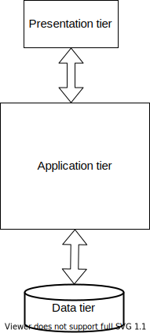

# Architektury – uložení a zpracování dat
- Centrální informační systémy
- Lokální síť
- Klient-server
- Monolitické architektury
	- Třívrstvá architektura
- Distribuované informační systémy
	- Architektury založené na službách

---

# Centrální informační systémy
- Centrálního počítač (_mainframe_) s databází a aplikacemi
- Aktivace aplikačních programů z terminálů (_pracovních stanic_)
- Z hlediska architektury není použita síťová komunikace (není klient)

 
<!-- .element: style="text-align:center" -->

---

# Lokální síť
- Zavedení lokálního klienta (osobní počítač -- PC)
- Aplikace na PC, databáze na speciálním serveru v rámci lokální sítě

<!-- .element: style="text-align:center" -->

---

# Lokální síť
- Není použita globální síť a standardní protokoly Internetu a TCP-IP
- Snížení rychlosti přenosů, bezpečnosti a zabezpečení integrity
- Vstupuje otázka **_izolovanosti transakcí_**, tj. možnosti **_víceuživatelského přístupu_**

---

# Architektura klient-server (dvouvrstvá)
- Užity dva druhy oddělených výpočetních systémů **_klient_** a **_server_**.
- **_Tloušťka_** klienta odpovídá jeho "**_inteligenci"_**

<!-- .element: style="text-align:center" -->

---

# Architektura klient-server
- Na nižší úrovni použita síťová komunikace standardizovaná protokoly Internetu TCP/IP
- Chování klienta a serveru rovněž standardizováno
	- Server specializovaný pro databázové dotazy
	- Po síti se přenášejí pouze dotazy a výsledky
- Ve vyšších vrstvách aplikačních protokolů se nejčastěji komunikuje **_serializovanými daty_**, případně v SQL

---

# Třívrstvá architektura
- _(three-tier architecture)_ 
- **Prezentační vrstva** – **vizualizuje** informace pro uživatele, většinou formou grafického uživatelského rozhraní, může kontrolovat zadávané vstupy, neobsahuje však zpracování dat
- **Aplikační vrstva** – jádro aplikace, logika a funkce, výpočty a zpracování dat
- **Datová vrstva** – nejčastěji databáze. Může zde být ale také (síťový) souborový systém, webová služba nebo jiná aplikace.

---

# Terminologická odbočka
- **Tier** – fyzická vrstva – jednotka nasazení (deployment)
	- Fyzické členění systému – klient, aplikační server, DB server
	- Tomu odpovídá volba technologií pro realizaci jednotlivých částí
- **Layer** – logická vrstva – jednotka organizace kódu
	- Obvykle řešena v rámci aplikační vrstvy
	- _Data_ _layer_ – část řešící komunikaci s databází
	- _Business_ _layer_ – část implementující logiku aplikace
	- _Presentation_ _layer_ – komunikace s klientem

---

# Schéma třívrstvé architektury
<!-- .slide: class="normal centered fullspace" data-transition="slide-in fade-out" -->

 <!-- .element: style="height:750px;margin:0;" -->

Database server 
(MySQL, Oracle, ...)

Web browser

Application server 
(PHP, Java, .NET, ...)

HTTP 
(přenos dat, serializace)

SQL 

---

# Schéma třívrstvé architektury (II)
<!-- .slide: class="normal centered fullspace" data-transition="fade-in slide-out" -->

 <!-- .element: style="height:750px;margin:0;" -->

PHP, Java, .NET, ... 
Různá rámcová řešení (framework)

Tenčí nebo tlustší klient v prohlížeči

Datový model (objektový, relační, ...)

---

# Distribuované architektury
- Monolitický systém (typické pro třívrstvou architekturu)
	- Vyvíjí se a nasazuje jako jeden celek
	- \+ snáze zvládnutelný vývoj, testování
	- \- obtížnější a pomalejší nasazování nových verzí
- Distribuované architektury
	- Service-oriented architecture (SOA)
	- Microservices (mikroslužby)
	- Spíše řešeno v rámci Pokročilých informačních systémů

---

# Mikroslužby
- Aplikace je rozdělena na malé části
	- Vlastní databáze (nepřístupná vně)
	- Business logika
	- Aplikační rozhraní (sítové)
- Typicky malý tým vývojářů na každou část (2 pizzas rule)
- Nasazují se odděleně
- \+ Technologická nezávislost, rychlé aktualizace
- \- Testovatelnost, režie komunikace, riziko nekompatibility, řetězové selhání, …
