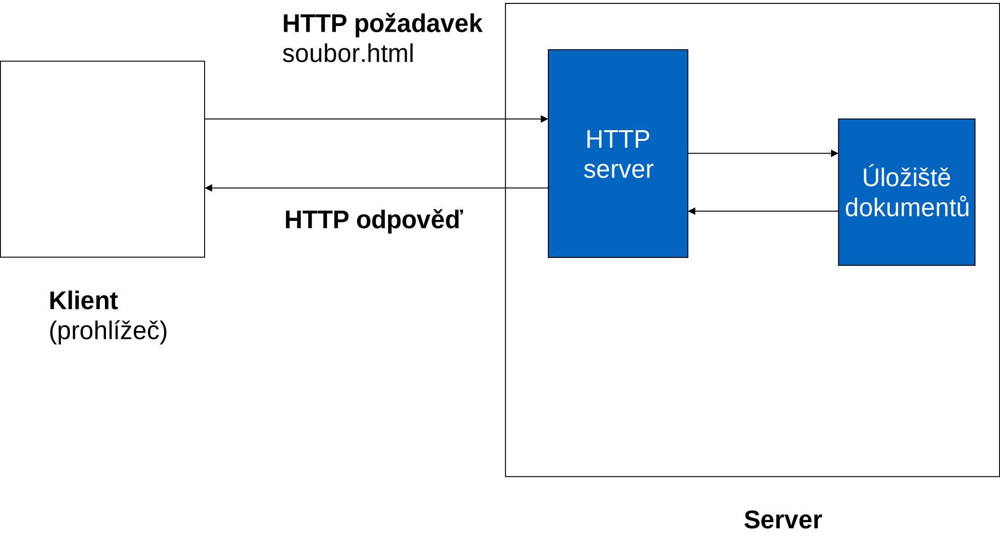
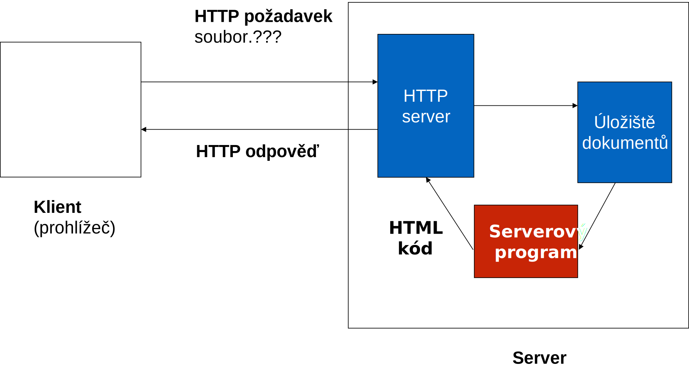
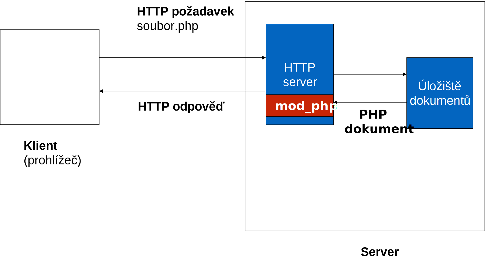
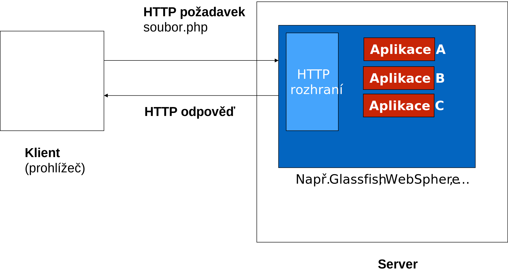
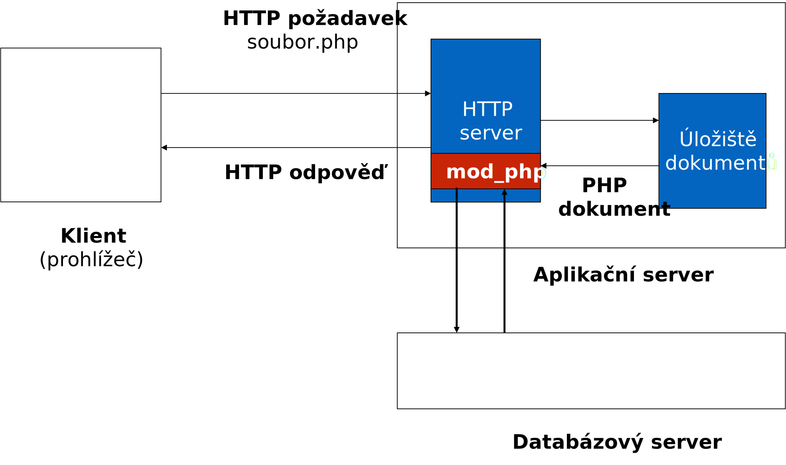
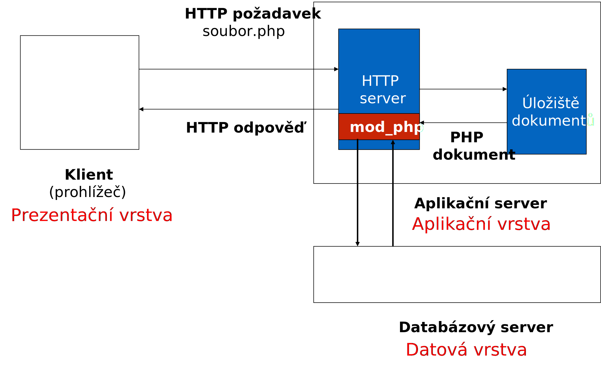
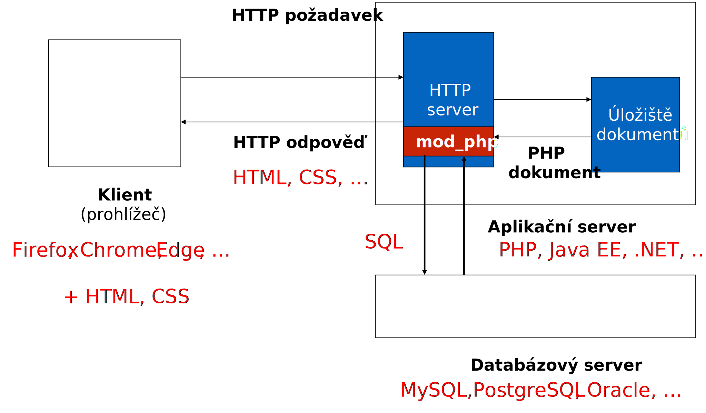
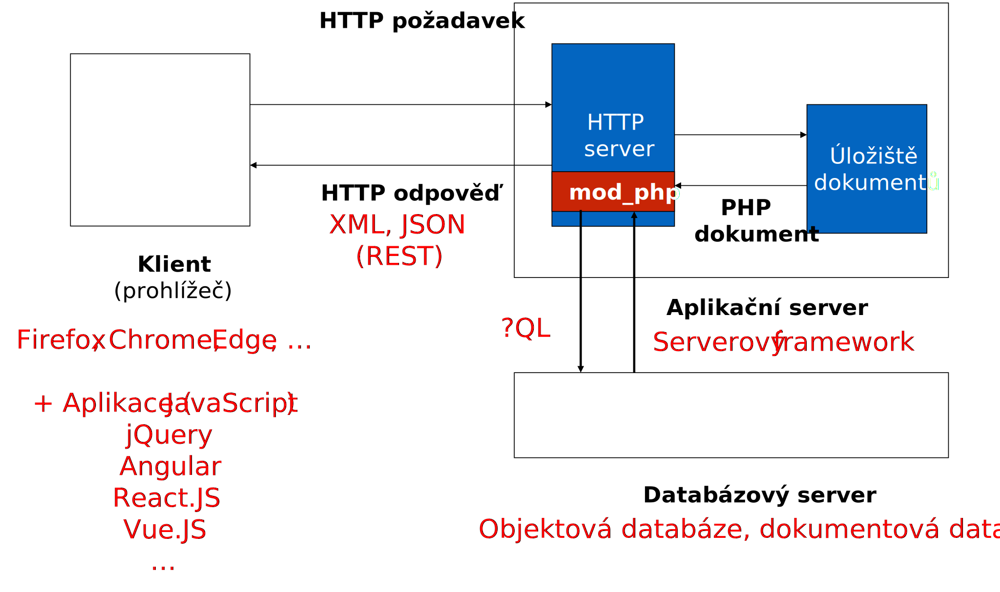

<!-- .slide: class="section" -->

<header>
	<h1>HTTP a dynamické stránky</h1>
	<p>Základní stavební kameny informačního systému</p>
</header>

---

# Základní scénář komunikace
<!-- .slide: class="normal centered fullspace" -->

 <!-- .element: style="height:750px;margin:0;" -->

---

# Protokol HTTP
- Aplikační protokol nad TCP/IP (Hypertext Transfer Protocol)
- Komunikaci začíná klient
	- Naváže spojení se serverem
	- Vyšle HTTP požadavek
- Server reaguje HTTP odpovědí
	- Stav – výsledek vyhodnocení požadavku
	- Požadovaný (nebo chybový) dokument
- Rozlišení typy dokumentů: MIME typ
- Detaily: např. v [přednáškách ITW](https://www.fit.vutbr.cz/study/courses/ITW/private/prednasky/p01/slide0250.html)

---

# HTTP požadavek (request)
- <span class="hljs-keyword">Metoda</span>, <span class="hljs-string">URL</span>, hlavičky, <span class="hljs-attr">tělo (payload)</span>

```http
GET /data.html HTTP/1.1
Host: www.fit.vutbr.cz
User-Agent: Mozilla/5.0 (X11; Linux x86_64; rv:69.0) Firefox/69.0
Accept: text/html,application/xhtml+xml,application/xml;q=0.9,*/*;q=0.8
Accept-Language: cs,en-US;q=0.7,en;q=0.3
… 
```

```http
POST /api/login.php HTTP/1.1
Host: www.fit.vutbr.cz
User-Agent: Mozilla/5.0 (X11; Linux x86_64; rv:69.0) Firefox/69.0
Accept: application/json, text/plain, */*
Content-Type: application/json
Content-Length: 39

{"username":"john","password":"mypwd"} 
```

---

# HTTP metody
- GET – získání dokumentu
- POST – zaslání dat
- PUT – nahrazení dokumentu
- DELETE – smazání dokumentu
- HEAD, CONNECT, OPTIONS, TRACE, PATCH, …

---

# HTTP odpověď (response)
- Stav, hlavičky, tělo (payload)

```http
HTTP/1.1 200 OK
Date: Wed, 02 Oct 2019 12:11:55 GMT
Server: Apache/2.4.38 (Debian)
Content-type: text/html; charset=utf-8
…

<!DOCTYPE html>
<html>
…
```

---

# MIME typ obsahu
- Hlavička `Content-type`
- Specifikace typu ve tvaru `třída/typ`
- Standardní typy
	- `text/plain`, `text/html`, `text/xml`
	- `application/json`, `application/x-www-form-urlencoded`
	- `image/jpeg`, `image/png`

---

# Dynamické webové stránky
<!-- .slide: class="normal centered fullspace" data-transition="slide-in fade-out" -->

 <!-- .element: style="height:750px;margin:0;" -->


---

# Dynamické webové stránky
<!-- .slide: class="normal centered fullspace" data-transition="fade-in slide-out" -->

 <!-- .element: style="height:750px;margin:0;" -->


---

# Přímočaré řešení: CGI
- Common Gateway Interface
- Externí program spouštěný HTTP serverem
- Nezávislé na implementačním jazyce
	- Výměna dat přes stdin/stdout a proměnné prostředí
	- Programování v C, PERL, Python, …
- Velká režie
	- Nový proces pro každý HTTP požadavek
- [Příklad CGI skriptu v PERLu](https://github.com/DIFS-Teaching/basic-demos/blob/master/cgi/cgi_perl.cgi)

---

# Efektivnější řešení
- FastCGI
	- Trvale běžící proces zpracovává více HTTP požadavků
- Rozšíření běžícího HTTP serveru
	- Rozšiřující moduly
	- Např. PHP (mod_php)
- Specializovaný HTTP server pro specifickou platformu
	- Např. Java EE server (Tomcat, Glassfish, …)
	- Podobně JavaScript (nodejs), .NET, … 

---

# Moduly HTTP serveru (PHP)
<!-- .slide: class="normal centered fullspace" -->

 <!-- .element: style="height:750px;margin:0;" -->

---

# Aplikační server (např. Java)
<!-- .slide: class="normal centered fullspace" -->

 <!-- .element: style="height:750px;margin:0;" -->

---

# Správa sezení – kontext 
- Protokol HTTP je **bezstavový**.
	- Požadavky jsou vyhodnocovány nezávisle na sobě.
- Potřebujeme rozlišit požadavky pocházející od stejných/různých klientů – **kontext**. 
- Je třeba přidat k HTTP mechanismus pro uchování informace o kontextu klientů. Tento mechanismus se nazývá **správa sezení** (_session_). 

---

# Správa sezení – princip 
- Nově příchozím uživatelům vygenerujeme jednoznačný identifikátor **Session ID**.
	- Při prvním HTTP požadavku od nového klienta (zařízení)
- Tímto identifikátorem se klient prokáže při každém dalším požadavku.
	- Jsme schopni rozlišit požadavky od jednotlivých klientů
- Jak to technicky zabezpečit?

---

# Jak udržet kontext
1. Předávání hodnoty Session ID jako parametr jednotlivých dotazů.
	- Vyžaduje příslušné úpravy na všech místech aplikace, která mohou generovat HTTP dotaz
	- Bezpečnostní problémy (session ID je např. v URL, v HTML kódu, ...)
2. Použití cookies
	- Zabudovaný mechanismus HTTP

---

# Cookies
- Cookie: Malý objem dat, který serverová aplikace může uložit na straně klienta (v prohlížeči)
- Každý cookie má **_jméno_** a **_hodnotu_**
- Pro každý cookie je navíc definována **_cesta_** a **_expirace_**
	- Přístupovat ke cookies mohou pouze stránky se stejnou cestou jako je stránka, která cookie uložila
	- Lze nastavit jiný adresář (nejčastěji kořenový, aby celá aplikace mohla číst všechna svoje cookie)

---

# Trvanlivost cookies (expirace)
- Lze zadat přesný čas, dokdy má být cookie uložen v prohlížeči – tzv. **_expirace_**
- Pokud není expirace zadána, cookie se vymaže se zavřením prohlížeče

---

# Řešení cookies v HTTP
- Server v rámci **odpovědi** na nějaký požadavek použije hlavičky `Set-Cookie`

```http
HTTP/1.0 200 OK
Content-type: text/html
Set-Cookie: theme=light; Path=/; Domain=.example.com
Set-Cookie: sessionToken=abc123; Expires=Wed, 09 Jun 2021 10:18:14 GMT
… 
```

- Klient uloží nastavené cookie, při každém dalším **požadavku** odešle všechna relevantní cookie pomocí hlavičky `Cookie`

```http
GET /spec.html HTTP/1.1
Host: www.example.org
Cookie: theme=light; sessionToken=abc123
… 
```

---

# Přístup k hodnotám cookies
- Na straně serveru
	- Server shromáždí hodnoty z HTTP hlaviček a zpřístupní aplikaci
	- Např. v proměnných prostředí, speciální proměnné, apod.
- Na straně klienta
	- JavaScriptové API v prohlížeči

---

# Cookies a Session ID
- Mechanismus řeší pouze identifikaci klienta
	- Rozlišení požadavků jednotlivých klientů
	- Zatím žádná autentizace (přihlášení uživatelů)
- Pozor na bezpečnost
	- Znalost Session ID umožňuje vydávat se za nějakého uživatele

---

# Cookies a Session ID – bezpečnost
- Způsob generování Session ID – předvídatelnost 
- Zcizení Session ID (session stealing)
	- Síťový odposlech – šifrování (HTTPS)
	- Útok na klientský prohlížeč (XSS)
		- http-only cookies
	- Útok na klientské zařízení
		- Datové soubory prohlížeče

---

# Architektura znovu
<!-- .slide: class="normal centered fullspace" data-transition="slide-in fade-out" -->

 <!-- .element: style="transform:scale(0.7);margin-top:-100px;" -->


---

# Databázová vrstva
<!-- .slide: class="normal centered fullspace" data-transition="fade-in fade-out" -->

 <!-- .element: style="transform:scale(0.7);margin-top:-110px;" -->

---

# Třívrstvá architektura
<!-- .slide: class="normal centered fullspace" data-transition="fade-in fade-out" -->

 <!-- .element: style="transform:scale(0.7);margin-top:-120px;margin-left:-40px" -->

---

# Základní technologie
<!-- .slide: class="normal centered fullspace" data-transition="fade-in fade-out" -->

 <!-- .element: style="transform:scale(0.7);margin-top:-110px;margin-left:-40px" -->

---

# Rozšiřující technologie
<!-- .slide: class="normal centered fullspace" data-transition="fade-in slide-out" -->

 <!-- .element: style="transform:scale(0.7);margin-top:-110px;margin-left:-40px" -->

---

# Co dále?
- Serverová část systému
	- Jazyk PHP
	- Řízení session a HTTP komunikace v PHP
	- Rámcová řešení v PHP (frameworks)
- Databázová vrstva
	- Datové modelování, relační datový model
	- Přístup k relační databázi v PHP (PDO)
- Klientská část
	- Relevantní základy HTML (vstup/výstup) + CSS
	- Klientské skripty (JavaScript)

