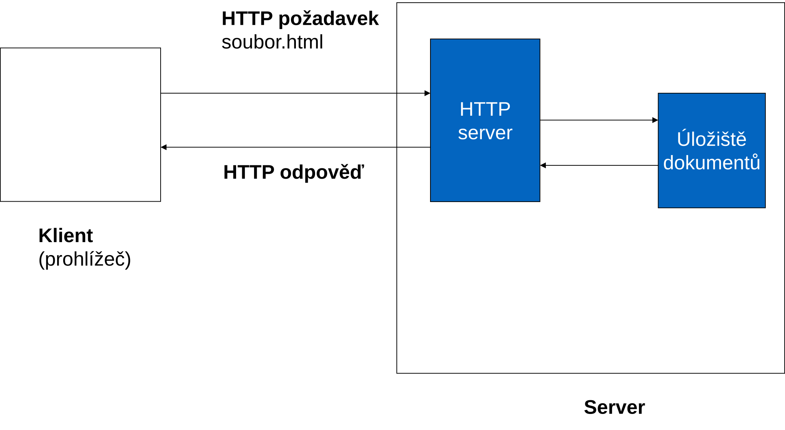
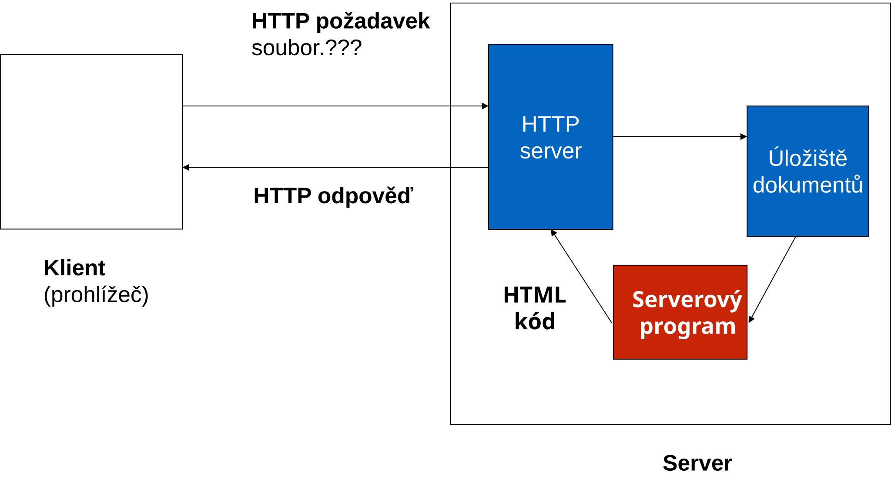
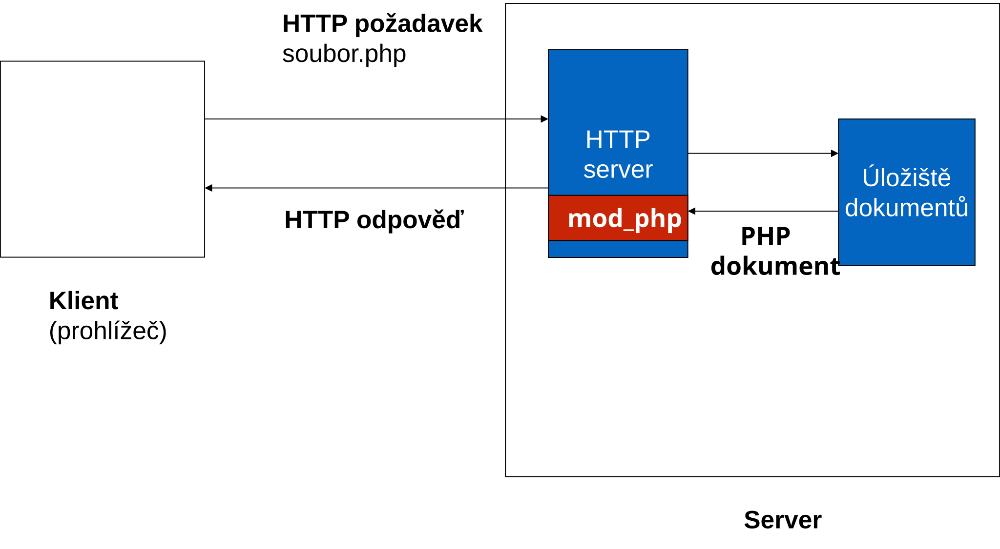
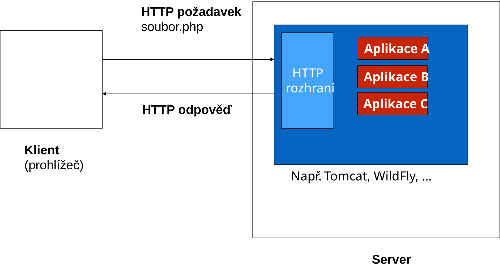
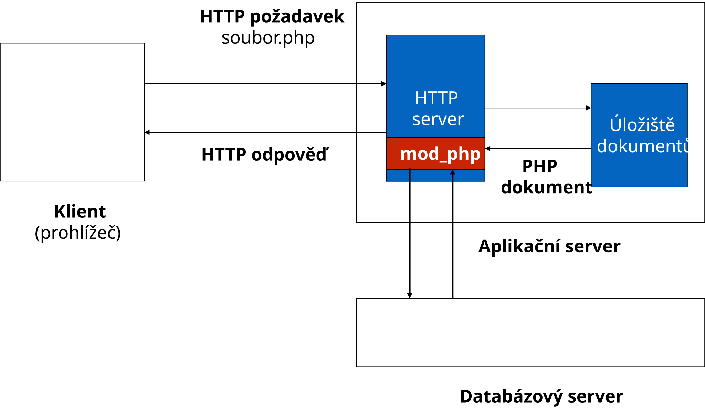
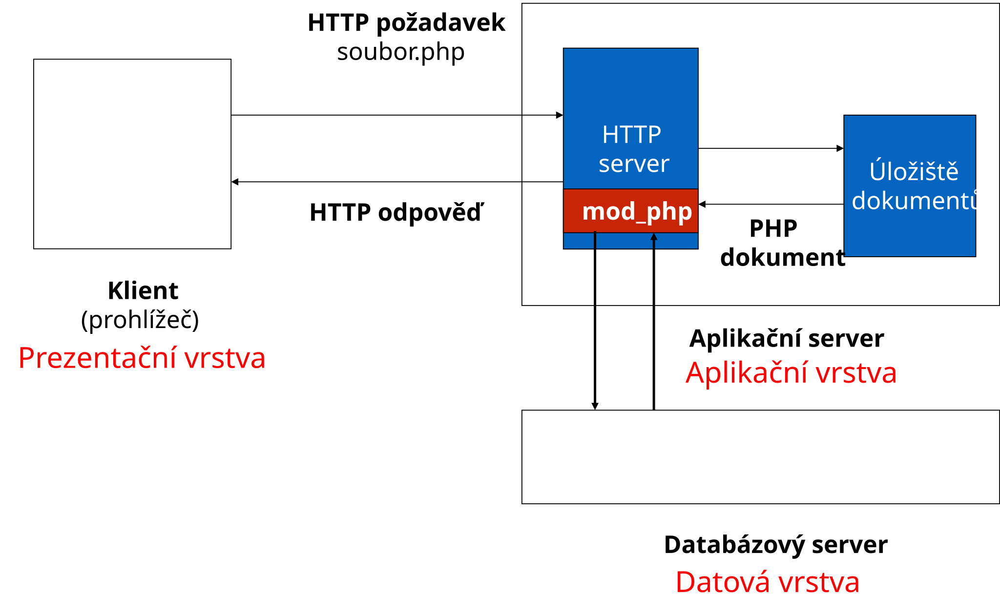
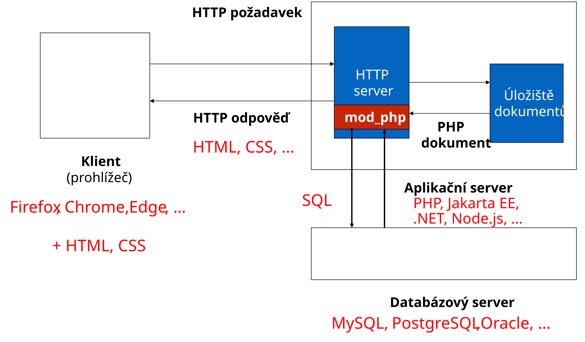
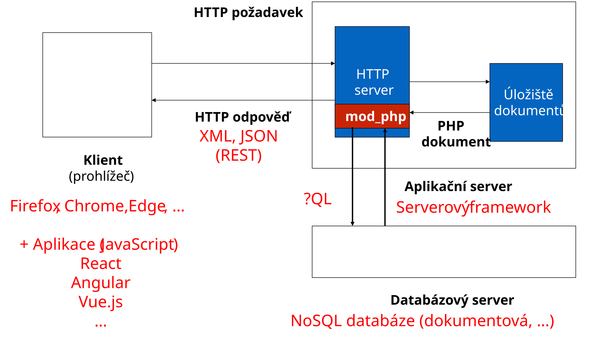
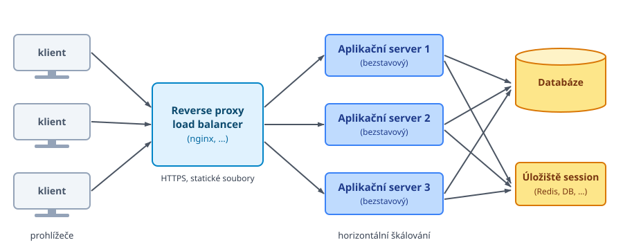

<!-- .slide: class="section" -->

<header>
	<h1>HTTP a dynamické stránky</h1>
	<p>Základní stavební kameny informačního systému</p>
</header>

---

# Základní scénář komunikace
<!-- .slide: class="normal centered fullspace" -->

 <!-- .element: style="height:750px;margin:0;" -->

---

# Protokol HTTP
- Aplikační protokol (Hypertext Transfer Protocol)
	- HTTP/1.1, HTTP/2 nad TCP; HTTP/3 nad QUIC (UDP)
- Komunikaci začíná klient
	- Naváže spojení se serverem
	- Vyšle HTTP požadavek
- Server reaguje HTTP odpovědí
	- Stav – výsledek vyhodnocení požadavku
	- Požadovaný (nebo chybový) dokument
- Rozlišení typů dokumentů: MIME typ
- Detaily: např. v [přednáškách ITW](https://gitshow.net/https/difs-teaching.github.io/slides/en/itwe/p01_web_technology#/15)

---

# HTTP požadavek (request)
- <span class="hljs-keyword">Metoda</span>, <span class="hljs-string">URL</span>, hlavičky, <span class="hljs-attr">tělo (payload)</span>

```http
GET /data.html HTTP/1.1
Host: www.fit.vut.cz
User-Agent: Mozilla/5.0 (X11; Linux x86_64; rv:140.0) Gecko/20100101 Firefox/140.0
Accept: text/html,application/xhtml+xml,application/xml;q=0.9,*/*;q=0.8
Accept-Language: cs,en-US;q=0.7,en;q=0.3
… 
```

```http
POST /api/login.php HTTP/1.1
Host: www.fit.vut.cz
Accept: application/json, text/plain, */*
Content-Type: application/json
Content-Length: 38

{"username":"john","password":"mypwd"} 
```

---

# HTTP metody
- GET – získání dokumentu
- POST – zaslání dat
- PUT – nahrazení dokumentu
- DELETE – smazání dokumentu
- HEAD, CONNECT, OPTIONS, TRACE, PATCH, …

---

# HTTP odpověď (response)
- Stav, hlavičky, tělo (payload)

```http
HTTP/1.1 200 OK
Date: Wed, 23 Sep 2026 12:11:55 GMT
Server: Apache/2.4.65 (Debian)
Content-Type: text/html; charset=utf-8
…

<!DOCTYPE html>
<html>
…
```

---

# MIME typ obsahu
- Hlavička `Content-Type`
- Specifikace typu ve tvaru `typ/podtyp`
- Standardní typy
	- `text/plain`, `text/html`, `text/xml`
	- `application/json`, `application/x-www-form-urlencoded`, `multipart/form-data`
	- `image/jpeg`, `image/png`

---

# Dynamické webové stránky
<!-- .slide: class="normal centered fullspace" data-transition="slide-in fade-out" -->

 <!-- .element: style="height:750px;margin:0;" -->


---

# Dynamické webové stránky
<!-- .slide: class="normal centered fullspace" data-transition="fade-in slide-out" -->

 <!-- .element: style="height:750px;margin:0;" -->


---

# Přímočaré řešení: CGI
- Common Gateway Interface
- Externí program spouštěný HTTP serverem
- Nezávislé na implementačním jazyce
	- Výměna dat přes stdin/stdout a proměnné prostředí
	- Programování v C, Perl, Python, …
- Velká režie
	- Nový proces pro každý HTTP požadavek
- [Příklad CGI skriptu v Perlu](https://github.com/DIFS-Teaching/basic-demos/blob/master/cgi/cgi_perl.cgi)

---

# Efektivnější řešení
- FastCGI
	- Trvale běžící proces zpracovává více HTTP požadavků
	- Např. PHP-FPM (dnes nejběžnější nasazení PHP)
- Rozšíření běžícího HTTP serveru
	- Rozšiřující moduly
	- Např. PHP (mod_php) – dříve běžné, princip viz dále
- Specializovaný HTTP server pro specifickou platformu
	- Např. Java – Jakarta EE (WildFly, GlassFish, …), servletový kontejner Tomcat
	- Podobně JavaScript (Node.js), Python (WSGI/ASGI), .NET (ASP.NET Core), … 

---

# Moduly HTTP serveru (PHP)
<!-- .slide: class="normal centered fullspace" -->

 <!-- .element: style="height:750px;margin:0;" -->

---

# Aplikační server (např. Java)
<!-- .slide: class="normal centered fullspace" -->

 <!-- .element: style="height:750px;margin:0;" -->

---

# Správa sezení – kontext 
- Protokol HTTP je **bezstavový**.
	- Požadavky jsou vyhodnocovány nezávisle na sobě.
- Potřebujeme rozlišit požadavky pocházející od stejných/různých klientů – **kontext**. 
- Je třeba přidat k HTTP mechanismus pro uchování informace o kontextu klientů. Tento mechanismus se nazývá **správa sezení** (_session_). 

---

# Správa sezení – princip 
- Nově příchozím uživatelům vygenerujeme jednoznačný identifikátor **Session ID**.
	- Při prvním HTTP požadavku od nového klienta (zařízení)
- Tímto identifikátorem se klient prokáže při každém dalším požadavku.
	- Jsme schopni rozlišit požadavky od jednotlivých klientů
- Jak to technicky zabezpečit?

---

# Jak udržet kontext
1. Předávání hodnoty Session ID jako parametr jednotlivých dotazů.
	- Vyžaduje příslušné úpravy na všech místech aplikace, která mohou generovat HTTP dotaz
	- Bezpečnostní problémy (session ID je např. v URL, v HTML kódu, ...)
2. Použití cookies
	- Zabudovaný mechanismus HTTP

---

# Cookies
- Cookie: Malý objem dat, který serverová aplikace může uložit na straně klienta (v prohlížeči)
- Každý cookie má **jméno** a **hodnotu**
- Pro každý cookie je navíc definována **cesta** a **expirace**
	- Cookie se odesílá jen s požadavky na stejnou doménu a cestu (včetně podadresářů)
	- Výchozí cesta je adresář stránky, která cookie uložila; lze nastavit jinou (nejčastěji kořenovou, aby celá aplikace mohla číst všechna svoje cookie)

---

# Trvanlivost cookies (expirace)
- Lze zadat přesný čas (`Expires`) nebo dobu platnosti (`Max-Age`), po kterou má být cookie uložen v prohlížeči – tzv. _expirace_
- Pokud není expirace zadána, cookie se vymaže se zavřením prohlížeče (obnova relace v prohlížeči ho však může zachovat)

---

# Řešení cookies v HTTP
- Server v rámci **odpovědi** na nějaký požadavek použije hlavičky `Set-Cookie`

```http
HTTP/1.1 200 OK
Content-Type: text/html
Set-Cookie: theme=light; Path=/; Expires=Wed, 09 Jun 2027 10:18:14 GMT
Set-Cookie: sessionToken=abc123; Path=/; HttpOnly
… 
```

- Klient uloží nastavené cookie, při každém dalším **požadavku** odešle všechna relevantní cookie pomocí hlavičky `Cookie`

```http
GET /spec.html HTTP/1.1
Host: www.example.com
Cookie: theme=light; sessionToken=abc123
… 
```

---

# Přístup k hodnotám cookies
- Na straně serveru
	- Server shromáždí hodnoty z HTTP hlaviček a zpřístupní aplikaci
	- Např. v proměnných prostředí, speciální proměnné, apod.
- Na straně klienta
	- JavaScriptové API v prohlížeči (kromě HttpOnly cookies)

---

# Cookies a Session ID
- Mechanismus řeší pouze identifikaci klienta
	- Rozlišení požadavků jednotlivých klientů
	- Zatím žádná autentizace (přihlášení uživatelů)
- Pozor na bezpečnost
	- Znalost Session ID umožňuje vydávat se za nějakého uživatele

---

# Cookies a Session ID – bezpečnost
- Způsob generování Session ID – předvídatelnost 
- Zcizení Session ID (session stealing)
	- Síťový odposlech – šifrování (HTTPS)
	- Útok na klientský prohlížeč (XSS)
		- HttpOnly cookies
	- Útok na klientské zařízení
		- Datové soubory prohlížeče

---

# Bezpečnostní atributy cookies
- `Secure` – cookie se odesílá pouze přes HTTPS
- `HttpOnly` – cookie není dostupný z JavaScriptu (ochrana proti zcizení pomocí XSS)
- `SameSite=Strict|Lax|None` – zda se cookie odesílá i s požadavky vyvolanými z cizích stránek
	- Ochrana proti **CSRF** (podvržení požadavku z jiného webu)
	- Prohlížeče založené na Chromiu bez uvedení atributu použijí `Lax`
- Po přihlášení vygenerovat nové Session ID (ochrana proti _session fixation_)

```http
Set-Cookie: sessionToken=abc123; Path=/; Secure; HttpOnly; SameSite=Lax
```

---

# Architektura znovu
<!-- .slide: class="normal centered fullspace" data-transition="slide-in fade-out" -->

 <!-- .element: style="width:1200px;margin-top:30px;" -->

---

# Databázová vrstva
<!-- .slide: class="normal centered fullspace" data-transition="fade-in fade-out" -->

 <!-- .element: style="width:1200px;margin-top:30px;" -->

---

# Třívrstvá architektura
<!-- .slide: class="normal centered fullspace" data-transition="fade-in fade-out" -->

 <!-- .element: style="width:1200px;margin-top:30px;margin-left:-40px;" -->

---

# Základní technologie
<!-- .slide: class="normal centered fullspace" data-transition="fade-in fade-out" -->

 <!-- .element: style="width:1200px;margin-top:30px;margin-left:-40px;" -->

---

# Rozšiřující technologie
<!-- .slide: class="normal centered fullspace" data-transition="fade-in slide-out" -->

 <!-- .element: style="width:1200px;margin-top:30px;margin-left:-40px;" -->

---

# Škálování třívrstvé architektury
<!-- .slide: class="normal centered fullspace" -->

 <!-- .element: style="width:1600px;margin-top:40px;" -->

---

# Škálování třívrstvé architektury
- **Vertikální** škálování – výkonnější server
- **Horizontální** škálování – více instancí aplikačního serveru
	- Požadavky rozděluje _load balancer_ (reverse proxy, např. nginx)
	- Proxy obvykle také zajišťuje HTTPS a statické soubory
- Úzkým hrdlem bývá databáze – replikace, cache
- Problém: **session** uložená v paměti jednoho serveru
	- _Sticky sessions_ – klient je směrován stále na stejný server (výpadek = ztráta session)
	- Sdílené úložiště session – databáze, Redis (aplikační servery zůstávají bezstavové)
	- Stav u klienta – podepsaný token (JWT, viz klientská část IS)

---

# Nasazení: kontejnery
- Kontejner = aplikace + všechny závislosti, izolovaný běh (Docker, Podman)
- Každá část systému ve vlastním kontejneru, sestava popsaná v `compose.yaml`
- Stejné prostředí pro vývoj i provoz; ve větším měřítku orchestrace (Kubernetes)

```yaml
services:
  web:
    image: nginx
    ports: ["443:443"]
  app:
    image: php:8.4-fpm
  db:
    image: postgres:17
    volumes: ["dbdata:/var/lib/postgresql/data"]
volumes:
  dbdata:
```

---

# Co dále?
- Serverová část systému
	- Jazyk PHP
	- Řízení session a HTTP komunikace v PHP
	- Rámcová řešení v PHP (frameworks)
- Databázová vrstva
	- Datové modelování, relační datový model
	- Přístup k relační databázi v PHP (PDO)
- Klientská část
	- Relevantní základy HTML (vstup/výstup) + CSS
	- Klientské skripty (JavaScript)

