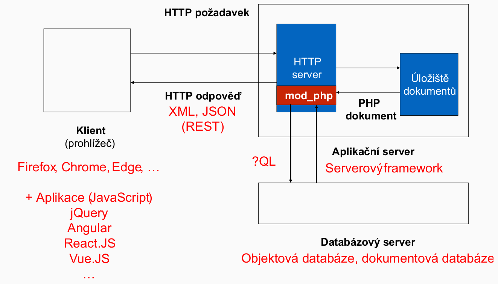
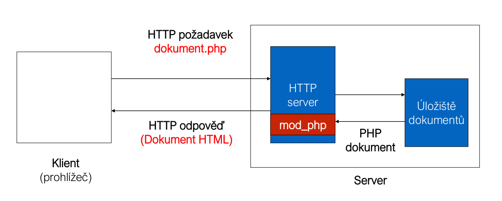

<!-- .slide: class="normal centered" -->

# Architektura

 <!-- .element: style="height:620px" -->

- [Web dev roadmap…](https://github.com/kamranahmedse/developer-roadmap), [schéma v Excalidraw](https://excalidraw.com/#json=BETVhKTV1TcDDaqgFWVQh,MOxg8oCuJywVks6yMPB5wA)

---

<!-- .slide: class="normal centered" -->

# Základní architektura v PHP

 <!-- .element: style="height:600px" -->

aplikační vrstva + prezentační vrstva

---

# Obsah

- [Základy jazyka HTML](#/html)
- [Základy jazyka PHP](#/php)
- Příklady použití PHP v informačních systémech
	1. [HTTP hlavičky (headers), přesměrování](#/hlavicky)
	2. [Cookies](#/cookies)
	3. [Zpracování hodnot zaslaných metodou GET a POST](#/formulare)
	4. [Session, autorizace](#/session)
