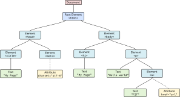

<!-- .slide: class="section" id="html" -->

<header>
    <h1>HTML</h1>
</header>

---

# HTML

- HyperText Markup Language
- značkovací jazyk pro tvorbu hypertextových dokumentů
	- dokument obsahující text v přirozeném jazyce doplněný **značkami** *(markup language)*
	- části obsahu mohou sloužit jako **odkazy na jiné dokumenty** *(hypertext)*

1. Výstup dat -- prezentace
	- text (formátování), seznamy, tabulky
2. Vstup dat -- formuláře
	- text, zaškrtávací pole, výběrové prvky

- doplněné o styly (CSS) a akce (klientský JavaScript)

---

# HTML dokument

- Obvykle označen příponou **.html** nebo **.htm**
- MIME type **text/html**
- Prostý textový soubor (Unicode, kódování **UTF-8**)
- Může obsahovat
	- Text
	- Vložené značky
	- Znakové entity -- pro vkládání znaků se speciálním významem:
		- `&lt;`&nbsp;(<), `&gt;`&nbsp;(>), `&amp;`&nbsp;(&), `&quot;`&nbsp;(")
		- v PHP je při výpisu dat vytváří funkce `htmlspecialchars()`
- Více mezer i konec řádku se zobrazí jako jedna mezera, řádky se zalamují až při vykreslování

---

# Značky a elementy

- HTML element: úsek dokumentu vymezený *značkami*

```html
<p>Obsah elementu</p>

<div class="menu" id="mainmenu">
Obsah elementu<br> Další obsah elementu.
</div>

<div>Nějaký <em>zvýrazněný</em> text.</div>
```

- Element má jméno, atributy a obsah
	- Z definice prázdné ([void](https://html.spec.whatwg.org/multipage/syntax.html#void-elements)) elementy -- jen počáteční značka
- Na velikosti písmen u názvů značek a atributů nezáleží (konvence: malá písmena), u hodnot (`id`, `class`) ano

---

# Struktura dokumentu

```html
<!DOCTYPE html>
<html lang="cs">
  <head>
    <meta charset="utf-8">
    <meta name="viewport" content="width=device-width, initial-scale=1">
    <title>Titulek stránky</title>
  </head>
  <body>

  … tělo dokumentu …

  </body>
</html>
```

---

# HTML dokument jako strom

<div class="col small" style="width:34%">

- HTML dokument lze popsat jako **strom elementů**
- Kořenový element je tvořen elementem `<html>`
- Synovské uzly jsou tvořeny elementy bezprostředně vnořenými v otcovském elementu
- Atributy (čárkovaně) nejsou potomky, jen patří k elementu

</div>
<div class="col" style="width:56%;margin-top:40px">



</div>

---

# Řádkové a blokové elementy

<div class="col small">

- **Řádkové** -- část textu
	- `<em>`, `<strong>` -- zvýraznění
	- `<code>`, `<var>` -- kód, proměnná
	- `<sup>`, `<sub>` -- horní a dolní index
	- `<a>` -- odkaz
	- `<br>` -- zalomení řádku
	- `<span>` -- obecný řádkový element

</div>
<div class="col small">

- **Blokové** -- struktura dokumentu
	- `<header>`, `<footer>`, `<nav>` -- záhlaví, zápatí, navigace
	- `<article>`, `<section>`, `<aside>` -- článek, kapitola, doplněk
	- `<h1>` -- `<h6>` -- nadpisy
	- `<p>`, `<ul>`, `<ol>`, `<table>` -- odstavce, seznamy, tabulky
	- `<div>` -- obecný blokový element

</div>

---

# Seznamy a tabulky

<div class="demo-grid">
<div>

```html
<ul>
  <li>První položka</li>
  <li>Druhá položka</li>
</ul>
```

</div>
<div class="html-demo">
<ul>
<li>První položka</li>
<li>Druhá položka</li>
</ul>
</div>
<div>

```html
<table>
  <caption>Příklad tabulky</caption>
  <tr><th>Jméno</th><th>Příjmení</th></tr>
  <tr><td>Jan</td><td>Novák</td></tr>
  <tr><td>Josef</td><td>Dvořák</td></tr>
</table>
```

</div>
<div class="html-demo">
<table>
<caption>Příklad tabulky</caption>
<tr><th>Jméno</th><th>Příjmení</th></tr>
<tr><td>Jan</td><td>Novák</td></tr>
<tr><td>Josef</td><td>Dvořák</td></tr>
</table>
</div>
</div>

---

# Globální atributy

- Atributy použitelné pro všechny elementy

<div class="small" style="font-size:75%">

| Atribut | Význam |
|---|---|
| `id="jmeno"` | Jednoznačný identifikátor |
| `class="jmeno"` | Použití pro kaskádové styly (CSS) |
| `style="styl"` | Styl přímo u elementu (spíše nepoužívat) |
| `data-*="hodnota"` | Vlastní data, např. pro JavaScript (`data-id="42"`) |
| `title="text"` | Titulek elementu (zobrazí se v „bublině“) |
| `lang="cs"` | Jazyk obsahu |
| `hidden` | Skrytý prvek |

</div>

- Generické elementy `<span>` a `<div>` nemají vlastní význam -- určí se pomocí `class`, obvykle s CSS

---

# Formuláře v HTML

- Interaktivní prvek stránky určený pro vstup dat

```html
<form action="vysledek.php" method="post">
    … HTML kód obsahující definice prvků formuláře …
</form>
```

- `action` -- dokument zpracovávající vložená data
- `method` -- metoda předání dat: GET nebo POST
- Zpracování dat
	- **Na serveru** -- klient odešle vyplněné údaje, server je zpracuje a vrátí dokument
	- **Na straně klienta** -- JavaScript (validace, odeslání přes `fetch()`)

---

# Vstupní pole

```html
<input type="text" name="polozka1" value="obsah">

<input type="password" name="heslo" value="heslo">

<input type="checkbox" name="souhlas" checked>

<input type="radio" name="volba" value="prvni"> První
<input type="radio" name="volba" value="druha"> Druhá

<input type="hidden" name="id" value="42">

<input type="submit" value="Odeslat">
```
<!-- .element: class="col small" style="width:58%" -->

<div class="col html-demo" style="width:32%">
<form onsubmit="return false">
<p><input type="text" name="polozka1" value="obsah"></p>
<p><input type="password" name="heslo" value="heslo"></p>
<p><input type="checkbox" name="souhlas" checked></p>
<p><input type="radio" name="volba" value="prvni"> První
<input type="radio" name="volba" value="druha"> Druhá</p>
<p class="grey"><em>(skrytý prvek se nezobrazí)</em></p>
<p><input type="submit" value="Odeslat"></p>
</form>
</div>

---

# Výběr, textová oblast, popisky

- Atribut `for` popisku `<label>` odpovídá atributu `id` vstupního prvku -- kliknutím na popisek se prvek vybere

```html
<select name="barva">
  <option value="red">Červená</option>
  <option value="blue" selected>Modrá</option>
</select>

<textarea rows="3" cols="20" name="oblast">
Textový obsah
</textarea>

<fieldset>
  <legend>Osobní údaje</legend>
  <label for="jmeno">Jméno</label>
  <input type="text" name="jmeno" id="jmeno">
</fieldset>
```
<!-- .element: class="col small" style="width:58%" -->

<div class="col html-demo" style="width:32%">
<form onsubmit="return false">
<p><select name="barva">
    <option value="red">Červená</option>
    <option value="blue" selected>Modrá</option>
</select></p>
<p><textarea rows="3" cols="20" name="oblast">Textový obsah</textarea></p>
<fieldset>
<legend>Osobní údaje</legend>
<label for="demo-jmeno">Jméno</label>
<input type="text" name="jmeno" id="demo-jmeno">
</fieldset>
</form>
</div>

---

# HTML5 typy a validace

<div class="demo-grid" style="grid-template-columns: 65% 30%">
<div>

```html
<input type="email" name="email" required>

<input type="number" name="vek" min="0" max="150">

<input type="date" name="narozeni">

<input type="text" name="psc" pattern="[0-9]{5}">
```

</div>
<div class="html-demo">
<form onsubmit="return false">
<p><input type="email" name="email" placeholder="email" required></p>
<p><input type="number" name="vek" min="0" max="150" value="23"></p>
<p><input type="date" name="narozeni"></p>
<p><input type="text" name="psc" pattern="[0-9]{5}" placeholder="PSČ"></p>
</form>
</div>
</div>

- Prohlížeč zkontroluje hodnoty před odesláním formuláře (typ, `required`, `min`/`max`, `pattern`)
- Validace v prohlížeči **nenahrazuje kontrolu na serveru**
	- požadavek lze odeslat i bez formuláře nebo s upraveným HTML

---

# Formulář a PHP

- Hodnota prvku se odešle pod klíčem daným atributem **`name`**
	- prvky bez `name` a nezaškrtnuté checkboxy se neodešlou vůbec
- Jméno končící `[]` -- PHP z hodnot vytvoří pole

```html
<form action="zpracuj.php" method="post">
  <input type="text" name="jmeno">
  <input type="checkbox" name="barvy[]" value="red">
  <input type="checkbox" name="barvy[]" value="blue">
  <input type="submit" value="Odeslat">
</form>
```

```php
$_POST['jmeno'];  // "Jan"
$_POST['barvy'];  // ["red", "blue"] -- pouze zaškrtnuté
```

---

# Příklad formuláře

<div class="demo-grid" style="grid-template-columns: 65% 30%">
<div>

```html
<form action="stranka.html" method="GET">
  <label for="name">Jméno</label>
  <input type="text" name="name" id="name"><br>
  <label for="surname">Příjmení</label>
  <input type="text" name="surname" id="surname"><br>
  <label for="stud">Student</label>
  <input type="checkbox" name="stud" id="stud"><br>
  <br>
  <div style="text-align: center">
    <input type="submit" value="Odeslat">
  </div>
</form>
```
<!-- .element: class="small" -->

</div>
<div class="html-demo">
<form onsubmit="return false" class="form-grid">
  <label for="ex-name">Jméno</label>
  <input type="text" name="name" id="ex-name">
  <label for="ex-surname">Příjmení</label>
  <input type="text" name="surname" id="ex-surname">
  <label for="ex-stud">Student</label>
  <input type="checkbox" name="stud" id="ex-stud">
  <div style="text-align: center">
    <input type="submit" value="Odeslat">
  </div>
</form>
</div>
</div>

---

# Odeslání souborů

```html
<form action="upload.php" method="post" enctype="multipart/form-data">
  <input type="file" name="soubor">
  <input type="submit" value="Nahrát">
</form>
```

- Pouze metoda **POST** a kódování **`enctype="multipart/form-data"`**
	- bez něj se odešle jen název souboru
- V PHP je soubor dostupný v poli **`$_FILES`**
	- `$_FILES['soubor']['name']`, `['type']`, `['size']`, `['tmp_name']`, `['error']`
	- soubor je uložen v dočasném adresáři -- přesun funkcí `move_uploaded_file()`

---

# Další zdroje

- předmět ITWe (Web Design):
	- [Introduction to HTML](https://gitshow.net/gh/DIFS-Teaching/slides@main/en/itwe/p02_html)
- online tutoriály:
	- [w3schools.com](https://www.w3schools.com/html/)
	- [MDN Web Docs](https://developer.mozilla.org/en-US/docs/Web/HTML)
	- [jakpsatweb.cz](https://www.jakpsatweb.cz/html/)
