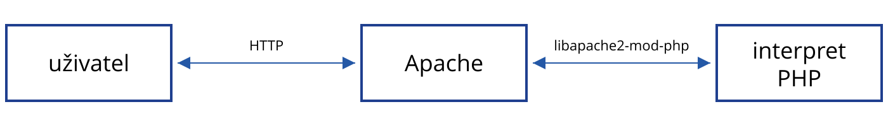
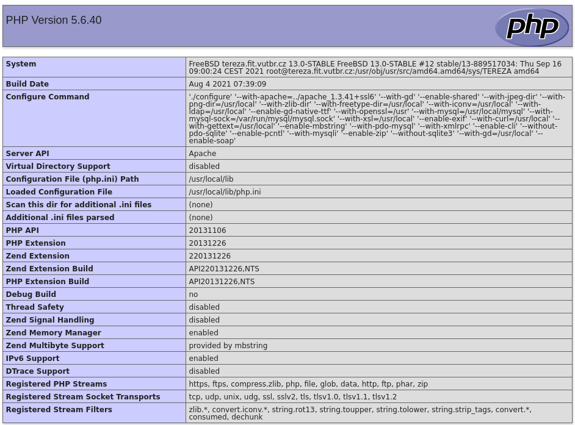

<!-- .slide: class="section" id="php" -->

<header>
    <h1>PHP</h1>
</header>

---

# PHP

- *Personal Home Page*, 1994, později *Hypertext Preprocessor*
- jednoduchý nástroj pro tvorbu dynamických webových stránek
- PHP vychází z následujících hypotéz:
	- problémy řešené na webu jsou často jednoduché, jejich technologické řešení je ale relativně složité
	- WWW stránka je v podstatě pouhý text
- cílem PHP tedy bylo usnadnit vývoj jednoduchých webových aplikací, u kterých se nevyplatí nasadit sofistikované a drahé aplikační prostředí
- k rozšíření PHP přispěla dostupnost na všech klíčových platformách zdarma
- dnes: PHP 8.x, [nejrozšířenější jazyk na straně serveru](https://w3techs.com/technologies/overview/programming_language) (WordPress, Laravel, Symfony, …)

---

<!-- .slide: class="normal centered" -->

# Základní architektura v PHP

 <!-- .element: style="height:600px" -->

<span class="minus">aplikační vrstva + prezentační vrstva</span>

---

# PHP: instalace

- instalace aplikačního serveru:
	- Apache (<span class="small">např.: apache2, apache2-utils, …</span>), Nginx
- instalace PHP a PHP modulu pro aplikační server
	- <span class="small">(např.: php8.4, php8.4-common, …, <strong class="minus">libapache2-mod-php8.4</strong>)</span>
	- <span class="small">nebo samostatná služba <strong>PHP-FPM</strong> (php8.4-fpm) volaná přes FastCGI -- obvyklé u Nginx</span>
- konfigurace aplikačního serveru, nastavení složky www
	- <span class="small">(např.: /etc/apache2/sites-available/000-default.conf)</span>

 <!-- .element: style="width:1400px;margin-top:0" -->

---

# PHP: informace

 <!-- .element: style="float:right;height:720px" -->

```php
<?php
   phpinfo();
?>
```
<!-- .element: style="width:38%;margin-left:0" -->

- [manuál](https://www.php.net/manual/en/function.phpinfo.php), [ukázka](https://www.fit.vut.cz/study/course/IIS/private/examples/phpinfo.php)

---

# PHP: vložení do HTML

- Vložení PHP skriptu pomocí značek **`<?php`** a **`?>`**
- [tutorial](https://www.w3schools.com/php/default.asp)

```php
<!DOCTYPE html>
<html>
<body>

  <h1>My first PHP page</h1>

  <?php
     echo "Hello World!";
  ?>

</body>
</html>
```

---

# PHP: generování HTML

```php
<ul>
<?php
   echo "<li>první položka</li>\n";
   echo "<li>druhá položka</li>\n";
?>
</ul>
Dnes je <?php echo date("Y-m-d") ?>
<br>
výsledek je <?php echo sin(5);?>

<!-- Konce řádků v kódu != konce řádků zobrazené -->
```

- zkrácený zápis výpisu: `<?= $x ?>` je totéž jako `<?php echo $x; ?>`

---

# PHP: pouze PHP kód

- soubory s příponou .php

```php
<?php
   function moje_funkce() {
      …
   }

   function jina_funkce() {
      …
   }

   /* konec PHP záměrně chybí */
```
<!-- .element: class="small" -->

- uzavírací `?>` na konci souboru se vynechává
	- mezery nebo prázdné řádky za ním by se odeslaly jako výstup a pak už nelze posílat HTTP hlavičky (viz [HTTP hlavičky](#/hlavicky))

---

# PHP: vkládání skriptů

- [**require**](https://www.php.net/manual/en/function.require.php) -- příkaz vložení externího skriptu

```php
<?php
   require 'somefile.php';
?>
```

- [**require_once**](https://www.php.net/manual/en/function.require-once.php) -- zkontroluje, zda již soubor nebyl vložen
- [**include**](https://www.php.net/manual/en/function.include.php) -- totéž, ale chybějící soubor způsobí jen varování (u `require` výjimku `Error`, bez zachycení konec skriptu)
- dnes se třídy obvykle nevkládají ručně -- [Composer](https://getcomposer.org/) a jeho *autoload* je načítá automaticky (viz [Aplikační frameworky v PHP](https://gitshow.net/gh/DIFS-Teaching/slides/iis/p04b_frameworky))

---

# PHP: proměnné

- identifikátor proměnné musí začínat znakem **$**
- typ proměnné se neudává -- určí se podle typu přiřazené hodnoty

```php
$jmeno = "Jan";
$vek = 23;
$vek = "dostatečný";
$jmeno_manzelky = NULL;
```
<!-- .element: class="small" -->

- typy parametrů (třída, pole) lze uvádět od PHP 5, od PHP 7 i skalární typy (`int`, `string`…) a návratové typy, od PHP 7.4 typy vlastností tříd (lokální proměnné typ mít nemohou)

```php
function secti(int $a, int $b): int {
   return $a + $b;
}
```
<!-- .element: class="small" -->

---

# PHP: řetězce

- V uvozovkách (*double-quoted*)

```php
$x = "Nahradí $hodnota a escape sekvence\n";
```
<!-- .element: class="small" -->

- V apostrofech (*single-quoted*)

```php
$x = 'Nenahradí $hodnota a escape sekvence\n';
```
<!-- .element: class="small" -->

- Spojování řetězců operátorem **`.`**

```php
$x = 'Jméno: ' . $jmeno . "\n";
```
<!-- .element: class="small" -->

- Vložení prvku pole do řetězce pomocí **`{ }`**

```php
$x = "Server: {$_SERVER['SERVER_NAME']}";
```
<!-- .element: class="small" -->

---

# PHP: pole

- představuje mapování klíčů na hodnoty ([dokumentace](https://www.php.net/manual/en/language.types.array.php))
	- klíč může být integer nebo string
	- hodnota může být libovolného typu

```php
<?php
   $pole["země"] = "Rusko";
   $pole[5] = true;
   echo $pole["země"];
   unset($pole["země"]);
   echo $pole["země"]; // Warning: Undefined array key
?>
```

---

# PHP: pole -- funkce

- [`count($pole)`](https://www.php.net/manual/en/function.count.php) -- počet prvků pole
- [`in_array($hodnota, $pole)`](https://www.php.net/manual/en/function.in-array.php) -- obsahuje pole danou hodnotu?
- [`array_key_exists($klic, $pole)`](https://www.php.net/manual/en/function.array-key-exists.php) -- obsahuje pole daný klíč?
- [`array_values($pole)`](https://www.php.net/manual/en/function.array-values.php) -- hodnoty pole jako nové pole s klíči 0, 1, 2, …
- [`array_keys($pole)`](https://www.php.net/manual/en/function.array-keys.php) -- klíče pole jako nové pole s klíči 0, 1, 2, …
- [a spousta dalších…](https://www.php.net/manual/en/ref.array.php)
---

# PHP: pole -- konstruktor

- jazyková konstrukce `array()`, nebo zkrácený zápis `[ ]` (od PHP 5.4)

```php
<?php
   $fruits = array(
      "fruits" => array(
         "a" => "orange",
         "b" => "banana",
         "c" => "apple"),
      "numbers" => array(1, 2, 3, 4, 5, 6),
      "holes" => array(
         "first",
         5 => "second",
         "third")
      );
?>
```
<!-- .element: class="col small" -->

```php
<?php
   $fruits = [
      "fruits" => [
         "a" => "orange",
         "b" => "banana",
         "c" => "apple"],
      "numbers" => [1, 2, 3, 4, 5, 6],
      "holes" => [
         "first",
         5 => "second",
         "third"]
      ];
?>
```
<!-- .element: class="col small" -->

---

# PHP: pole -- průchod

- klíče a příslušné hodnoty

```php
foreach ($pole as $klic => $hodnota)
   echo "Hodnota pro $klic je $hodnota";
```

- pouze hodnoty

```php
foreach ($pole as $hodnota)
   echo "Hodnota je $hodnota";
```


---

# PHP: existence hodnot

- **isset($x)** -- `true`, pokud proměnná nebo prvek pole existuje a není `NULL`
	- hodnoty z formuláře (`$_GET`, `$_POST`) ani cookies nemusí existovat -- vždy ověřit

```php
if (isset($_POST['login'])) {
   $login = $_POST['login'];
} else {
   $login = '';
}

// totéž pomocí ternárního operátoru
$login = isset($_POST['login']) ? $_POST['login'] : '';

// totéž pomocí operátoru ?? (od PHP 7)
$login = $_POST['login'] ?? '';
```
<!-- .element: class="small" -->

---

# PHP: řídicí struktury

- větvení programu, cykly

```php
<?php
   $t = date("H");

   if ($t < "10") {
      echo "Have a good morning!";
   } elseif ($t < "20") {
      echo "Have a good day!";
   } else {
      echo "Have a good night!";
   }
?>
```
<!-- .element: class="small" -->

- existuje [alternativní syntaxe](https://www.php.net/manual/en/control-structures.alternative-syntax.php) (`if: … endif;`), vhodná pro kombinaci s HTML
- dokumentace: [řídicí struktury](https://www.php.net/manual/en/language.control-structures.php), [if / elseif / else](https://www.php.net/manual/en/control-structures.elseif.php), [tutoriál w3schools](https://www.w3schools.com/php/php_if_else.asp)


---

# PHP: porovnání

- `==` porovná hodnoty po převodu na stejný typ, `===` porovná hodnotu i typ (obdobně `!=` a `!==`)

```php
"1" == 1        // true
"1" === 1       // false
null == false   // true
"abc" == 0      // false (od PHP 8), true (PHP 7)
```

- Pozor na funkce, které vrací `false` při neúspěchu, ale jinak mohou vrátit i `0`

```php
strpos("/index.php", "/") === 0   // true -- řetězec začíná "/"
strpos("index.php", "/") == 0     // true -- "/" nenalezeno, false == 0
strpos("index.php", "/") === 0    // false
```

---

# PHP: třídy, objekty

- třída

```php
class SimpleClass {
   // property declaration
   public $var = 'a default value';

   // method declaration
   public function displayVar() {
      echo $this->var;
   }
}
```
<!-- .element: class="small" -->

- instance

```php
$sc = new SimpleClass();
$sc->displayVar();
```
<!-- .element: class="small" -->

---

# PHP: konstruktor

- třída

```php
class SimpleClass {
   public $var = '';
   public function __construct($value) {
      $this->var = $value;
   }
   public function displayVar() {
      echo $this->var;
   }
}
```
<!-- .element: class="small" -->

- instance

```php
$sc = new SimpleClass('Some value');
$sc->displayVar();
```
<!-- .element: class="small" -->

---

# PHP: viditelnost proměnných

Proměnné jsou viditelné v lokálním scope

```php
$x = "XXX";

function put_in_x($myparam) {
   $x = $myparam;
}

put_in_x("YYY");
echo $x; // vypíše "XXX"
```

---

# PHP: viditelnost proměnných (2)

- zpřístupnění globálních proměnných pomocí **global**

```php [4]
$x = "XXX";

function put_in_x($myparam) {
   global $x;
   $x = $myparam;
}

put_in_x("YYY");
echo $x; // vypíše "YYY"
```

- `global` je spíše nedoporučované -- funkce by měla data dostat jako parametry a výsledek vrátit (`return`)

---

# PHP: superglobals

- globální proměnné (asociativní pole) automaticky dostupné ve všech kontextech bez nutnosti deklarace:
	- `$GLOBALS` -- globální proměnné
	- `$_SERVER` -- informace o hlavičkách, cestách a umístění skriptů
	- `$_GET` -- parametry z URL (query string)
	- `$_POST` -- data formuláře odeslaného metodou POST
	- `$_COOKIE` -- cookies
	- `$_FILES` -- soubory poslané pomocí metody POST
	- `$_ENV` -- proměnné prostředí, kde běží interpret PHP
	- `$_REQUEST` -- obsah `$_GET` a `$_POST` (dle [request_order](https://www.php.net/manual/en/ini.core.php#ini.request-order) i `$_COOKIE`)
	- `$_SESSION` -- proměnné sezení

---

# PHP: ladění

- [**var_dump($x)**](https://www.php.net/manual/en/function.var-dump.php) -- vypíše typ i hodnotu (i pole a objekty)
- [**print_r($x)**](https://www.php.net/manual/en/function.print-r.php) -- čitelný výpis pole nebo objektu

```php
$pole = ["jmeno" => "Jan", "vek" => 23];
var_dump($pole);   // array(2) { ["jmeno"]=> string(3) "Jan" ["vek"]=> int(23) }
print_r($pole);    // Array ( [jmeno] => Jan [vek] => 23 )
echo '<pre>' . htmlspecialchars(print_r($_POST, true)) . '</pre>';
```
<!-- .element: class="small" -->

- Zobrazení chyb ve stránce -- [**display_errors**](https://www.php.net/manual/en/errorfunc.configuration.php) v `php.ini`, nebo ve skriptu:

```php
ini_set('display_errors', '1');
error_reporting(E_ALL);
```
<!-- .element: class="small" -->

- Pouze při vývoji -- na produkčním serveru chyby zapisovat do logu (`log_errors`)
