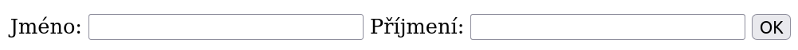
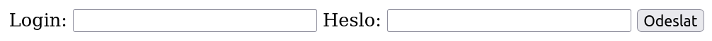

<!-- .slide: class="section" id="formulare" -->

<header>
    <h1>Příklad #3:<br>Zpracování formulářů</h1>
</header>

---

# Formulář v HTML

 <!-- .element: style="width:1500px;margin:60px 0" -->

```html
<form action="phpZpracujForm1.php" method="get">
   <label for="name">Jméno:</label>
   <input type="text" name="name" id="name">
   <label for="surname">Příjmení:</label>
   <input type="text" name="surname" id="surname">
   <input type="submit" value="OK">
</form>
```

---

# Metoda GET

- vyplněné hodnoty se **zakódují do URL dokumentu**, který je zpracovává
- formulář
	- `<form action="zpracuj.php" method="get">`
- vygeneruje URL:
	- `zpracuj.php?name=Jan&surname=Novak`
- PHP dekóduje URL a zpřístupní hodnoty v poli **$_GET**
	- `$name = $_GET['name'] ?? '';` -- hodnota nemusí existovat
	- při výpisu zpět do stránky vždy escapovat: `echo htmlspecialchars($name);`

---

# Metoda POST

- hodnoty se předají **v těle HTTP požadavku** (ne v URL)
	- (požadavek POST místo GET)
- PHP převezme data od webového serveru a zpřístupní v poli **$_POST** (JSON a jiná data přes `php://input`)
- **GET jen pro čtení** (vyhledávání, filtrování), **POST pro operace, které mění data** (přihlášení, uložení, smazání)
	- odkaz (GET) může prohlížeč předem načíst nebo ho projde vyhledávací robot

---

# GET vs. POST

<div class="col">

- **GET**
	- <span class="plus">+</span> transparentní
	- <span class="plus">+</span> hodnoty lze uložit
	- <span class="plus">+</span> pro odeslání stačí odkaz
	- <span class="minus">-</span> omezené množství dat
	- <span class="minus">-</span> nevhodné pro předání citlivých dat

</div>
<div class="col">

- **POST**
	- <span class="plus">+</span> velké množství dat (soubory)
	- <span class="plus">+</span> hodnoty nejsou v URL (chrání až HTTPS)
	- <span class="minus">-</span> nelze uložit
	- <span class="minus">-</span> nelze odeslat pouhým odkazem
	- <span class="minus">-</span> problém s tlačítkem *Zpět* (řeší přesměrování 303)

</div>

---

# Příklad: přihlašovací formulář

 <!-- .element: style="width:1500px;margin:60px 0" -->

```php
<form action="<?= htmlspecialchars($_SERVER['SCRIPT_NAME']) ?>"
      method="post">
   <label for="login">Login:</label>
   <input type="text" name="login" id="login">
   <label for="pwd">Heslo:</label>
   <input type="password" name="pwd" id="pwd">
   <input type="submit" value="Odeslat">
</form>
```

---

# Příklad: přihlašovací formulář (autentizace)

```php [2-4]
<?php
$login = $_POST['login'] ?? '';
$pwd = $_POST['pwd'] ?? '';
if ($login == 'admin' && $pwd == 'blackhat') {
   // přesměrování na výsledkovou stránku (viz Přesměrování dnes)
   header('Location: login_vysledek.php', true, 303);
   exit;
}
?>
```

<p class="small">Heslo v kódu je jen pro ukázku -- v praxi se ověřuje proti hashi uloženému v databázi (<a href="https://www.php.net/manual/en/function.password-verify.php"><code>password_verify()</code></a>).<br><a href="https://www.fit.vut.cz/study/course/IIS/private/examples/login.php">příklad…</a></p>
