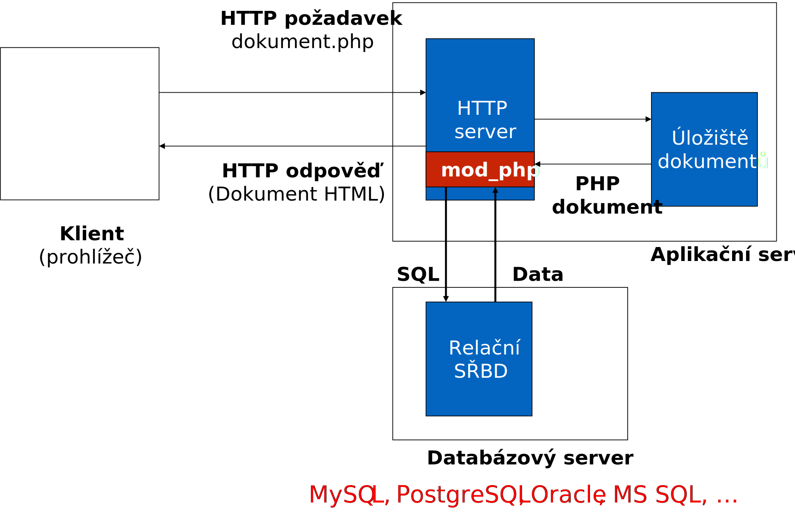

# Integrace SŘBD
- Pro ukládání dat se používá nejčastěji relační SŘBD – databázový server. 
	- Formalizovaná struktura na základě analýzy domény.
	- Ukládání dat přímo do souborů na serveru vyžaduje povolit webovému serveru právo zápisu na některou část lokálního souborového systému – bezpečnostní rizika.
	- Databázový server umožňuje efektivnější práci s velkým množstvím dat – efektivita, zajištění konzistence.
	- Může běžet na jiném počítači než webový server a může být dostupný prostřednictvím sítě – škálovatelnost.

---

# Architektura serveru s PHP
<!-- .slide: class="normal centered fullspace" data-transition="slide-in fade-out" -->

 <!-- .element: style="width:1200px;margin-top:30px;" -->

---

# Integrace databázového serveru (SŘBD)
<!-- .slide: class="normal centered fullspace" data-transition="fade-in slide-out" -->

 <!-- .element: style="width:1200px;margin-top:30px;" -->

---

# Návrh schématu databáze
- Doménový model – E-R diagram nebo diagram tříd
	- Identifikace entit – vlastnosti, jejich typ
	- Identifikace vztahů – kardinalita 
- Transformace na schéma databáze – _viz IDS, také v další přednášce_
	- Entity na tabulky, vlastnosti na sloupce
	- Vztahy: vazba primární – cizí klíč, příp. vazební tabulky
- Primární klíč, indexy

---

# Primární klíč
- U všech tabulek, které figurují ve vztazích nebo je nutné řádky jednoznačně identifikovat
- Přirozený primární klíč – často problematický
	- Právní problémy – ochrana osobních údajů
	- Praktické problémy – vše se může změnit
- Umělý primární klíč
	- Je nutné zajistit unikátnost v rámci tabulky
	- Generované cizí klíče – různá podpora v db systémech
	- MySQL: volba auto_increment u primárního klíče

---

# Indexy
- Pomocná datová struktura usnadňující vyhledávání podle hodnoty
	- Např. B+ strom
- Může být vytvořen nad jedním nebo více sloupci
	- `ADD KEY` | `INDEX`
	- Automaticky nad primárními klíči
	- V některých systémech i nad výrazem (např. `upper(name)`)
- Index na druhou stranu má prostorové nároky a jeho údržba má časové nároky (přidávání, mazání řádků)

---

# Než začneme: Příprava DB serveru
- Vytvoření databáze, přidělení práv uživateli

```sql
CREATE DATABASE demo;
CREATE USER 'demo2'@'localhost' IDENTIFIED WITH 'password';
GRANT ALL PRIVILEGES ON `demo`.* TO 'demo2'@'localhost';
```

- Vytvoření tabulek


```sql
CREATE TABLE `users`(
	`id` INT NOT NULL,
	`name` VARCHAR(255) NOT NULL,
	`surname` VARCHAR(255) NOT NULL,
	 PRIMARY KEY (`id`))
ENGINE = InnoDB;
```

---

# Spolupráce s databázovým serverem
- Aplikace v PHP běží na serveru dávkově
- Celou komunikaci s databází je třeba řešit v rámci zpracování jednoho HTTP požadavku.
- Demo: [GitHub](https://github.com/DIFS-Teaching/basic-demos/tree/master/php-forms-pdo)

---

# Práce s databází
1. Připojení k databázovému serveru
	- Autentizace aplikace (ne uživatele!)
2. Připojení konkrétní databáze
	- DB server ověří přístupová práva
3. Zaslání SQL dotazu
	- Získáme výsledek dotazu
4. Převzetí a zpracování výsledků
	- _(případně zpět k bodu 3)_
5. Ukončení spojení _(často na pozadí)_

---

# Relační databáze v PHP
- Historicky vlastní API pro každý databázový systém
	- Typicky sada funkcí v PHP
	- Např. `mysql_xxxx()`
- Snaha o sjednocení
	- Abstraktní vrstva s ovladači pro různé systémy
	- PHP Data Objects (PDO) – standard v PHP od verze 5.1
	- Existují různé další alternativy třetích stran

---

# PHP Data Objects (PDO)
- Jednoduchá abstrakce nad databázovým systémem
- Poskytuje **standardní rozhraní** pro základní operace
	- Objektově orientované rozhraní
- Toto rozhraní implementují **ovladače** (_drivers_) pro jednotlivé konkrétní systémy
	- Např. MS SQL, Firebird, IBM, Informix, MySQL, Oracle, DB2, PostgreSQL, SQLite, …
	- Viz [dokumentace k PDO](http://php.net/manual/en/book.pdo.php)

---

# Připojení k databázi
- Vytvoření instance třídy PDO
- Specifikace spojení pomocí DSN (data source name)


```php
<?php
$dsn = 'mysql:host=localhost;dbname=testdb';
$username = 'username';
$password = 'password';
$options = array(
    PDO::MYSQL_ATTR_INIT_COMMAND => 'SET NAMES utf8',
); 

$pdo = new PDO($dsn, $username, $password, $options);
```

---

# Zaslání SQL dotazu
- Jednorázový dotaz: PDO::query

```php
$stmt = $pdo->query("SELECT name, surname FROM users");
```

- Opakovaný dotaz: PDO::prepare a PDO::execute

```php
// Připravení dotazu
$stmt = $pdo->prepare("SELECT name, surname 
	FROM users WHERE id = ?");
// Vykonání dotazu
$stmt->execute(array($userId));
```

- Získáme tzv. _statement_ ($result)
- **Parametry:** prevence SQL injection, viz dále

---

# Zpracování výsledků – fetch()
- Statement zpřístupní celý výsledek dotazu.
- Sloupce výsledné tabulky odpovídají projekci v příkazu SELECT.

```php
while ($row = $stmt->fetch())
{
    echo $row['name'] . "\n";

    echo $row['surname'] . "\n";
}
```

- Alternativně přístup ke sloupcům přes indexy.

---

# Zpracování výsledků – fetchAll()
- `fetchAll()` přečte všechny zbývající řádky výsledku a uloží do pole.
- Opatrně: počet řádků je nutno omezit, např. pomocí `WHERE` (na rovnost), `LIMIT` apod.

```php
$stmt = $pdo->prepare("SELECT name, surname
	FROM users LIMIT 100");
$stmt->execute();
$data = $stmt->fetchAll();
foreach ($data as $row) {
	echo $row["name"] . "\n";
	echo $row["surname"] . "\n";
}
```

---

# Parametrizované dotazy
- Naivní (starý) přístup – <span style="color:red">NEBEZPEČNÉ</span>

```php
$sql = "SELECT * FROM users WHERE name='$name'";
```

- Pokud (např. uživatelský vstup) 
```php
$name = "franta';DROP TABLE users; -- ";
```

- Dostaneme

```sql
SELECT * FROM users
	WHERE name = 'franta'; DROP TABLE users; -- '
```

---

# Parametrizované dotazy v PDO

```php
$stmt = $pdo->prepare('SELECT * FROM users
				WHERE email = ? AND status = ?');
$stmt->execute([$email, $status]);
$user = $stmt->fetch();
```

nebo

```php
$stmt = $pdo->prepare('SELECT * FROM users
				WHERE email = :email AND status = :status');
$stmt->execute(['email' => $email, 'status' => $status]);
$user = $stmt->fetch();
```

---

# Vkládání a změna dat
- `INSERT`

```php
$stmt = $pdo->prepare("
	INSERT INTO uzivatel (name, surname) VALUES(?, ?)");
$stmt->execute([$jmeno, $prijmeni]);
```

- Generované ID: `$pdo->lastInsertId()`
 
- `UPDATE`

```php
$stmt = $pdo->prepare("
	UPDATE uzivatele SET name = ?, surname = ?
	WHERE id = ?");
$stmt->execute([$jmeno, $prijmeni, $idUzivatele]);
```

---

# Uživatelské účty v databázi
- Tabulka uživatelů se sloupci login a password
- Hesla se nesmí ukládat v otevřené podobě
	- Nutno použít hashovací funkci
	- V PHP např. `password_hash()` a `password_verify()`
- [Demo aplikace](https://github.com/DIFS-Teaching/basic-demos/tree/master/php-login-db)

---

# Co dále?
- Složitější schéma databáze
	- Vztahy, kolekce
	- Integrita a konzistence databáze
- Složitější operace nad databází
	- Transakce
