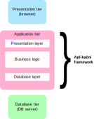

# Aplikační frameworky

- Rámcová řešení pro implementaci serverových aplikací
	- Neplést s frontend frameworky!
- Poskytují API (třídy a metody) pro běžné úlohy a situace
	- Zpracování požadavku apod.
- Vynucují pevnou strukturu aplikace
- Tvůrce se může soustředit na tvorbu vlastního řešení
	- Implementace aplikační logiky
	- Uživatelské rozhraní nebo API (volitelně)

---

<!-- .slide: class="normal centered" -->

# Vrstvy aplikace

 <!-- .element: style="height: 750px"; text-align: center" -->

---

 # Nejdůležitější úlohy frameworku

- Zpracování HTTP požadavků
	- Dekódování požadavku a parametrů
	- Volání příslušné aplikační logiky
	- Generování odpovědi
- Tvorba GUI na serveru
	- Snadné generování výstupního HTML (šablony)
	- Znovupoužitelné komponenty (např. formuláře)
- Databázová vrstva
	- Jednotná komunikace s DB serverem
	- Jednotná konfigurace

---

# Další běžné funkce

- Jednotná konfigurace aplikace
- Správa instancí objektů a závislostí
	- Dependency injection
- Autentizace a autorizace

---

# Hlavní PHP frameworky

Populární v ČR:

- Laravel -- https://laravel.com/
- Symfony -- https://symfony.com/
- Nette -- https://nette.org/

Širší přehled:

- např. [10 Popular PHP frameworks in 2020](https://raygun.com/blog/top-php-frameworks/) 
- (ale podobných žebříčků je mnoho)

---

<!-- .slide: class="normal centered" -->

# Je dobré použít framework?

??**ANO** <!-- .element: style="font-size:200%" -->

??(Pro produkční, déle udržovanou aplikaci)

- ??Přehledná struktura aplikace -- udržovatelnost, rozšiřitelnost
- ??Produktivita
- ??Bezpečnost (záleží na frameworku)

