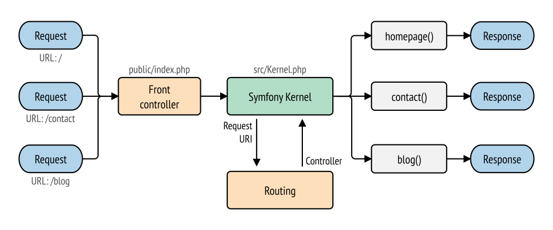

<!-- .slide: class="section" -->

<header>
	<h1>Architektura frameworku</h1>
	<p>Jak to uvnitř funguje?</p>
</header>

---
# Specifika PHP

- PHP využívá dávkové zpracování
	- Nic z aplikace na serveru trvale neběží
- Celý framework se ``startuje'' znovu při příchodu každého HTTP požadavku
	- Lze optimalizovat vyrovnávacími paměťmi apod.
- Na druhou stranu poměrně přímočará implementace

---

# Bootstraping

-- viz [definice na Wikipedii](https://en.wikipedia.org/wiki/Bootstrapping)

- Aktivace funkcionality frameworku při příchodu HTTP požadavku
- Typický scénář:
	- Všechny požadavky se směrují na jeden vstupní skript
		- `index.php`, `bootstrap.php`, ...
	- Ten dekóduje požadavek, aktivuje aplikační logiku a vrátí výsledek (HTTP odpověď)


---

# Zpracování HTTP požadavku

([Symfony: The Symfony Application Flow](https://symfony.com/doc/current/introduction/http_fundamentals.html#the-symfony-application-flow))

 <!-- .element: style="width: 905%"; -->

---

# Architektura aplikace

- Nejčastěji návrhový vzor MVC
- **Model**
	- Třídy implementující business logiku (operace, zahrnuje práci s databází)
- **View**
	- Generované HTML, šablona naplněné daty
- **Controller**
	- Přiřazený k HTTP požadavku (routing)
	- Volá metody modelu
	- Na základě výsledku vytváří View

---

# Routing

- Mapování URL na controller, který se bude volat
- Konfigurace
	- Anotace u controllerů, speciální konfigurační soubory, nebo PHP \
	  např. [Konfigurace Symfony](https://symfony.com/doc/current/routing.html) \
	  nebo [Nette Router](https://doc.nette.org/cs/application/routing)
- Konvence
	- Pevně definovaný způsob pojmenování controllerů a mapování URL \
	  např. Nette [SimpleRouter](https://doc.nette.org/cs/application/routing#toc-simplerouter)

---

# View (Laravel) -- Blade templates

```html
<!-- View stored in resources/views/greeting.blade.php -->

<html>
    <body>
        <h1>Hello, {{ $name }}</h1>
    </body>
</html>
```

---

# Controller (Laravel)

```php
<?php

namespace App\Http\Controllers;

use App\Http\Controllers\Controller;
use App\Models\User;

class UserController extends Controller
{
    /**
     * Show the profile for the given user.
     *
     * @param  int  $id
     * @return \Illuminate\View\View
     */
    public function show($id)
    {
        return view('greeting', ['name' => 'James']);
    }
}
```

---

# View (Symfony) -- Twig

```twig
{# template/users/welcome.html.twig #}
<!DOCTYPE html>
<html>
    <head>
        <title>Welcome to Symfony!</title>
    </head>
    <body>
        <h1>{{ page_title }}</h1>

        
            Hello {{ user.name }}!
        

        {# ... #}
    </body>
</html>
```

---

# Controller (Symfony)

```php
// src/Controller/UserController.php
namespace App\Controller;

use Symfony\Bundle\FrameworkBundle\Controller\AbstractController;

class UserController extends AbstractController
{
    // ...

    public function welcome()
    {
        // the template path is the relative file path from `templates/`
        return $this->render('user/welcome.html.twig', [
            'page_title' => $title,
            'user' => $user,
        ]);
    }
}
```

---

# View (Nette) -- Latte

```html
{block content}
	<h1 n:block="title">Můj blog</h1>

	{foreach $posts as $post}
	<div class="post">
		<div class="date">{$post->created_at|date:'F j, Y'}</div>

		<h2>{$post->title}</h2>

		<div>{$post->content}</div>
	</div>
	{/foreach}
{/block}
```

---

# Presenter (Nette)

```php
namespace App\Presenters;
use Nette;

class HomepagePresenter extends Nette\Application\UI\Presenter
{
	/** @var Nette\Database\Context */
	private $database;

	public function __construct(Nette\Database\Context $database)
	{
		$this->database = $database;
	}

	public function renderDefault(): void
	{
		$this->template->posts = $this->database->table('posts')
			->order('created_at DESC')
			->limit(5);
	}
}

```

---

# Model (Nette)

```php
namespace App\Model;

use Nette;

class ArticleManager
{
	use Nette\SmartObject;

	/** @var Nette\Database\Context */
	private $database;

	public function __construct(Nette\Database\Context $database)
	{
		$this->database = $database;
	}

	public function getPublicArticles()
	{
		return $this->database->table('posts')
			->where('created_at < ', new \DateTime)
			->order('created_at DESC');
	}
}
```

---

# Dependency injection

- Framework zabezpečuje vytváření instancí objektů
	- DI container
- Každá část specifikuje požadované služby (objekty)
	- Nejčastěji jako parametru konstruktoru
- Framework vytvoří a dodá instanci
	- Způsob vytvoření je definován v konfiguraci aplikace

---

# Dependency injection (Nette)

```php
namespace App\Presenters;

use Nette;
use App\Model\ArticleManager;


class HomepagePresenter extends Nette\Application\UI\Presenter
{
	/** @var ArticleManager */
	private $articleManager;

	public function __construct(ArticleManager $articleManager)
	{
		$this->articleManager = $articleManager;
	}

	public function renderDefault(): void
	{
		$this->template->posts = $this->articleManager->getPublicArticles()->limit(5);
	}
}
```

---

# Databázová vrstva

- Jednoduché abstrakce nad SQL
	- [Fluent query builder](https://laravel.com/docs/8.x/queries) (Laravel)
	- [Nette database](https://doc.nette.org/cs/3.0/database-core)
- Objektově relační mapování
	- [Doctrine ORM](https://www.doctrine-project.org/) ([preferované v Symfony](https://symfony.com/doc/current/doctrine.html#configuring-the-database))
	- [Eloquent](https://laravel.com/docs/8.x/eloquent) (Laravel)
