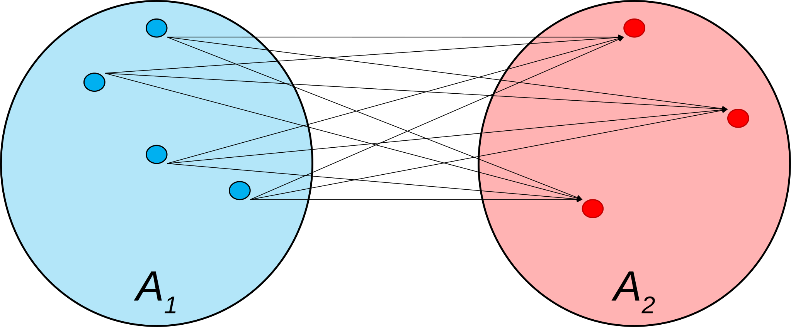
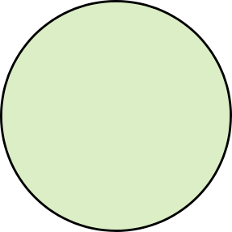
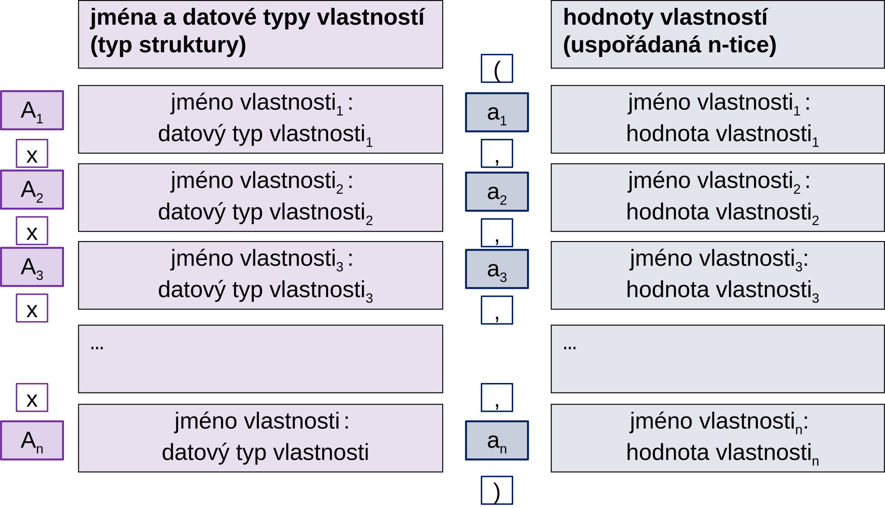
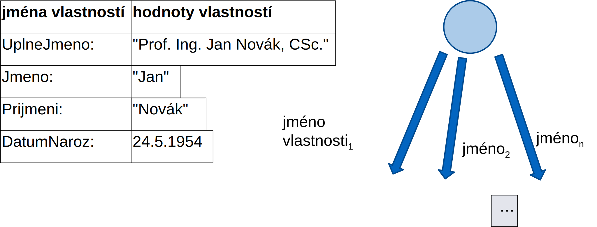
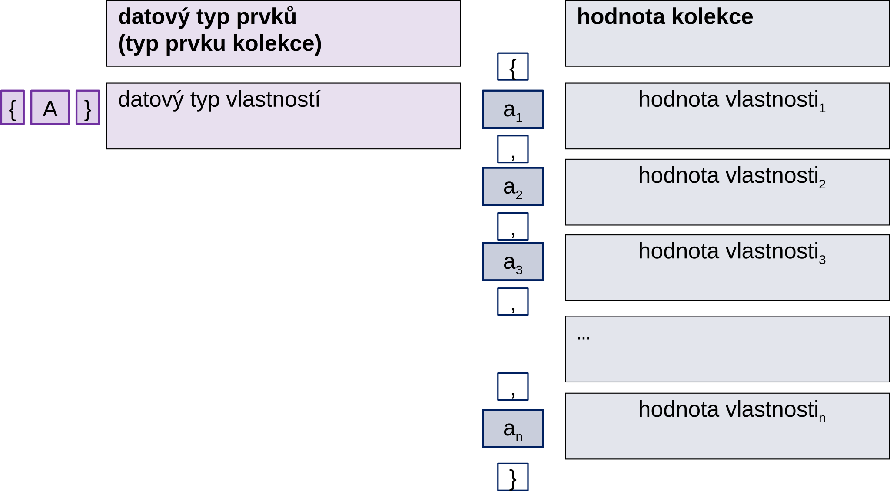
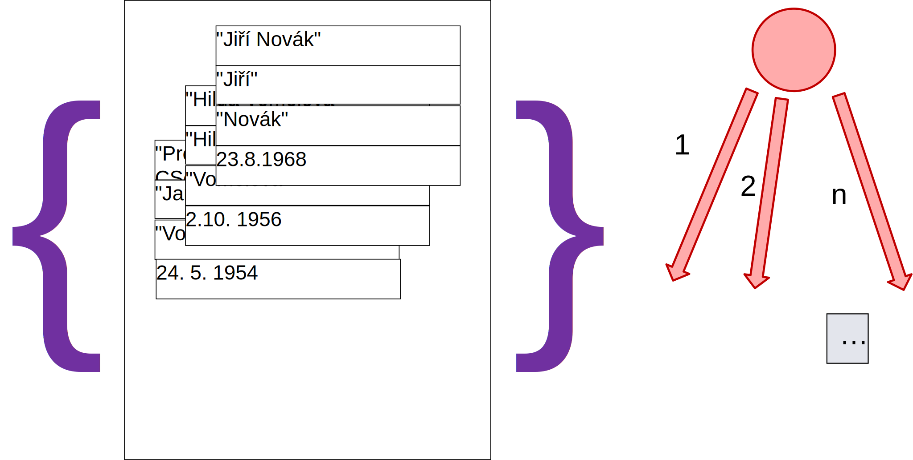
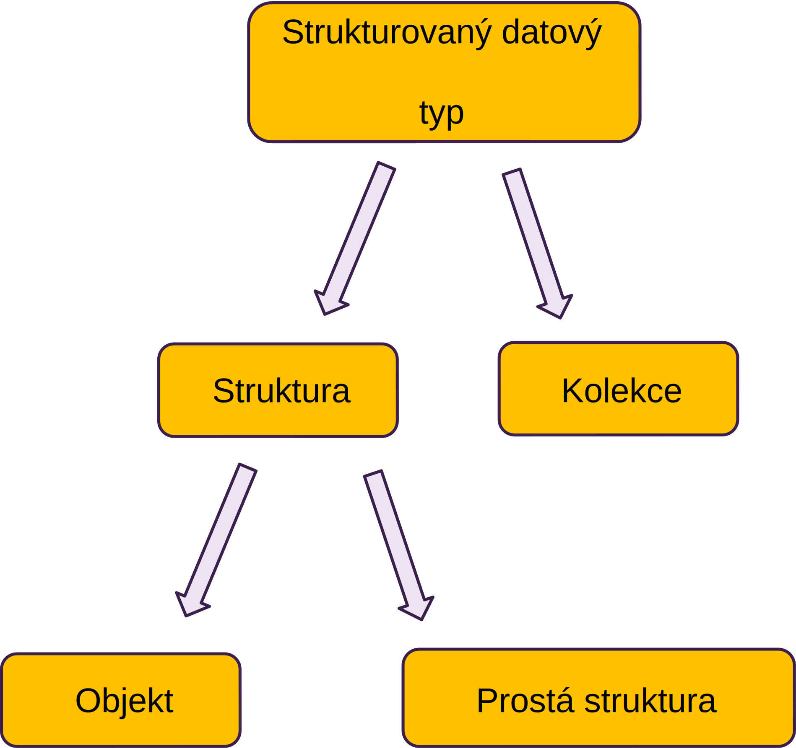
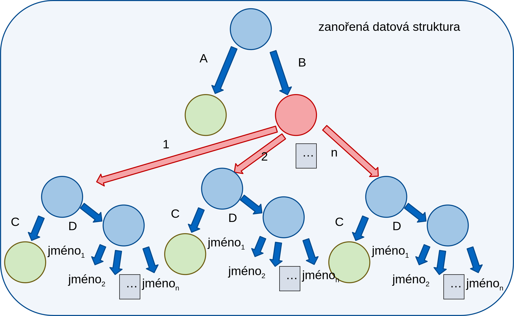

<!-- .slide: class="section" -->

<header>
	<h1>Strukturovaná data</h1>
	<p>Jak vyrobit z jednoduchých údajů složitý?</p>
</header>

---
<!-- .slide: class="normal centered" -->

# Kartézský součin A1 x A2

 <!-- .element: style="height:550px" -->

Výsledkem je **množina dvojic** -- celkem `$4x3=12$` dvojic.

---

# Kartézský součin
- *Uspořádaná n-tice* `$(a_1, a_2, \dots, a_n)$`
- *Kartézský součin množin* `$A_1 \times A_2 \times \dots \times A_n$` je množina všech uspořádaných n-tic takových, že `$a_1 \in A_1, a_2 \in A_2, \dots, a_n \in A_n$`
- Podstatné je, že v uspořádané n-tici je každá hodnota prvkem jediné z množin v kartézském součinu a to té, která jí indexem odpovídá

---

<!-- .slide: class="section" -->
<header>
	<h1>Struktura a kolekce</h1>
</header>

---

# Základní typy

 <!-- .element: style="float: right; height: 100px" -->

- Základní nestrukturované datové typy:
	- Celočíselné
	- Reálná čísla
	- Znaky / řetězce
	- Datum/čas
	- Výčtové typy 
	apod.

---

# Strukturované datové typy

- Strukturovaný datový typ = datová struktura = *metadata* 
	- Jak z jednodušších datových typů (ať už základních nebo i jednodušších strukturovaných) budovat složitější. 
- Existují základní dva způsoby, jak strukturované datové typy vytvářet:
	- _struktura_ a
	- _kolekce_.
- Vše je definováno předem, před vznikem hodnoty

---

# Struktura
- Strukturované hodnoty vytvářené:
	- __Pevným počtem__ dílčích hodnot obecně __různých__ typů
	- Tedy uspořádané n-tice, které jsou prvky kartézského součinu množin dílčích datových typů
	- Hodnoty jsou pojmenované, tzn. přistupuje se k nim přes jejich unikátní jméno
- Jako synonymum pro uspořádanou n-tici (tedy hodnotu) je velmi často užíván termín _struktura_ nebo _záznam_. Jako synonymum pro kartézský součin (tedy datový typ) budeme často používat _typ struktura_ nebo _typ záznam_.

---

<!-- .slide: class="normal centered" -->

# Schéma struktury

 <!-- .element: style="height:700px" -->


---

# Příklad datového typu struktura

```
structure FyzOsoba
   properties
      UplneJmeno: 	string
	  Jmeno:      	string
	  Prijmeni:   	string
	  DatumNaroz: 	date
   end structure
```
Definujeme *metadata*.

---

# Hodnota struktury

<!-- .slide: class="normal centered" -->

 <!-- .element: style="height:700px" -->

---

# Kolekce
- _Kolekce_ (synonyma jsou _řetězec_, _posloupnost_, _seznam_, _soubor_) je, na rozdíl od struktur, tvořena
	- *__Předem neomezeným počtem__ hodnot __stejných__ datových typů.*

---

# Kolekce
- Množina obsahuje obvykle každý prvek pouze jednou. Pokud je povoleno, aby daný prvek byl v množině vícekrát, mluvíme o _multimnožině_ 
- Tradiční seznam je *uspořádanou multimnožinou*
- Obecně lze vytvářet kolekce s prvky libovolných datových typů. 
- Časté omezení je vytvářet _pouze kolekce s prvky datového typu struktura_ 

---

# Operace nad množinou
- Vkládání prvku do kolekce (_add_),
- Získání prvku z kolekce (_item_),
- Určení počtu prvků kolekce (_count_) a
- Rušení prvku kolekce (_remove_)

případně
- Provádění operací nad všemi prvky (_forall_)

---

# Vlastnosti kolekce
- _Kurzor (__iterator__)_, což je ukazovátko do kolekce, kterým lze posunovat oběma směry a nastavovat je do různých pozic v kolekci podle různých kriterií. 
- Protože v průběhu práce s kurzorem se může kolekce měnit co do obsahu i počtu prvků, dělíme kurzory na _stabilní_, které na tuto skutečnost neberou zřetel a _nestabilní_, které reflektují změny
- Nad kolekcí může existovat jedno nebo více definovaných _uspořádání_ jejich prvků podle různých klíčů. 

---

<!-- .slide: class="normal centered" -->

# Schéma kolekce

 <!-- .element: style="height:700px" -->

---

# Příklad datového typu kolekce struktur

```
collection FyzickeOsoby of
	structure FyzOsoba
   	properties
		UplneJmeno: string
	   	Jmeno:      string
	   	Prijmeni:   string
	   	DatumNaroz: date
	end structure 
```

---

<!-- .slide: class="normal centered" -->

# Hodnota kolekce

 <!-- .element: style="height:700px" -->

---

# Agregáty
- Vlastnostmi kolekce jsou nejčastěji _agregáty (agregované hodnoty)_, což jsou hodnoty statisticky popisující prvky _kolekce_ nejčastěji _číselných hodnot_. 
	- _počet prvků,_
	- _maximum_, 
	- _minimum_, 
	- _součet hodnot_, 
	- _průměr_ atd.

---

# Objekt a prostá struktura
- _Objekt je struktura s identifikací._
- Každému objektu v systému přiřazena _jednoznačná identifikace_ nazývaná _OID (__object__ __identification__)_. 
- Objekt je tedy _struktura, jejíž systémovou a obvykle první vlastností je OID_. Hodnotu OID generuje databázový systém při vzniku objektu a po celou dobu činnosti ji nemění.
- Tím, že má objekt OID, je _identifikovatelný_ a tudíž i _odkazovatelný_. Má to za následek, že může figurovat jako _člen_ ve _vztazích_. To struktura bez identifikace nemůže. Takovou strukturu bez OID budeme nadále nazývat _prostou strukturou_.

---

<!-- .slide: class="normal centered" -->

# Strukturované datové typy

 <!-- .element: style="height:700px" -->

---

# Zanořené kolekce a struktury
- Obecně lze struktury a kolekce libovolně vzájemné vnořovat

```
structure ZANORENA
   properties
      A: integer
      B: collection of structure
            properties
               C: integer
               D: structure
               …
                  end structure

         end structure
end structure
```

---

<!-- .slide: class="normal centered" -->

# Graf hodnoty zanořených typů

 <!-- .element: style="height:700px" -->


