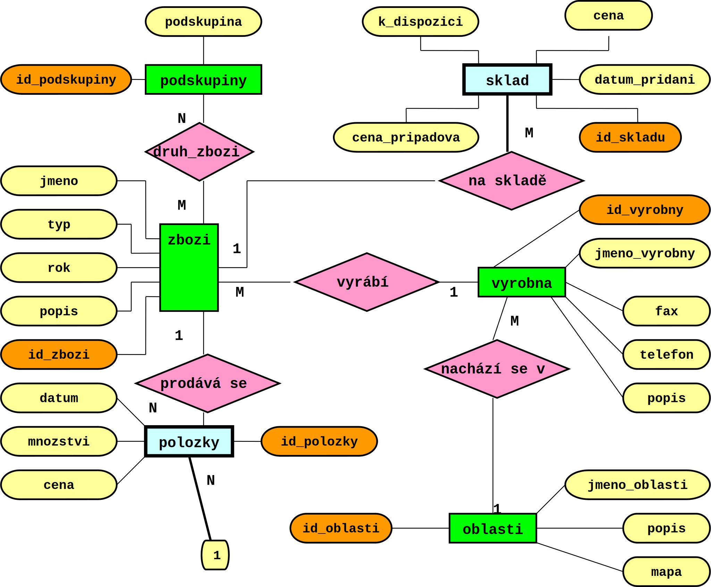
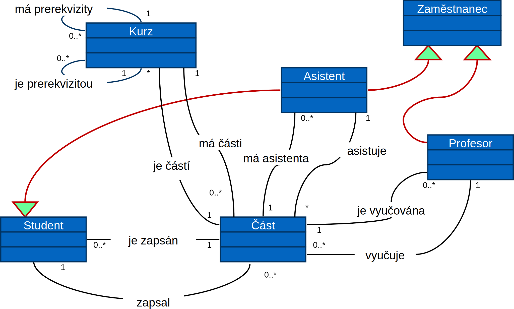
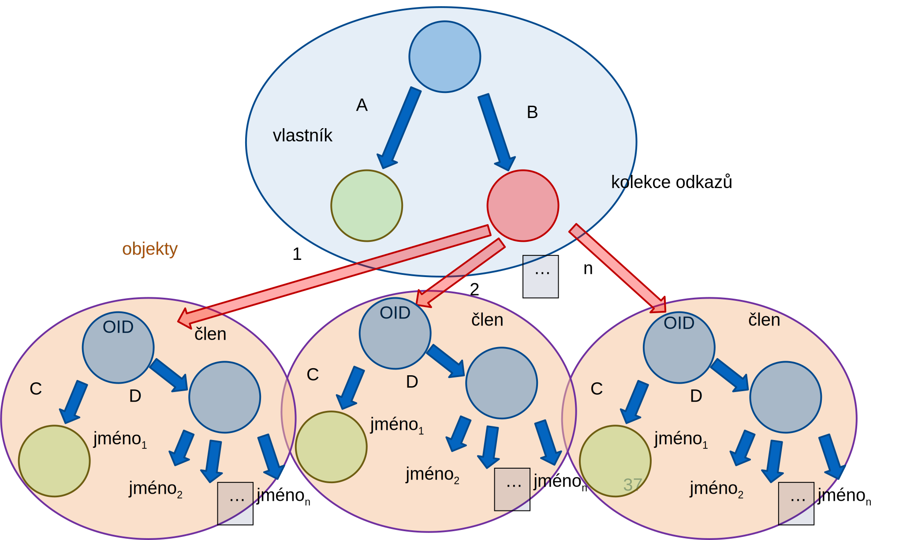

<!-- .slide: class="section" -->

<header>
	<h1>Datové modelování</h1>
	<p>Od struktury a kolekce k modelům</p>
</header>

---

# Data, metadata, atd.

- **Data**
	- Konkrétní hodnota (*výskyt*)
	- Např. "Jan Novák", "1250 Kč", ... (i strukturované hodnoty)
- **Metadata** = jak vypadají data
	- Formální popis struktury dat
	- Záleží na datovém modelu:
		- Relační: definice struktury tabulek (relací)
		- Objektový: definice tříd
		- ...

---

# Další úrovně

- Každou úroveň metadat lze opět popsat
- **meta-metadata = meta<sup>2</sup>data** = jak vypadají metadata
	- Popis datového modelu
	- Např. relační: relace je kolekce struktur, SQL jako prostředek definice metadat, ...
- **meta<sup>3</sup>data**
	- Jak se popisuje databázový model -- kolekce, struktura, ...
- ... atd.

---

# Modelování
- Cíle modelování: 
	- Zobrazit (a tím i zjednodušit = abstrakce) modelovanou realitu
	- Vyvinout univerzální struktury pro popis modelované reality, které jsou schopné tvořit datové modely = meta<sup>2</sup>data
	- Z nich sestavit modely pro různá použití

---

# Databázové modely
- Modely, které je schopen interpretovat systém pro řízení databázového systému SŘBD
- Jinak též zvané **produkční modely**
- V jejich definičním jazyku musejí být zapsána **metadata** pro všechny datové struktury uložené v databázi
- Prozatím budeme uvažovat jako produkční **relační a objektový datový model**.

---

# Konceptuální modely
- Slouží pro komunikaci mezi návrháři, případně se zákazníky
- Jsou formálně přesné a **převoditelné** na produkční modely
- Často jsou grafické pro větší přehlednost
- Nejběžnější konceptuální modely **diagram tříd (UML)** a **E-R diagram**

---

# Transformace mezi datovými modely
- Slouží nejčastěji pro transformaci konceptuálních modelů na produkční.
- Transformace je tím složitější, čím jsou modely více sémanticky odlišné.
- Nejčastěji se uvažuje **transformace E-R diagramu na relační datový model**.

---

<!-- .slide: class="section" -->
<header>
	<h1>Konceptuální modely</h1>
</header>

---

# Entity-relationship (E-R) diagram
- Hlavní komponenty E-R diagramu jsou:
	- **entita** a 
	- **vztah** (**_relationship_** nikoliv **_relation_**).
- **Entity** modelují objekty, které se vyskytují v modelovaném fyzickém systému
	- např. studenti, profesoři, předměty na vysoké škole
	- a jejich **atributy**
- **Vztahy** modelují spojení mezi entitami -- například profesoři _učí_ předměty. 
- Navíc tvoří důležitou část E-R specifikace **integritních omezení** na entitách a vztazích, např. profesor učí **pouze jeden předmět** v daném čase.

---

<!-- .slide: class="normal centered" -->
# Příklad E-R diagramu

 <!-- .element: style="height:700px" -->


---

# Diagram tříd

- **Třídy**
	- Jejich **vlastnosti** (jméno a datový typ)
- **Vztahy**
	- S různou kardinalitou
- **Dědičnost**
	- Generalizace -- specializace

---

<!-- .slide: class="normal centered" -->
# Příklad diagramu tříd

 <!-- .element: style="height:700px" -->


---

<!-- .slide: class="section" -->
<header>
	<h1>Databázové modely</h1>
</header>

---

# Relační model dat
- Tabulka (= **relace**) v relačním modelu je _kolekcí struktur_, přičemž datové typy vlastností jsou _jednoduché_ (tedy především _ne odkazy/vztahy_)
- Srovnej: _Podmnožina kartézského součinu_

```vbnet
collection of
	structure
		properties
			jméno vlastnosti1: jednoduchý datový typ1
			jméno vlastnosti2: jednoduchý datový typ2
			…
			jméno vlastnostin: jednoduchý datový typn
	end structure
```

---

# Vztahy
- Umožňují odkazovat z jedné (strukturované) hodnoty (vlastníka) jinou (člen)
- Musí existovat datový typ _jednoznačné identifikující (odkazující) strukturovanou hodnotu_ (např. OID)
- Vztah je definován prvkem vlastníka typu odkaz (reference) a členem, který je hodnotou odkazu identifikován. 

---

# Vztahy
- Relační model dat vztahy přímo neobsahuje
	- Vytváří se až v okamžiku dotazování (JOIN apod.)
	- (Neplést s referenční integritou!)
- Objektový model
	- Vztahy lze tvořit pomocí OID

---

# Objektový model dat

- Základní typy + datový typ OID
- Objekt je vždy strukturou na nejvyšší úrovni
- Dva druhy neomezeně zanořených struktur
	- Kolekce (někdy omezení pouze na kolekce prostých struktur a OID)
	- Prosté struktury (ostatní)
- Další vlastnosti zde neřešené (dědičnost apod.)
- **Odpadá nutnost transformace objektového modelu na schéma relační databáze**

---

# Odkazované struktury (objekty)

```
structure VLASTNIK
   properties
      A: integer
      B: CLEN 
end structure

object CLEN
   properties
      C: integer
      D: structure
      …
end object
```

---

<!-- .slide: class="normal centered" -->
# Graf hodnoty odkazovaných typů

 <!-- .element: style="height:700px" -->

---

# Objektově-relační mapování (ORM)

- Čistě objektové databáze se v praxi vyskytují minimálně
- Relační databáze jsou oproti tomu rozšířené, výkonné a odladěné
- ORM je databázová vrstva zajišťující automatické mapování objektů na relace a zpět
	- Program pracuje s objekty (např. uživatelé, smlouvy, …)
	- ORM vrstva vytváří SQL dotazy, transformuje data
- Zajišťuje konzistenci aplikace a schématu databáze
	- Možnost automatické tvorby schématu databáze apod.
	- Snazší úpravy aplikace

---

# ORM řešení
- Java
	- Standardní aplikační rozhraní JPA, Hibernate, ...
- PHP
	- Např. knihovna Doctrine
	- Použití do značné míry shodné s JPA
- Obdobně na dalších platformách
	- .NET, Python, JavaScript, …
- Více v předmětu Pokročilé informační systémy

---

# Transformace modelů

- Mezi modely mohou existovat transformace, zejména, pokud jsou si *sémanticky blízké*
- Velmi častou je transformace **E-R diagramu na relační datový model**
	- viz. postup z IDS

---

# Jiné transformace

- Diagram tříd lze transformovat na relační model obdobně jako E-R diagram
	- Je nutno řešit dědičnost – různé strategie
- Pro objektový databázový model lze přímo použít diagram tříd
	- V modelu se přímo definují třídy a jejich vlastnosti
	- Vztahy jsou reprezentovány vlastnostmi tříd
	- Odkazy na jiné objekty
		- např. `zbozi.vyrobna`

---

# Závěr
- **Ze struktur, kolekcí a základních typů můžeme vytvořit známé produkční i konceptuální modely**
- Reprezentace kolekcí a struktur:
	- Textová reprezentace ve formálních jazycích -- **serializace** (1D) -- komunikace mezi složkami systému
	- Grafická reprezentace - **vizualizace** (2D) -- vstup a výstup systému

