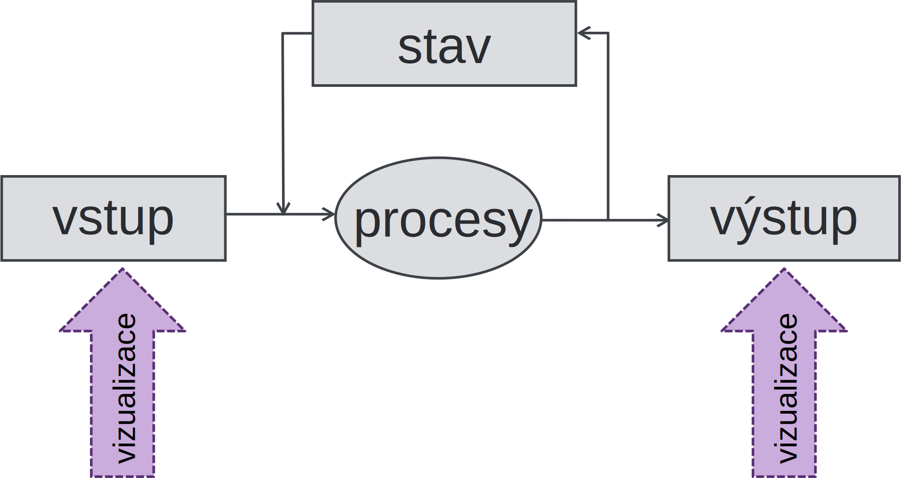
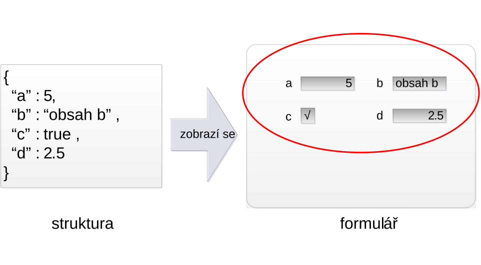
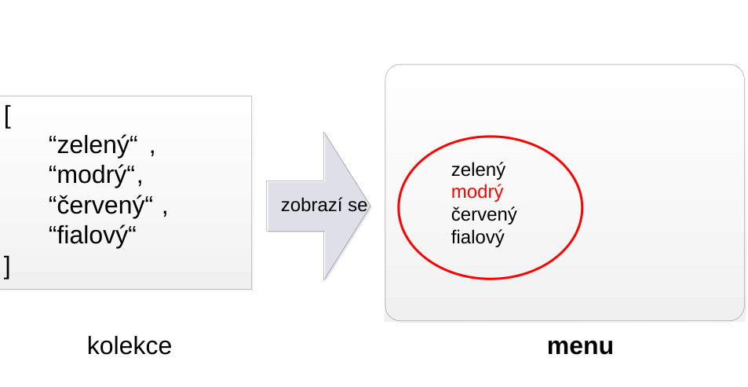
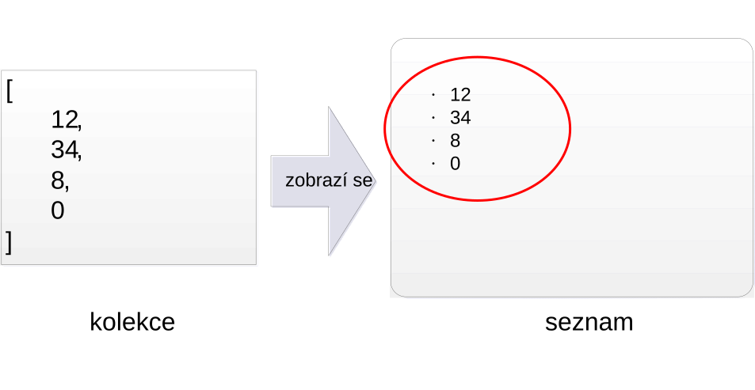
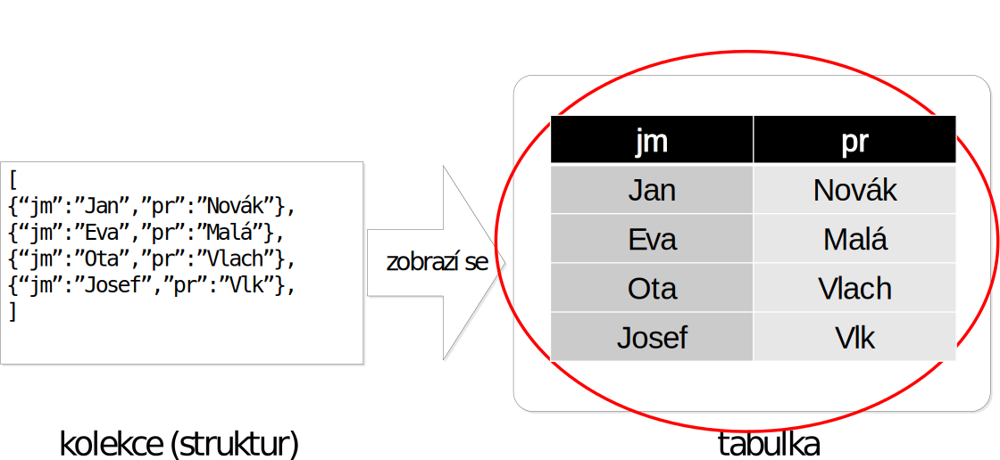

# Vizualizace a serializace
- Data v IS – jednoduché hodnoty, struktury a kolekce reprezentované pomocí vhodných modelů
- **Vizualizace**
	- 2D reprezentace dat
	- HTML, CSS
	- Pokročilé: JavaScript, XSLT, Grafická prezentace
		- V další přednášce
- **Serializace**
	- 1D reprezentace – sériová forma (řetězec)
	- JSON, XML, další specializované formáty

---

<!-- .slide: class="normal centered" -->

# Vizualizace v informačním systému

 <!-- .element: style="height: 700px" -->

---

# Zobrazení struktury

- Počet položek formuláře není závislý na hodnotě struktury

---

# Zobrazení kolekce jako menu

-  Počet řádků seznamu se mění s hodnotou kolekce
-  V HTML např. `<select>`, `<input type=“radio”>`

---

# Zobrazení kolekce jako seznamu

-  počet řádků seznamu se mění s hodnotou kolekce
-  v HTML např. `<ul>`, `<ol>`, `<li>`, …

---

# Zobrazení kolekce jako tabulky

-  počet řádků seznamu se mění s hodnotou kolekce
-  nejčastější variantou je tabulka zobrazující kolekci struktur (relaci) 

---

# Vizuální prezentace

- HTML kód generovaný by měl popisovat pouze obsah výsledného dokumentu a jeho strukturu
	- Tabulky, seznamy, formuláře, atd.
- Vizuální prezentace musí být definována zvlášť
	- Často spravována nezávisle
	- Více variant vzhledu (např. desktop, mobil, …)
	- Chceme udržet serverový kód co nejjednodušší
- Jak definovat vizuální prezentaci odděleně?
	- Cascading Style Sheets – CSS 

---

# Cascading Style Sheets

- Samostatná definice vzhledu – stylový předpis (_style sheet_)
	- Sada CSS pravidel
- Každé pravidlo definuje vlastnosti nějaké množiny HTML elementů
	- Selektor pravidla – vybírá množinu HTML elementů
	- Deklarace vlastností – definuje konkrétní vizuální vlastnosti
- Jedno pravidlo se může týkat většího množství elementů
- Vzhled elementů může být výsledkem aplikace většího množství pravidel

---

# Více o CSS

- Jednoduchý příklad
	- https://github.com/DIFS-Teaching/basic-demos/blob/master/php-forms-pdo/style.css
- Přednášky ITW
	- https://www.fit.vutbr.cz/study/courses/ITW/private/prednasky/

---

# CSS Frameworky

- Hotová CSS řešení pokrývající nejčastější prvky uživatelského rozhraní
- Využití nejčastěji pomocí přidání různých tříd HTML elementům (standardní atribut class)
- Vhodné pro rychlý návrh aplikace
	- Avšak značná část specifikace vzhledu se přesouvá do HTML, což úplně nechceme
	- Možnost kombinovat s vlastními CSS předpisy a problém alespoň částečně eliminovat
- Např. Bootstrap

