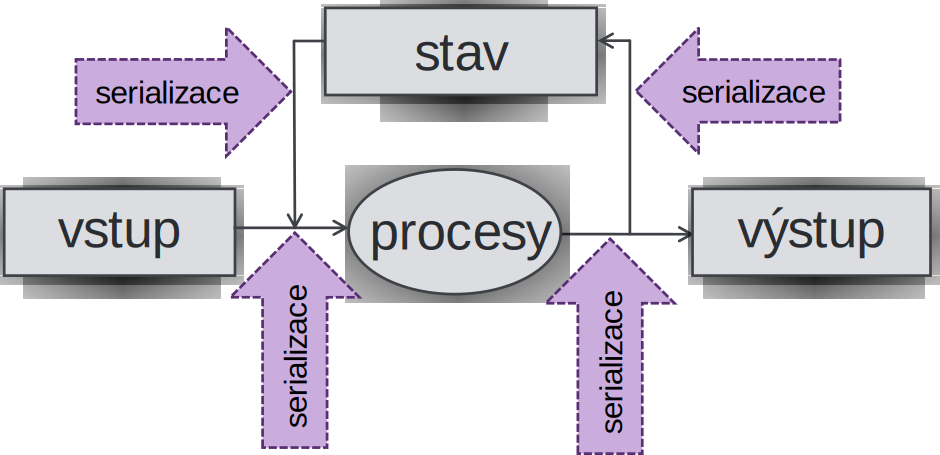

<!-- .slide: class="section" -->

<header>
   <h1>Serializace</h1>
   <p>Řetězcová reprezentace strukturovaných dat</p>
</header>

---

# Serializace

- _Serizalizace_ (_marshalling_) je proces konvertování datových struktur nebo stavů objektů do formátu, který může být 
	- uložen (např. textový soubor) nebo 
	- přenášen síťovým přenosem
- _Deserializace_ (_unmarshalling_) – rekonstrukce hodnoty na tentýž nebo jiný použitelný i netextový formát (vytvoření sémanticky ekvivalentního klonu původní datové struktury)
- Tento proces je složitý zejména v případě použití referujících hodnot (_vztahů_) a u objektů také u _metod_.

---

# Serializace v informačním systému

<!-- .slide: class="normal centered" -->

 <!-- .element: style="height: 700px" -->


---

# Syntaxe serializačních formátů
- Formálněji řečeno je serializace vyjádřením hodnoty struktury v nějakém **formálním jazyce**
- Hodnoty struktury a kolekce mají tvar
	- hodnota typu struktura = uspořádaná n-tice `$(a_1, a_2, \dots, a_n)$`
	- hodnota typu kolekce = uspořádaná množina `$\{b_1, b_2, \dots, b_n\}$`
- Na úrovni hodnoty = výskytu jsou stejné
- Jde o závorkované zanořené věty tvaru `$a^n \dots b^n$`, formální jazyk tudíž musí být minimálně **bezkontextový**

---

# Syntaxe serializačních formátů

- Vyhovuje libovolný bezkontextový jazyk mající možnost zápisu literálů strukturovaných hodnot (např. JavaScript – JSON)
- případně speciální bezkontextové jazyky (např. značkovací XML)

---

# Serializační formáty

- Často proprietární formáty jednotlivých aplikací
	- Závislost na architektuře (např. dump paměti)
	- Nemožnost sdílet existující nástroje (parser, …)
- 1987 zavedla firma Sun Microsystems  _External Data Representation_ (XDR)
- 1990 XML 
- 2001 JSON
- 2001 YAML
- mnoho dalších

---

# XML
- e**X**tensible **M**arkup **L**anguage
- Původně značkovací jazyk primárně pro tvorbu dokumentů
	- Vývoj ze standardu SGML
- Snadno rozšiřitelný pro další aplikace
	- Možnost formální definice vlastního schématu, validace, transformací, objektová reprezentace, …
- Proto ve své době první kandidát pro reprezentaci dat
	- Avšak v mnoha situacích poměrně těžkopádný

---

# JSON
- **J**ava **S**cript **O**bject **N**otation
- Navržen jako jazyk pro přenos dat mezi serverem a prohlížečem
- Využívá syntaxi pro zápis literálů v JavaScript
	- Snadné zpracování zejména v JS aplikacích
- Avšak je nezávislý na platformě
	- Podpora na všech hlavních serverových i klientských platformách

---

# YAML
- YAML - Ain't Markup Language
- YAML  obsahuje rysy pro efektivní serializaci uživatelsky příjemnou a potenciálně kompaktnější.
- Jsou to:
	- podpora ne-hierarchických struktur
	- strukturování dat indentací-zanořením (nebere tabelátory)

---

# YAML příklad

```yaml
invoice: 34843
date   : 2001-01-23
bill-to: &id001
    given  : Chris
    family : Dumars
    address:
        lines: 458 Walkman Dr.
        city    : Royal Oak
        state   : MI
        postal  : 48046
ship-to: *id001
```

---

# YAML příklad

```yaml
product:
    - sku         : BL394D
      quantity    : 4
      description : Basketball
      price       : 450.00
    - sku         : BL4438H
      quantity    : 1
      description : Super Hoop
      price       : 2392.00
tax  : 251.42
total: 4443.52
comments: >
    Late afternoon is best.
    Backup contact is Nancy
    Billsmer @ 338-4338.
```

---

# JSON
- **JSON** (JavaScript Object Notation)
- Je založen na podmnožině programovacího jazyka JavaScript, Standard ECMA-262 3rd Edition - December 1999. 
- Zápis v JSON je literálem v jazyce JavaScript. Není tudíž třeba speciálního analyzátoru
	- Všechny prohlížeče a klientské JavaScripty implicitně analyzují JSON
	- Ale v praxi se analyzátor používá i v JavaScriptu (bezpečnost)

---

# Struktura v JSON

 <!-- .element: style="width:80%" -->

Je serializací **_neuspořádané struktury_**

---

# Kolekce v JSON

 <!-- .element: style="width:80%" -->

Je serializací **_uspořádané kolekce – seznamu_**

---

# Základní typy v JSON

 <!-- .element: style="width:80%" -->

---

# Textové řetězce v JSON

 <!-- .element: style="height:700px" -->

---

# Čísla v JSON

 <!-- .element: style="height:700px" -->

---

# Příklad JSON

```json
{
   "firstName": "John",
   "lastName": "Smith",
   "address": {
      "streetAddress": "21 2. street",
      "city": "New York",
      "state": "NY",
      "postalCode": 10021
   },
   "phoneNumbers":[
      "212 555-1234",
      "646 555-4567"
   ]
}
```

- V PHP funkce `json_encode($pole)` a `json_decode($retezec)`.

---

<!-- .slide: class="section" -->
<header>
	<h1>Omezené serializační formáty</h1>
   <p>Pro speciální použití
</header>

---

# Omezené serializační formáty
- Omezují hloubku zanoření a typy položek strukturovaných hodnot
- Použití například pro předávání obsahu formulářů v HTML protokolem HTTP

---

# application/x-www-form-urlencoded 
- Serializace struktury s položkami textového a booleovského typu
- Mezery se převádějí na plus a nealfanumerické znaky na %_hh_, kde _hh_ je hexadecimální kód znaku. 
- Hodnoty položek jsou odděleny &.  Bývá položka pro tlačítko Submit a jeho jméno, pro indikaci, které tlačítko užil uživatel pro odeslání.

---

# application/x-www-form-urlencoded 
- Pokud uživatel vyplní formulář se vstupními poli `Jmeno` a `Chut`:

```text
	Jmeno=Hru%9Aka&Chut=Vanilkova
```

- Používá se pro přenos hodnot z prvku `<form>` jazyka HTML
- Metody GET i POST

---

# multipart/form-data
- Serializace struktury s položkami textového a booleovského typu
- pouze pro metodu POST. Každé odeslané pole zde má svůj vlastní oddíl, oddělený oddělovačem (boundary string) zvoleným tak, aby nekolidoval s odesílanými daty.
- Neprovádí se žádné kódování hodnot. Je tedy možné přenášet **binární data**.
- Používá se pro přenos hodnot z prvku `<form>` jazyka HTML
	- Nutno specifikovat pomocí atributu enctype
	- Potřebné pro přenos souborů `<input type="file">`

---

# Příklad formuláře s MIME typem

```html
<form action="upload.php" method="post"
				enctype="multipart/form-data">
    Select file to upload:
    <input type="file" name="fileToUpload" id="fileToUpload">
    <input type="submit" value="Upload Image" name="submit">
</form>
```

- PHP automaticky převezme uploadovaný soubor a uloží do dočasného souboru na serveru
- Údaje jsou v `$_FILES['fileToUpload']['…']`
	- name – jméno originálního souboru
	- tmp_name – jméno dočasného souboru
	- type – MIME typ souboru

---

# Příklad serializovaného formuláře

```
   -----------------------------7d627e30307c4
   Content-Disposition: form-data; name="Jmeno"
    
   hruška
   -----------------------------7d627e30307c4
   Content-Disposition: form-data; name="Chut"
    
   Vanilkova
   -----------------------------7d627e30307c4
   Content-Disposition: form-data; name="thefile"; filename="a.jpg"
   Content-Type: application/octet-stream

   …………
   -----------------------------7d627e30307c4--
```

---

# XML -- Extensible Markup Language

- Serializační formát vycházející ze starších značkovacích jazyků
- Orientovaný na dokumenty
   - Odlišný způsob zápisu
- Celá řada souvisejících technologií pro zpracování XML

---

# XML dokumenty
- Syntakticky obdobné jako v HTML
- Hierarchické zanořování XML prvků (**elementů**)
	- Každý element má _jméno_ a případně _atributy_
	- Jeden **kořenový element**
- Syntaktické rozdíly oproti HTML
	- XML nedefinuje jména ani význam elementů a atributů – vše je dáno konkrétní aplikací
	- Proto všechny značky jsou párové (parser nezná jejich význam)
	- Hodnoty všech atributů musí být v uvozovkách

---

# Prázdný prvek
- Je-li element prázdný, tj. nemá žádný obsah (ale může mít atributy), bude mít tvar

	```xml
   <jméno  případné atributy />
   ```

- Což je ekvivalentní

   ```xml
   <jméno  případné atributy></jméno>
   ```

---

# Příklad XML

```json
{
   "firstName":"John",
   "lastName":"Smith",
   "address":{
      "streetAddress":"21 2. street",
      "city":"New York",
      "state":"NY",
      "postalCode":10021
   },
   "phoneNumbers":[
      "212 555-1234",
      "646 555-4567"
   ]
}
```
<!-- .element: class="col"  -->

```xml [1-15|1|2,15|11,14|1-15]
<?xml version="1.0" encoding="UTF-8"?>
<person>
   <address>
      <city>New York</city>
      <postalCode>10021</postalCode>
      <state>NY</state>
      <streetAddress>21 2. street</streetAddress>
   </address>
   <firstName>John</firstName>
   <lastName>Smith</lastName>
   <phoneNumbers>
      <item>212 555-1234</item>
      <item>646 555-4567</item>
   </phoneNumbers>
</person>
```
<!-- .element: class="col"  -->


- Záhlaví XML není nutné pro kódování UTF-8
- Navíc kořenový element a elementy pro prvky kolekce

---

# Příklad XML -- Alternativně

```json
{
   "firstName":"John",
   "lastName":"Smith",
   "address":{
      "streetAddress":"21 2. street",
      "city":"New York",
      "state":"NY",
      "postalCode":10021
   },
   "phoneNumbers":[
      "212 555-1234",
      "646 555-4567"
   ]
}
```
<!-- .element: class="col"  -->

```xml [3-7]
<?xml version="1.0" encoding="UTF-8"?>
<person>
   <address
      city="New York"
      postalCode="10021"
      state="NY"
      streetAddress="21 2. street"/>
   <firstName>John</firstName>
   <lastName>Smith</lastName>
   <phoneNumbers>
      <item>212 555-1234</item>
      <item>646 555-4567</item>
   </phoneNumbers>
</person>
```
<!-- .element: class="col"  -->

- Atributy místo elementů
- Prázdný element `<address />`

---

# JSON nebo XML?

- **JSON**
   - Většinou komunikace specifická pro aplikaci
   - Ad-hoc formát
   - Snadné čtení i zápis, mapování na objekty jazyka
- **XML**
   - Dokumenty spíše orientované na text
   - Často veřejně sdílená data
   - Celý ekosystém navazujících technologií -- *v dalších přednáškách*
      - Adresování, transformace, vizualizace, ...
- Často je volba zbytečně subjektivní :-)
