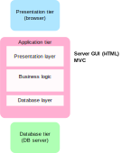

<!-- .slide: class="section" -->

<header>
	<h1>REST v PHP</h1>
	
Co je třeba k implementaci REST v PHP?

</header>

---

# Co musíme řešit?

1. Analýzu HTTP požadavku
	- Metoda a cesta ➜ **routing**
2. Dekódování vstupních dat
	- Parsování json, dekódování GET parametrů ➜ **deserializace**
3. Vykonání příslušné operace
	- Aplikační logika
4. Zakódování a odeslání výsledku
	- Vytvoření JSON, a odeslání ➜ **serializace**

---

<!-- .slide: class="normal centered" data-transition="slide-in fade-out" -->

# Vrstvy aplikace - serverové GUI

 <!-- .element: style="height: 750px"; text-align: center" -->

---

<!-- .slide: class="normal centered" data-transition="fade-in slide-out" -->

# Vrstvy aplikace - využití API

 <!-- .element: style="height: 750px"; text-align: center" -->

---

# REST v čistém PHP

- Vyhodnocení metody a cesty požadavku
	- `$_SERVER['REQUEST_METHOD']` a `$_SERVER['PATH_INFO']`
- Přečtení těla požadavku (pokd je)
	- `file_get_contents('php://input')`
- Nastavení stavového kódu a hlaviček odpovědi
	- `http_response_code()`, `header()`
- Serializace a deserializace
	- `json_encode()`, `json_decode()`

Demo: https://github.com/DIFS-Teaching/basic-demos/tree/master/php-rest-db

---

# Využití PHP frameworku

- Webový framework zajistí routing a zavolání *controlleru*
- Controller volá aplikační logiku a definuje odpověď
- Dekódování JSON:
	- Podpora deserializace. Např. `$request->json()->all()` v Laravel.
- Odeslání JSON:
	- [Symfony](https://symfony.com/doc/current/components/http_foundation.html#creating-a-json-response)
	- [Laravel](https://laravel.com/docs/8.x/responses#json-responses)
	- [Nette](https://doc.nette.org/cs/3.0/presenters#toc-odeslani-odpovedi)

---

# Pokročilejší řešení

- Framework může automatizovat vše kromě aplikační logiky
- Ta může mít podobu funkce se standardními parametry a návratovou hodnotou
- Příklady:
	- Java (JAX-RS) \
		https://github.com/DIFS-Teaching/jsf-basic/blob/master/src/main/java/org/fit/pis/api/People.java
	- .NET core \
		https://dotnet.microsoft.com/apps/aspnet/apis
