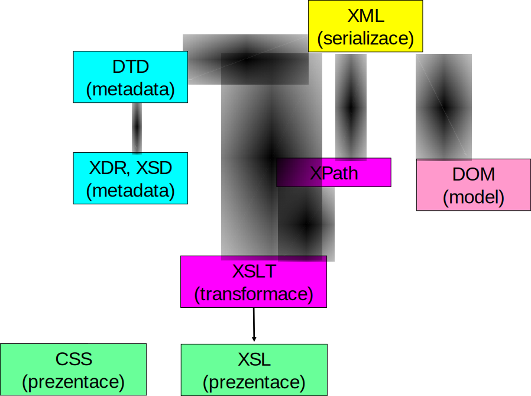

# XML -- Extensible Markup Language

- Serializační formát vycházející ze starších značkovacích jazyků
- Orientovaný na dokumenty
   - Odlišný způsob zápisu
- Celá řada souvisejících technologií pro zpracování XML

---

# XML dokumenty
- Syntakticky obdobné jako v HTML
- Hierarchické zanořování XML prvků (**elementů**)
	- Každý element má _jméno_ a případně _atributy_
	- Jeden **kořenový element**
- Syntaktické rozdíly oproti HTML
	- XML nedefinuje jména ani význam elementů a atributů – vše je dáno konkrétní aplikací
	- Proto všechny značky jsou párové (parser nezná jejich význam)
	- Hodnoty všech atributů musí být v uvozovkách

---

# Příklad XML

```json
{
   "firstName":"John",
   "lastName":"Smith",
   "address":{
      "streetAddress":"21 2. street",
      "city":"New York",
      "state":"NY",
      "postalCode":10021
   },
   "phoneNumbers":[
      "212 555-1234",
      "646 555-4567"
   ]
}
```
<!-- .element: class="col"  -->

```xml
<?xml version="1.0" encoding="UTF-8"?>
<person>
   <address>
      <city>New York</city>
      <postalCode>10021</postalCode>
      <state>NY</state>
      <streetAddress>21 2. street</streetAddress>
   </address>
   <firstName>John</firstName>
   <lastName>Smith</lastName>
   <phoneNumbers>
      <item>212 555-1234</item>
      <item>646 555-4567</item>
   </phoneNumbers>
</person>
```
<!-- .element: class="col"  -->


- Záhlaví XML není nutné pro kódování UTF-8
- Navíc kořenový element a elementy pro prvky kolekce

---

# Příklad XML -- Alternativně

```json
{
   "firstName":"John",
   "lastName":"Smith",
   "address":{
      "streetAddress":"21 2. street",
      "city":"New York",
      "state":"NY",
      "postalCode":10021
   },
   "phoneNumbers":[
      "212 555-1234",
      "646 555-4567"
   ]
}
```
<!-- .element: class="col"  -->

```xml
<?xml version="1.0" encoding="UTF-8"?>
<person>
   <address
      city="New York"
      postalCode="10021"
      state="NY"
      streetAddress="21 2. street"/>
   <firstName>John</firstName>
   <lastName>Smith</lastName>
   <phoneNumbers>
      <item>212 555-1234</item>
      <item>646 555-4567</item>
   </phoneNumbers>
</person>
```
<!-- .element: class="col"  -->

- Atributy místo elementů
- Prázdný element `<address />`

---

# Mixed content

- Element může obsahovat směs vnořených elementů a textu

```xml [9-10]
<?xml version="1.0" encoding="UTF-8"?>
<person>
   <firstName>John</firstName>
   <lastName>Smith</lastName>
   <phoneNumbers>
      <item>212 555-1234</item>
      <item>646 555-4567</item>
   </phoneNumbers>
   <description>Mr. Smith is <strong>very important</strong> and
		should be given <em>special care</em>.</description>
</person>
```

- Pořadí elementů může být významné (srov. s JSON)


---

# Komponenty XML technologie

<!-- .slide: class="normal centered" -->



