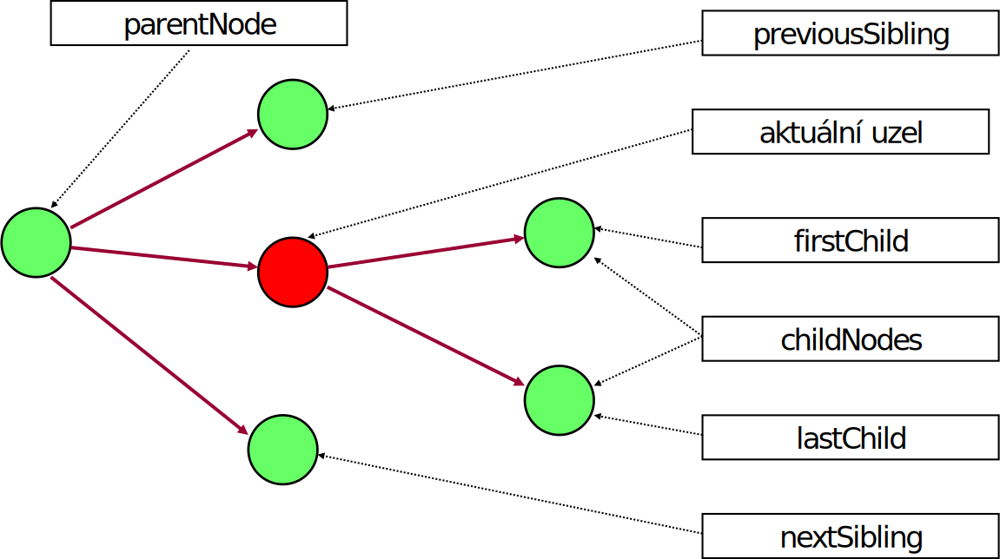

<!-- .slide: class="section" -->

<header>
	<h1>Document Object Model</h1>
	
Reprezentace (nejen) XML v programovacích jazycích

</header>

---
# Úvod
- Objektová reprezentace XML (nebo HTML) dokumentu pro práci s dokumentem
	- Čtení, a změna dokumentů
- Dokument je reprezentován jako strom objektů
- W3C standard, definuje rozhraní objektů nezávisle na platformě
	- Implementace: JavaScript, Java, PHP, C++, C#, …

---

# Třídy DOM

---

# Rozhraní Node
- Je základem modelu a má velký počet následníků
- Tři kategorie metod:
	- určení charakteristik uzlu (jméno, typ, hodnota)
	- určení pozice v dokumentu (navigace), přístup k příbuzným uzlům
	- modifikace obsahu uzlu (manipulace s uzly)

---

# Vlastnosti uzlu
- **nodeType**
- `nodeName`
- `nodeValue`
- `hasChildNodes()`
- `ownerDocument`
- `attributes`
- **textContent**

---

# Příklad navigačních operací

---

# Kolekce uzlů
- má standardní operace:
	- `item(index)`
	- `length`
	- `nextNode()`
	- `reset()`

---

# Rozhraní Document

- Reprezentuje celý dokument
- Vlastnost `documentElement` – kořenový element dokumentu
- Metody pro vyhledání elementů
	- `getElementsByTagName()`
	- `getElementById()`

---

# Rozhraní Element

- Reprezentuje jeden element 
- Metody pro vyhledání elementů
	- `getElementsByTagName()`
- Metody pro práci s atributy
	- `getAttribute()`
	- `setAttribute()`

---

# Alternativní rozhraní

- DOM rozhraní je univerzální, ale poněkud těžkopádné v mnoha situacích
- Různé platformy poskytují různá alternativní rozhraní pro práci s XML
- Např v PHP: [SimpleXML](https://www.php.net/manual/en/book.simplexml.php)

---

# Příklady

- Příklady na XML v PHP: GitHub

https://github.com/DIFS-Teaching/basic-demos/tree/master/php-xml
 
