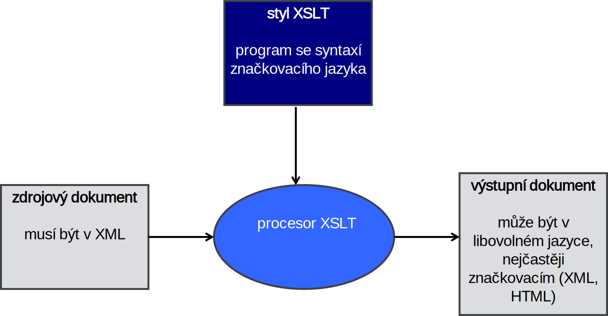

<!-- .slide: class="section" -->

<header>
	<h1>XPath a XSLT</h1>
	<p>Transformace a vizualizace XML dat</p>
</header>

---

# Komponenty XML technologie

<!-- .slide: class="normal centered" -->


---

# Vizualizace XML dat
- CSS – Cascading Style Sheets
	- Stejně jako v HTML, jen v selektorech jiná jména elementů
- XSL – eXtensible Style Sheet Language
	- Xpath – adresování elementu („selektory“)
	- XSLT – XSL Transformations (transformace)
	- XSL-FO – formatting objects (popis prezentace)
		- (místo toho se ale spíše transformuje do HTML)
- (nebo formátování DOM např. v PHP)
- Příklady:
	https://github.com/DIFS-Teaching/basic-demos/tree/master/xml-style 

---

# XPath
- Jazyk pro výběr uzlů v XML dokumentu
- Výsledkem vyhodnocení XPath výrazu je obecně **množina elementů**
	- Obdobně jako CSS selektory, ale mocnější
- Předpokládá existenci ‘kurzoru’ (ukazovátka) představujícího aktuální pozici v dokumentu
	- Absolutní i relativní „cesty“ v dokumentu
- Použitelný i na webu
	- [Introduction to using XPath in JavaScript](https://developer.mozilla.org/en-US/docs/Web/XPath/Introduction_to_using_XPath_in_JavaScript) (MDN)

---

# Základní tvar výrazu

- `krok1/krok2/krok3/…` - relativní cesta
- `/krok1/krok2/krok3/…` - absolutní cesta
- Výsledkem každého kroku je obecně **množina uzlů DOM**
- Pokud je výsledkem kroku množina uzlů, pak se další krok provádí paralelně ze všech cílů předchozího kroku

---

# Operace pro navigaci

- Slouží k popisu cesty ve stromové struktuře dokumentu
- Mají tvar\
	`osa::typ uzlu DOM`
- Osa (axis) v každém kroku určuje, kam se přemístí ukazovátko, může to být na jediný další uzel nebo i na množinu
- Za `::` může být typový výraz omezující cíl pouze na uzly jistého typu

---

# Typový výraz
- Libovolný typ prvku je označen `node()` nebo `*`
- Nebo **jména prvků**
- Další omezení (atributy, pozice, …)

---

# child:: potomek daného uzlu

- potomek daného uzlu se označí `child::`
- jméno funkce child je možné vynechat
- `child::address/child::city`\
je totožné s\
`address/city`

---

# Zástupné znaky
- je možné použít znaku `*` pro libovolný typ uzlu, např.
`person/*/city` 
- `//` popisují všechny potomky daného jména (ve všech úrovních), např.
`people//person`

---

# Další osy
- `descendant`, `descendant-or-self::` -- potomci (včetně samotného uzlu) 
- `ancestor::`, `ancestor-or-self::` -- předek
- `self::` -- uzel sám
- `parent::` -- rodičovský uzel (totéž co `..`)
- `preceding-sibling::` -- předchozí sourozenec
- `following-sibling::` -- následující sourozenec

---

# Omezující podmínka
- výsledkem cesty může být celý seznam uzlů
- filtry se používají pro další selekci
- mají tvar booleovské podmínky uzavřené do hranatých závorek
- lze jich uvést i několik za sebou `[…][…][…][…]…`
- lze užívat logické spojky `and`, `or` a `not`
- relační operátory jsou `=` `!=` `>=` `<=` `<` `>`

---

# Přístup k hodnotě atributu
- `attribute::` nebo zkráceně `@`
- například \
address[@city='Brno'] nebo\
address[attribute::city='Brno']

---

# Určení pozice
- `position()=číslo` pozice, lze zkrátit pouze na číslo
- `person[position()=1]` je totéž jako `person[1]`
- `last()` určuje poslední element: `person[position() = last()]`

---

# Různé typy výrazů v podmínkách
- Úplný řetězcový a číselný výraz
	- včetně reálných čísel
	- podřetězce, atd.

---

<!-- .slide: class="section" -->
<header>
	<h1>XSLT</h1>
   <p>XSL Transformations</p>
</header>

---

# Schéma transformace XSLT

<!-- .slide: class="normal centered" -->



---

# Transformace
- XSLT vytváří z jednoho dokumentu obecně jiný dokument (např. XML, který může odpovídat jinému DTD)
- transformace jsou popsány šablonami – **_templates_**
- šablony jsou přiřazeny elementům zdroje pomocí výrazů **_XPath_**

---

# Příklad

- `xsl:` formát (jazyk XSLT)
- bez prefixu: výstup


 ```xslt
 <xsl:template match="emph">
		<in-seq font-weight="bold">
			<xsl:apply-templates>
		</in-seq>
</xsl:template>
```

---

# Šablony
- tělo definice stylu tvoří nejméně jedna šablona

```xslt
<template match="výraz XPath">
	…
</template>
```

- výrazem se určují uzly DOM, které jsou danou šablonou upravovány

---

# Průchod stromem hierarchie
- V šabloně je nutné explicitně určit, zda se mají zpracovávat i podstromy\
`<apply-templates select="výraz Xpath"/>`
- Je nutné zajistit, aby existovala šablona pro libovolný element `match="*"`, případně pro kořenový element `match="/"`
- Element `<apply-templates/>` je možno použít i vícekrát a potom se podstrom zpracovává vícekrát (asi vždy s jiným select)

---

# Proces transformace

- Udržuje se seznam uzlů ke zpracování
- Na počátku obsahuje pouze kořenový uzel zdrojového stromu DOM 
- Zpracováním seznamu zdrojových uzlů se na výstupu vytváří fragment výstupního textu nebo stromu
- Při zpracování je první prvek ze seznamu zdrojových uzlů vyjmut a stává se aktuálním uzlem (_current node_). 
- Pro aktuální uzel jsou nalezena všechny šablony, který s ním lze sjednotit (_to match_) 

---

# Proces transformace
- Z nich je zvolena (instanciována) ta nejvhodnější (např. podle pořadí nebo priority).
- Výsledek instanciace zkopírován do výstupního textu nebo stromu. 
- Šablona může obsahovat instrukce, které umísťují  další zdrojové DOM uzly ke zpracování do seznamu, např.
	
`xsl:apply-templates` (následníci)  
	
`xsl:for-each` (určeni výrazem XPath)

---

# Výstup z transformace
- Nejčastěji se používá vkládání výstupních elementů jazyka HTML (vizualizace XML transformací na HTML)
- Libovolný text vložený do šablony bude rovněž součástí výstupu

---

# value-of

```xslt
<xsl:value-of
  select = "xpath-expression" 
  disable-output-escaping = "yes or no" 
/>
```

- Přenos zadané hodnoty na výstup
- Totéž pomocí `{xpath-expression}`

---

# Použití transformace pro vizualizaci
- Transformace do HTML (nejběžnější)
- Transformace do XSL-FO
	- Jazyk popisující fyzický vzhled dokumentu (opět XML)
		- Rozměry stránky, jednotlivé bloky, řádky textu, jejich vizuální vlastnosti, …
	- Následně zpracování procesorem FO
		- Výstup do PDF, PostScript, PCL, SVG, …
- Příklad:
https://github.com/DIFS-Teaching/basic-demos/tree/master/xml-style 

---

# Implementace XSLT
- `xsltproc` (téměř v každém Unixu)
- PHP
	- `XSLTProcessor`
- Java
	- `javax.xml.transform.Transformer`
	- Apache Xalan, Saxon
- C
	- `libxslt`
- **Každý webový prohlížeč**

