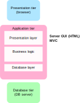
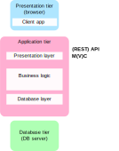

# Klientská strana IS

- **Tenký klient** -- prohlížeč
   - Zobrazuje HTML, odesílá GET a POST požadavky (formuláře)
   - Prezentační logika (chování UI) **na serverové straně**
- **Tlustý klient** -- aplikace (webová, mobilní, ...)
   - Volá funkce aplikačního rozhraní (např. REST)
   - Prezentační logika (chování UI) **na klientské straně**

---

<!-- .slide: class="normal centered" data-transition="slide-in fade-out" -->

# Vrstvy aplikace - tenký JS klient

 <!-- .element: style="height: 750px"; text-align: center" -->

---

<!-- .slide: class="normal centered" data-transition="fade-in slide-out" -->

# Vrstvy aplikace - tlustý JS klient

 <!-- .element: style="height: 750px"; text-align: center" -->
