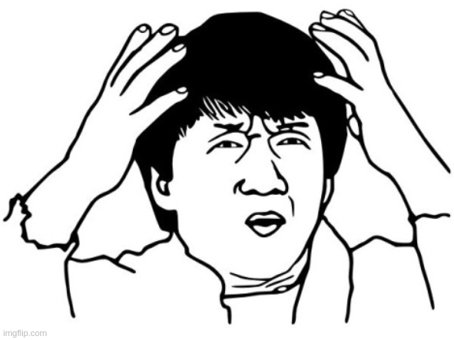
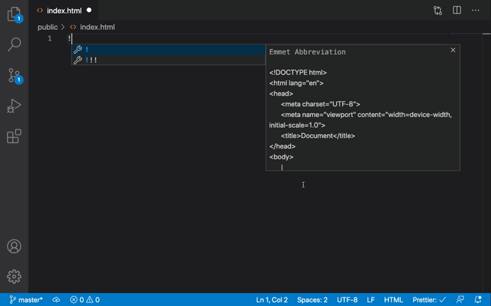
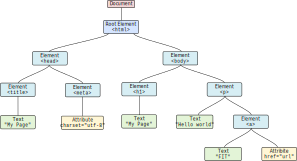

<!-- .slide: class="section" -->

<header>
	<h1>Jazyk HTML</h1>
	<p>úvod, principy</p>
</header>

---

# HTML

- HTML = <i>Hypertext Markup Language</i>
- *standardní* jazyk pro tvorbu hypertextových dokumentů

<br>

- **1994**: vzniká ***W3C*** (<i>[World Wide Web Consorcium](https://www.w3.org/)</i>) -- hlavní organizace pro webové standardy
  - **[HTML 4.01](https://www.w3.org/TR/html401/)** -- nedostačující (multimédia, sémantika, nejednotná implementace, ...)
- **2000–2004**: W3C prosazuje XHTML -- nepraktické pro běžný web (přísná syntaxe, složitost, ...)
- **2004**: vzniká ***WHATWG*** (<i>[Web Hypertext Application Technology Working Group](https://whatwg.org/)</i>)
    - reakce na stagnaci vývoje HTML 
    - vyvíjí paralelně verzi ***HTML5*** --> zmatek
- **2014**: WHATWG zavádí **[HTML Living Standard](https://html.spec.whatwg.org/)**
  - nečíslovaný, průběžně aktualizovaný HTML
- **2019** 🥳 : Dohoda mezi W3C a WHATWG
  - WHATWG je oficiálním správcem HTML a DOM
  - W3C se soustředí na CSS, přístupnost a další technologie

---

# HTML dokument

- textový dokument
  - MIME type *text/html*
  - obvykle přípona *.html* nebo *.htm*
- kódování znaků: ***UTF-8***
  - staré: ISO-8859-2, windows-1250, ...
- populární editory, IDE: **[VSCode](https://code.visualstudio.com/)**, **[WebStorm](https://www.jetbrains.com/webstorm/)**, ...

<div style="display:flex; align-items: center; justify-content: space-around;">


</div>

<span class="note"><a href="https://code.visualstudio.com/docs/languages/emmet">VS Code Emmet</a><span>

---

# HTML dokument: základní struktura

- obsahuje *text*, *vložené značky* a *znakové entity*

```html
<!DOCTYPE html>
<html lang="en">
  <head>
    <meta charset="UTF-8">
    <title>Document</title>
  </head>
  <body>
    <!-- Let's greet the new students -->
    <p>Hello! You shall not pass! &#x1F9D9;</p>
    <a href="https://www.fit.vut.cz/study/course/ITW/">ITW</a>
  </body>
</html>
```

- výsledek:

<pre class="code-render">
<!-- Let's greet the new students -->
<p>Hello! You shall not pass! &#x1F9D9;</p>
<a href="https://www.fit.vut.cz/study/course/ITW/">ITW</a>
</pre>

<span class="note"><a href="http://www.quickmeme.com/meme/3657cw">.</a><span>

---

# HTML dokument: základní struktura

- ***`DOCTYPE`*** -- instrukce pro prohlížeč, deklarace typu dokumentu

```html
<!DOCTYPE html> 

<!DOCTYPE HTML PUBLIC "-//W3C//DTD HTML 4.01//EN"
  "http://www.w3.org/TR/html4/strict.dtd">

<!DOCTYPE html PUBLIC "-//W3C//DTD XHTML 1.0 Strict//EN"
  "http://www.w3.org/TR/xhtml1/DTD/xhtml1-strict.dtd">
```

- ***`<html lang="en">`*** -- kořenový element a jazyk obsahu dokumentu

- ***`<head>`*** -- hlavička dokumentu, metadata určená pro prohlížeč
  - *`<meta charset="UTF-8">`* -- určuje kódování znaků
  - *`<title>Document</title>`* -- název stránky zobrazený v záložce prohlížeče
  - ... (viz dále)

- ***`<body>`*** -- tělo dokumentu, obsah zobrazený uživateli

---

# HTML dokument: DOM

- dokument tvoří ***strom*** skládájící se z ***uzlů*** (element, atribut, komentář, text, ...)

<div style="text-align: center">
  
</div>

- *CTRL+SHIFT+I* / karta *Průzkumník* (Inspector/Elements)
- pravé tlačítko myši na element / *Prozkoumat prvek* (Inspect)

<span class="note"><a href="https://dom.spec.whatwg.org/">DOM</a>,<span>
<span class="note"><a href="https://dom.spec.whatwg.org/#node">Node</a>,<span>
<span class="note"><a href="https://dom.spec.whatwg.org/#interface-document">Document</a>,<span>
<span class="note">přednáška klientský JavaScript...<span>

---

# HTML element

- úsek dokumentu vymezený ***značkami*** (otevírací a uzavírací)

```html
<p>Obsah elementu</p>

<div class="menu" id="mainmenu">
Obsah elementu<br> Další obsah elementu.
</div>

<div>Nějaký <em>zvýrazněný</em> text.</div> 
```

- skládá se z *jména*, *atributů* a *obsahu*

<br>

- některé elementy mohou mít jen počáteční značku *`<li>`*, *`<p>`* (× XHTML)
- některé elementy nemusí mít také obsah *`<br>`*, *``* (tzv. <a href="https://html.spec.whatwg.org/multipage/syntax.html#void-elements">void element</a>) 
- ***case insensitive*** -- na velikosti písmen nezáleží (× XHTML)

<span class="note"><a href="https://html.spec.whatwg.org/multipage/semantics.html#semantics">WHATWG</a></span>

---

# HTML element: definice

<iframe src="https://html.spec.whatwg.org/multipage/grouping-content.html#the-li-element"
  style="width: 40%; height: 500px; zoom: 1.5" class="img-right box">
</iframe>

- specifikace HTML určuje existující elementy a jejich vlastnosti:
  - sémantika (význam, co reprezentuje)
  - kontext, kde může být použitý
  - povolený obsah (další elementy, text)
  - povolené atributy
  - možnost vypuštění uzavírací značky

<br>

- příklad definice elementu *`<li>`*: **[WHATWG](https://html.spec.whatwg.org/multipage/grouping-content.html#the-li-element)**

<br>

- validita dokumentu: **[online validátor W3C](https://validator.w3.org/)**

---

# HTML atribut

- tzv. <i>***content attributes***</i> -- zapisují se v HTML jako *`název="hodnota"`*
  - vyjadřují *počáteční* stav elementů 
  - určeny ve specifikaci elementů
- ***globální atributy*** -- použitelné v každém elementu
  - **`id`** -- jednoznačný identifikátor (*unikátní* v dokumentu)
  - **`class`** -- třída
  - **`style`** -- CSS inline styly
  - **`title`** -- titulek
  - **`lang`** -- jazyk obsahu
  - **`hidden`** -- skrytý prvek
  - **`tabindex`** -- pořadí aktivace přes TAB
  - [další...](https://developer.mozilla.org/en-US/docs/Web/HTML/Reference/Attributes)
- vlastní atributy ***`data-*`*** (rozšiřitelnost)

<span class="note"><a href="https://developer.mozilla.org/en-US/docs/Web/HTML/Reference/Attributes">MDN reference</a>,</span>
<span class="note">Globální atributy: <a href="https://html.spec.whatwg.org/#global-attributes">WHATWG</a>,</span>
<span class="note"><a href="https://developer.mozilla.org/en-US/docs/Web/HTML/Reference/Attributes">MDN</a></span>

---

# HTML dokument: komentáře

- **poznámky v HTML dokumentu**, které nemají být zobrazeny prohlížečem
  - komentáře autora stránky
  - ***zůstavájí ve zdrojovém kódu!***

```html
  <!-- toto je můj plagiát projekt -->
  <html>
```

- **(server side inculdes)**
  - jednoduchý serverový skriptovací mechanismus
  - vkládání obsahu z jiných souborů, spouštění příkazů při generování stránky na serveru
  - musí být podporováno na serveru (např. Apache, nginx)

```html
  <!--#include file="header.html" -->
  Date: <!--#echo var="DATE_LOCAL" -->
```

<span class="note"><a href="https://httpd.apache.org/docs/current/mod/mod_include.html">Apache</a>,</span>
<span class="note"><a href="https://nginx.org/en/docs/http/ngx_http_ssi_module.html">nginx</a></span>

---

# HTML dokument: text, bílé znaky

- sloučí se do jedné, řádky se zalamují dynamicky až při vykreslování

```html
<body>
   Hello!
     You shall not pass!
     
     &#x1F9D9;

     One Ring to rule them all, One Ring to find them, One Ring to bring them all and in the darkness bind them.
</body>
```

<pre class="code-render" default-style="" resizable="true">
Hello!
     You shall not pass!
     
     &#x1F9D9;

     One Ring to rule them all, One Ring to find them, One Ring to bring them all and in the darkness bind them.
</pre>

<br>

- vynucení bílých znaků: *`<br>`*, *`&nbsp;`*
- zachování bílých znaků: *`<pre>`* <i>(viz dále...)</i>

<span class="note"><a href="http://www.quickmeme.com/meme/3657cw">.</a><span>

---

# HTML dokument: znakové entity

- pro vkládání speciálních znaků: ***`&kód`***

<iframe src="https://html.spec.whatwg.org/multipage/named-characters.html#named-character-references-table"
  style="width: 40%; height: 350px; zoom: 2" class="img-right box">
</iframe>

<br>

| Entita      | Znak                              |
|-------------|-----------------------------------|
| `&lt;`      | &lt;                              |
| `&gt;`      | &gt;                              |
| `&amp;`     | &amp;                             |
| `&reg;`     | &reg;                             |
| `&copy;`    | &copy;                            |
| `&euro;`    | &euro;                            |
| `&nbsp;`    | "&nbsp;" (nedělitelná mezera)     |
| `&#x1F9D9;` | &#x1F9D9;                         |


<span class="note"><a href="https://html.spec.whatwg.org/multipage/named-characters.html">WHATWG</span>

---

# HTML dokument: vzhled

- ***jazyk HTML není určen k definici vzhledu!*** (× starší verze HTML)

<br>

- jazyk ***CSS*** (<i>Cascading Style Sheets</i>)
  - vizuální podoba elementů pomocí ***CSS vlastností*** (`color`, `font-weight`, `margin`, ...)

```html
<h2>ITW</h2>
<p>Hello! <b>You</b> shall <span style="color: red">not</span> pass! &#x1F9D9;</p>
```

<pre class="code-render" default-style="" resizable="true" style="height: 250px">
<h2>ITW</h2>
<p>Hello! <b>You</b> shall <span style="color: red">not</span> pass! &#x1F9D9;</p>
</pre>

  - prohlížeč dodá *implicitní vzhled* pro známé HTML elementy (`<h2>`, `<b>`, `<p>`, ...)
  - možné přetížit *vlastním stylovým předpisem* (např. `<span style="color: red">`, ***...***)

<span class="note">Více v další přednášce CSS...</span>

---

# HTML dokument: cíl

- předat ***obsah*** spolu se ***strukturou*** a ***významem***

<br>

- je propojen s dalšími HTML dokumenty pomocí *hypertextových odkazů* -- utváří web

<br>

- definuje *vztahy s dalšími dokumenty jiných typů*
  - obrázky, multimédia, stylové předpisy, fonty, JavaScript
