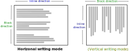

<!-- .slide: class="section" -->

<header>
	<h1>Obsah dokumentu</h1>
	<p>blokové, řádkové a řídkově-blokové elementy</p>
</header>

---

# Obsah dokumentu

- tvořen elementem *`<body>`* a vnořenými elementy

- tvoříme *obsah* a popisujeme *strukturu* a *význam* částí dokumentu

<br>

<div style="font-size: 2rem">

|   Typ   |   Vybrané příklady elementů   |
|---------|-------------------------------|
|   Sekce a kontejnery  |   `div`, `section`, `article`, `nav`, `aside`   |
|   Nadpisy  |   `h1` -- `h6`   |
|   Seznamy  |   `ul`, `ol`, `li`, `dl`, `dt`, `dd`   |
|   Tabulky  |   `table`, `tr`, `td`, `th`, `thead`, `tbody`, `tfoot`   |
|   Textové prvky  |   `p`, `span`, `strong`, `em`, `br`   |
|   Multimédia  |   `img`, `audio`, `video`,`svg` `canvas`   |
|   Formuláře  |   `form`, `input`, `label`, `textarea`, `button`, `select`   |
|   Interaktivní  |   `a`, `button`, `details`, `summary`   |
|   Skriptování  |   `script`, `template`   |

</div>

<span class="note"><a href="https://developer.mozilla.org/en-US/docs/Web/HTML/Reference/Elements">MDN</a>,</span>
<span class="note"><a href="https://www.w3schools.com/TAGS/default.asp">W3Schools</a></span>

---

# Flow content

- různé druhy elementů -- dle specifikace tzv. <i>***flow content***</i>
  - obsahové elementy, <i>„většina elementů, které se používají v těle dokumentů a aplikací“</i>

<iframe src="https://html.spec.whatwg.org/images/content-venn.svg" alt="Elements"
  style="width: 100%; height: 80px; zoom: 10; position: absolute; bottom: 0; left: 0; z-index: -1">
</iframe>

<span class="note"><a href="https://html.spec.whatwg.org/multipage/dom.html#kinds-of-content">WHATWG</a></span>

---

# Normal flow (CSS)

- normální (běžný) tok v dokumentu
- *výchozí způsob rozmísťování elementů na stránce*, pokud není určeno žádným stylem jinak

- rozlišujeme formátování:
  - <span style="color: green">**blokové**</span> (<i><span style="color: green">block</span> formatting context</i>) -- řadí se pod sebe
  - <span style="color: blue">**řádkové**</span> (<i><span style="color: blue">inline</span> formatting context</i>) -- řadí se vedle sebe
- u některých asijských jazyků je to naopak (tzv. <span style="color: #8B8000">vertikální směr psaní</span>)

<div class="block-center">
  
</div>

<span class="note"><a href="https://developer.mozilla.org/en-US/docs/Web/CSS/CSS_display/Block_and_inline_layout_in_normal_flow">MDN</a></span>

---

# Blokové elementy

  - tzv. <i>**block-level content**</i> (např. `h2` nebo `p`)
  - elementy se řadí *pod sebe*, ovlivňují tok textu a způsobují zalomení
  - *zabírají šířku rodiče* (pokud není nastaveno jinak -- viz přednáška CSS)
  - šířku, výšku, okraje (`margin`, `padding`) je možné měnit

```html
Hello! <h2>You</h2> shall <p style="width: 200px;">not</p> pass! &#x1F9D9;
```

<pre class="code-render" default-style="
h2, p {
  border: 2px solid green;
  background-color: lightgreen;
}" resizable="true" style="height: 450px">
Hello! <h2>You</h2> shall <p style="width: 300px;">not</p> pass! &#x1F9D9;
</pre>

---

# Řádkové elementy

  - tzv. <i>**inline-level content**</i> (např. `b` nebo `i`)
  - elementy se řadí *vedle sebe*, neovlivňují tok textu, nezpůsobují zalomení
  - *šířka obvykle odvozená od obsahu*
  - šířku a výšku *není* možné měnit

```html
Hello! <b>You</b> shall <i style="width: 200px;">not</i> pass! &#x1F9D9;
```

<pre class="code-render" default-style="
b, i {
  border: 2px solid blue;
  background-color: lightblue;
}

" resizable="true" style="height: 150px">
<p>Hello! <b>You</b> shall <i style="width: 200px;">not</i> pass! &#x1F9D9;
</pre>

<br>

  - okraje (`margin`, `padding`) je možné měnit, ale *vertikální okraje neovlivní okolní řádky*

=--

<!-- .slide: class="editor" -->

# Blokové vs. řádkové elementy

<div data-iframe="assets/examples/inline/inline.html"></div>

<div class="note"><a href="assets/examples/inline/inline.html">zdroj</a></div>

---

# Řádkově-blokové elementy
- speciální druh řádkového elementu, používá se pojem <i>**inline-block**</i>
- chovají se jako inline (lze je mít *v řádku s textem*)
- ale *respektují rozměry* (width, height) a mají *blokový box model* (`margin`, `padding`)

- používají se hlavně pro prvky, které mají být v řádku, ale zároveň mít pevnou velikost
  - obrázky, multimédia, formuláře
  - `img`, `svg`, `canvas`, `video`, `iframe`, `input`, `button`, ...


```html
<p>
  Hello! 
  You shall not pass!. 
</p>
```

<pre class="code-render" default-style="" resizable="true" style="height: 200px">
<p>
<p>Hello! 
You shall not pass!. </p>
</p>
</pre>

=--

<!-- .slide: class="editor" -->

# Řádkově-blokové elementy

<div data-iframe="assets/examples/inline/inline2.html"></div>

<div class="note"><a href="assets/examples/inline/inline2.html">zdroj</a></div>

---

# Srovnání

<br>

<div class="block-center">
<table class="matrix-table center-table" style="text-align: center;">
  <tr><th></th><th style="color: green">blokový</th><th style="color: blue">řádkový</th><th style="color: #0096FF">řádkově-blokový</th></tr>
  <tr><th>řazení elementů</th><td>pod sebe</td><td>vedle sebe</td><td>vedle sebe</td></tr>
  <tr><th>šířka (width)</th><td>🟢</td><td>🔴</td><td>🟢</td></tr>
  <tr><th>výška (height)</th><td>🟢</td><td>🔴</td><td>🟢</td></tr>
  <tr><th>okraje (margin)</th><td>🟢</td><td>⚪*</td><td>🟢</td></tr>
  <tr><th>vycpávka (padding)</th><td>🟢</td><td>⚪*</td><td>🟢</td></tr>
</table>
</div>

<br>

`*` vertikální okraje neovlivní okolní řádky

<span class="note">více v přednášce CSS...</span>

---

# Zanoření elementů

- **<span style="color: green">blokové</span> elementy**
  - mohou obsahovat **vybrané** blokové elementy -- dle **[specifikace](https://html.spec.whatwg.org/multipage/index.html)**
  - mohou obsahovat libovolné řádkové (řádkově-blokové) elementy
- **<span style="color: blue">řádkové</span> (<span style="color: #0096FF">řádkově-blokové</span>) elementy**
  - **nemohou** obsahovat blokové elementy
```html
V <b>tučném textu <p>odstavec</p> nemůže být</b>.
```
  - mohou obsahovat libovolné řádkové (řádkově-blokové) elementy
```html
<b>y = <i>e</i><sup>2<i>x</i></sup></b> 
```
<pre class="code-render" default-style="" resizable="true" style="height: 100px">
<b>y = <i>e</i><sup>2<i>x</i></sup></b> 
</pre>

---

# Význam elementů

- **<span style="color: green">blokové</span> elementy**
  - představují zpravidla základní stavební bloky stránky
  - `header`, `footer`, `section`, `nav`, `h1`, `p`, *`div`*, ...
- **<span style="color: blue">řádkové</span> (<span style="color: #0096FF">řádkově-blokové</span>) elementy**
  - představují zpravidla výsledný obsah v dokumentu -- zvýraznění textu, obrázky, multimédia, ...
  - `b`, `i`, `a`, `img`, `svg`, `video`, *`span`*, ...

<br>

- **generický element** (*`div`*, *`span`*)
  - nemá implicitní význam
  - používá se pro seskupení obsahu, zpravidla s atributem *`class`*
- **sémantický element** (např. *`nav`*, *`time`*, ...)
  - svým názvem jasně vyjadřuje svůj význam a účel pro obsah, který obaluje
  - doporučeno používat, pokud existují pro daný případ (*přístupnost*, *SEO*)

<span class="note">více přednáška Přístupnost</note>

=--

<!-- .slide: class="editor" -->

# Ukázka HTML elementů

<div data-iframe="assets/examples/html/html-elements-cs.html"></div>

<div class="note"><a href="assets/examples/html/html-elements-cs.html">zdroj</a></div>