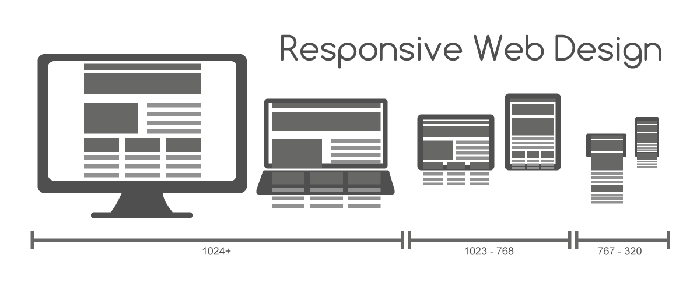
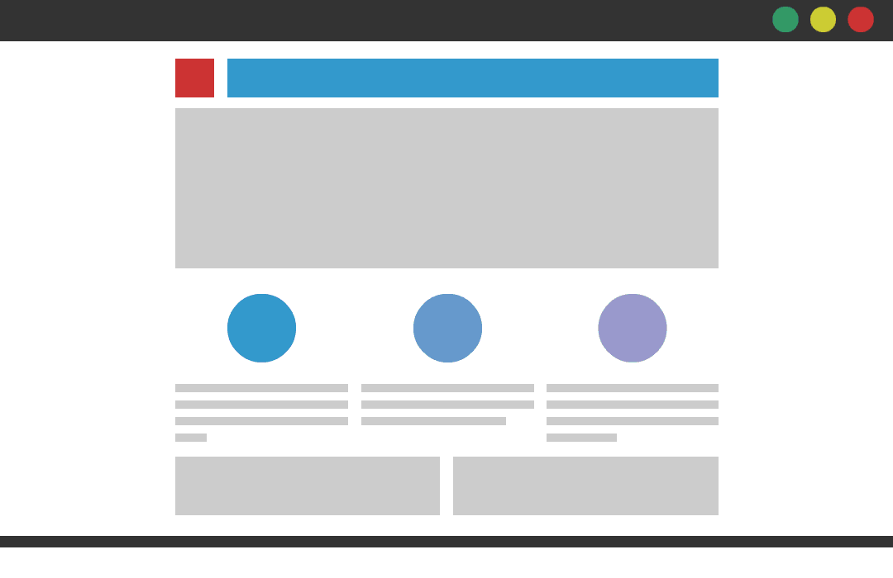
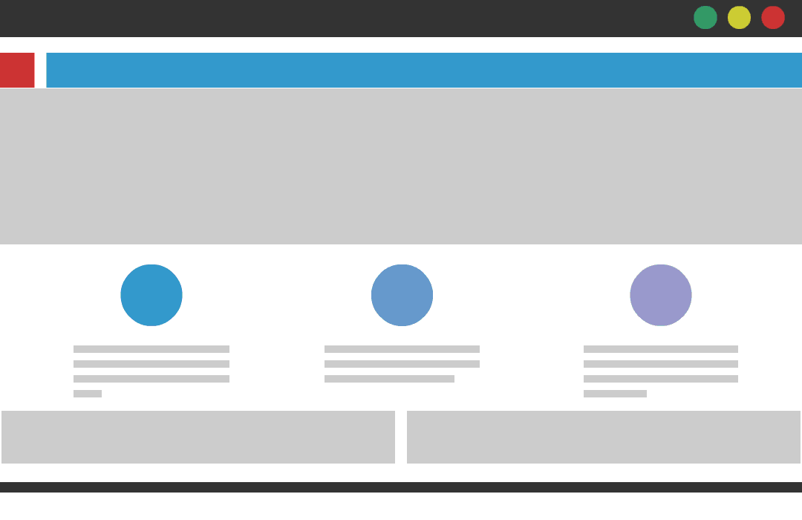

# Motivace

- přizpůsobit dokument zařízením s různým rozlišením
  - mobilní zařízení, tablet, notebook, standardní monitor, ...
  - [statistiky...](https://gs.statcounter.com/screen-resolution-stats)

  

fixní × pružný × adaptivní × ***respozivní*** layout

<a href="https://commons.wikimedia.org/wiki/File:Responsive_Web_Design_for_Desktop,_Notebook,_Tablet_and_Mobile_Phone.png">zdroj obrázku</a>

=--

# Pružný (fluid) layout

- šířka vyjádřená v procentech

 

  

=--

# Adaptivní (adaptive) layout

- obsahuje body zlomu (tzv. *breakpoints*)

 

  

=--

# Responzivní (responsive) layout

- kombinace responzivního a adaptivního layoutu

 

  

