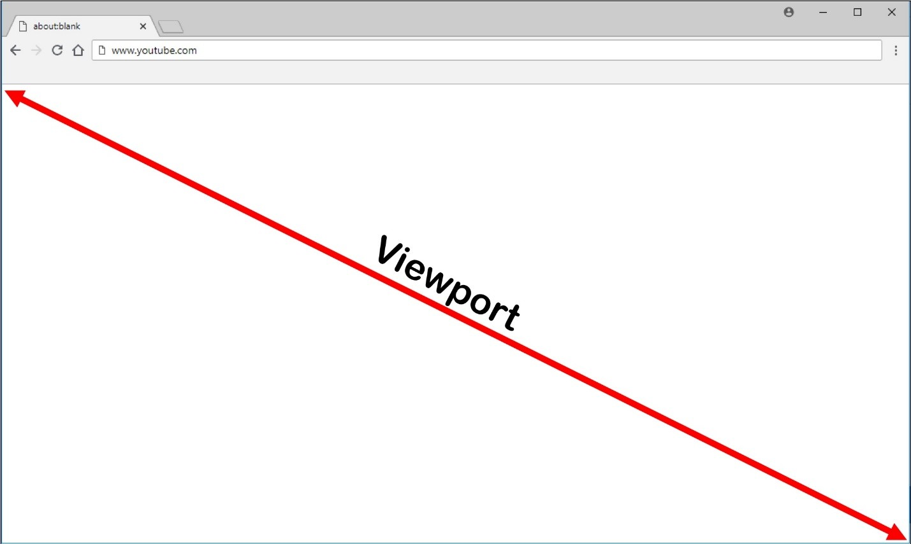

<!-- .slide: class="section" -->
 
<header>
    <h1>Úvod, pojmy</h1>
    <p>Viewport, Media Queries, Breakpoints, Grid System</p>
</header>

---

# Viewport

- viditelná část dokumentu, obecně záleží na velikosti okna prohlížeče

<div style="text-align: center;">
  
</div>

- zajímá nás zejména ***dostupná šířka*** (horizontální scrollování není uživatelsky přívětivé)

---

# Viewport: mobilní zařízení

- prohlížeče mobilních zařízení mají šířku viewportu větší než je jejich rozlišení
  - problém pro responzivní design

<div class="img-right box" style="width: 900px;">
  
</div>

<br>

- je nutná úprava v hlavičce HTML dokumentu:

```html
<head>
  <meta name="viewport"
        content="width=device-width,
                 initial-scale=1">
</head>
```

<span class="note"><a href="https://www.w3schools.com/css/css_rwd_viewport.asp">zdroj obrázku</a></span>

---

# Postup návrhu

1. navrhnout layout (rozložení vizuálních prvků) dokumentu<br> ***nejprve pro mobilní zařízení:*** (přístup <i>*mobile first*</i>)
   - dokument obsahuje zpravidla jeden sloupec skládající se z bloků, jejichž šířka
je relativní (zpravidla 100% – celá šířka, případně nějaký padding/margin)
   - nepoužívat velké elementy o pevné šířce

<br>

2. navrhnout layout dokumentu ***dále pro vyšší typy rozlišení:***
  - *dynamicky přeskupit* bloky do více sloupců (*floats*, *flex*, *grid*, ...) při vyšším rozlišení
  - ***CSS3 Media Queries***

---

# Media Queries

- využití pravidla ***`@media`*** pro podmínečnou definici stylů
- CSS3 Media Queries (W3C recommendation)

```css
@media not|only mediatype and (expressions) {
  /* CSS pravidla */
}
```

- ***`not`***: negace celého pravidla
- ***`only`***: starší prohlížeče budou danou konstrukci ignorovat
- ***`mediatype`***: typ média/zařízení
   - *`screen`*, `print`, `speech`, `all`, ...
- ***`expressions`***: výrazy podmiňující pravidlo (velikost obrazovky, ...)

---

# Media Queries: podmínky a body zlomu

- ***`min-width`***, ***`max-width`***, `orientation`, další výrazy...

- pomocí Media Queries je možné omezit (tzv. ***breakpoints*** -- body zlomu) uplatnění
pravidel pouze pro konkrétní rozlišení obrazovky:

```css
/* extra small screen rules */

@media only screen and (min-width: 576px) {
  /* small screen rules */
}

@media only screen and (min-width: 768px) {
  /* medium screen rules */
}

@media only screen and (min-width: 992px) {
  /* large screen rules */
}

/* etc... */
```

<span class="note"><a href="https://getbootstrap.com/docs/5.3/layout/breakpoints/">Bootstrap breakpoints</a></span>

=--

# Bootstrap breakpoints

<br><br>

<div style="display: flex; justify-content: center;">

| Breakpoint          | Prefix třídy | Šířka |
|---------------------|-------------|------------|
| Extra small         | žádný        | <576px     |
| Small               | `sm`          | ≥576px     |
| Medium              | `md`          | ≥768px     |
| Large               | `lg`          | ≥992px     |
| Extra large         | `xl`          | ≥1200px    |
| Extra extra large   | `xxl`         | ≥1400px    |

</div>

<span class="note"><a href="https://getbootstrap.com/docs/5.3/layout/breakpoints/">zdroj</a></span>

---

# Grid systém

- technika pro organizaci elementů do mřížky skládající se z ***<i>n</i> sloupců***
  - často ***12*** -- dobře dělitelné, ale obecně libovolné

<div class="img-right" style="width: 1000px;">
  
</div>

<br>

- snadnější návrh
- snadnější implementace
- lepší organizace elementů na stránce
- člověk lépe vnímá obsah

---

# Grid systém: implementace

- nutné řešit problém horizontálního pozicování bloků:
  - ***floats*** (využívá např. Bootstrap 3)
  - ***Flexbox*** (využívá např. Bootstrap 4)
  - ***CSS Grid*** -- pokročilý způsob pro tvorbu layoutu

<br>

- přístupy je ***vhodné kombinovat*** v závislosti na konkrétním problému
  - pozicování elementů na jednom řádku vs. do mřížky apod.

<span class="note">Princip jednotlivých druhů pozicování bloků byl probrán v přednášce: <a href="#">CSS: Rozložení stránek, praktické použití</a></span>