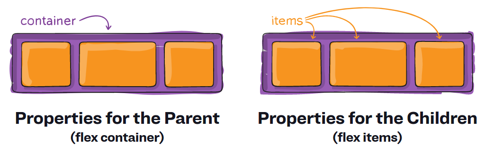

<!-- .slide: class="section" -->
 
<header>
    <h1>Grid systém: Flexbox</h1>
</header>

---

# Flexbox

- nástroj pro rozmísťování prvků v jedné dimenzi (řádek/sloupec)
  - probráno v přednášce 6. CSS -- layouty

<br>

- layout se skládá z:

<br>

<ol style="display: flex; justify-content: space-around; width: 100%;">
  <li>
  
  ***kontejnerů*** (<i>flex container</i>)
  
  </li>
  <li>
  
  ***položek kontejnerů*** (<i>flex items</i>)
  
  </li>
</ol>

<div style="text-align: center;">
  
</div>

<span class="note"><a href="https://css-tricks.com/snippets/css/a-guide-to-flexbox/">Zdroj obrázku</a></span>

---

# 1. Flex kontejner: řádek

- rodičovský element, který obsahuje další elementy, které chceme pozicovat v rámci kontejneru

```css
.row {
  display: flex;

  flex-direction: row; /* nastavení hlavní osy - orientace do řádku
                          není nutné nastavovat, implicitní hodnota */
  
  flex-wrap: wrap; /* prvky se budou zalamovat, pokud budou přesahovat */

  align-items: stretch; /* zarovnání prvků na vedlejší ose
                           položky řádku budou zabírat celou výšku řádku */
}
```

---

# 2. Položky Flex kontejneru: sloupce

```css
[class*="col-"] {
  flex-basis: 100%; /* základní velikost */
  flex-grow: 1; /* růst šířky bude rovnoměrný pro všechny sloupce */
  flex-shrink: 1; /* snižování šířky bude rovnoměrné pro všechny sloupce */
}

@media only screen and (min-width: 768px) {
  .col-sm-1 { flex-basis: 25%; }
  .col-sm-2 { flex-basis: 50%; }
  .col-sm-3 { flex-basis: 75%; }
  .col-sm-4 { flex-basis: 100; }
}

/* atd... */
```

---

# Vše dohromady

<pre class="code-render" default-style="

* {
  box-sizing: border-box;
}

body {
  background-color: lightyellow;
}

.row {
  display: flex;
  flex-direction: row;
  flex-wrap: wrap;
  justify-content: start;
  align-items: stretch;
  border: 4px solid blue;
  max-width: 1400px;
  margin: auto;
  background: white;
}

[class*='col-'] {
  flex-basis: 100%;
  flex-grow: 1;
  flex-shrink: 1;
  border: 2px solid red;
  display: flex;
  align-items: center;
  justify-content: center;
  padding: 1rem;
  padding-top: 2rem;
  position: relative;
}

[class*='col-']::after {
  content: 'col: 100%';
  position: absolute;
  top: 10px;
  left: 10px;
  font-size: 24px;
  color: red;
  font-weight: normal;
}

header {
  text-align: center;
}

h2 {
  margin: 0;
}

article, nav {
  background-color: bisque;
}

nav ul {
  align-self: start;
}

p {
  font-size: 20px;
  text-align: justify;
  margin: 0;
}

ul {
  margin: 0;
  font-size: 30px;
}

@media only screen and (min-width: 768px) {
  .col-md-1 { flex-basis: 25%; } /* 1/4 */
  .col-md-2 { flex-basis: 50%; } /* 2/4 */
  .col-md-3 { flex-basis: 75%; } /* 3/4 */
  .col-md-4 { flex-basis: 100%; } /* 4/4 */
  .col-md-1::after { content: 'col: 1/4' }
  .col-md-2::after { content: 'col: 2/4' }
  .col-md-3::after { content: 'col: 3/4' }
  .col-md-4::after { content: 'col: 4/4' }
}

@media only screen and (min-width: 1200px) {
  .col-lg-1 { flex-basis: 25%; } /* 1/4 */
  .col-lg-2 { flex-basis: 50%; } /* 2/4 */
  .col-lg-3 { flex-basis: 75%; } /* 3/4 */
  .col-lg-4 { flex-basis: 100%; } /* 4/4 */
  .col-lg-1::after { content: 'col: 1/4' }
  .col-lg-2::after { content: 'col: 2/4' }
  .col-lg-3::after { content: 'col: 3/4' }
  .col-lg-4::after { content: 'col: 4/4' }
}

" resizable="true" style="height: 800px;">

body
<header id="content" class="row">
  <h2 class="col-lg-4 col-md-4">
    Tworba webových stránek
  </h2>
</header>
<main id="content" class="row">
  <nav class="col-lg-1 col-md-2">
    <ul>
      <li>O předmětu</li>
      <li>Rozvrh</li>
      <li>Přednášky</li>
      <li>Cvičení</li>
      <li>Projekt</li>
    </ul>
  </nav>
  <article class="col-lg-3 col-md-2">
    <p>Lorem ipsum dolor sit amet, consectetur adipiscing elit. Curabitur tempus faucibus libero, sed ultricies  ectus iaculis ut. Suspendisse tincidunt lorem sed leo tempus, vitae euismod eros dictum. In enim elit,  aucibus et turpis quis, pretium pretium metus. Nulla ornare purus id sollicitudin ornare. Vivamus ac magna in lacus facilisis molestie. Sed dapibus nulla dignissim elit hendrerit viverra. Morbi rhoncus tristique erat ac scelerisque. Lorem ipsum dolor sit amet, consectetur adipiscing elit. Aenean at semper enim. Praesent ac augue non dolor aliquam blandit. Pellentesque ullamcorper diam nec massa luctus, a viverra neque vulputate.
    </p>
  </article>
</main>

</pre>

<span class="note">💡 otestujte různé šířky příkladu</span>

=--

<!-- .slide: class="editor" -->

# Příklad

<div data-iframe="assets/examples/responsive/flex.html"></div>

<div class="note"><a href="assets/examples/responsive/flex.html">zdroj</a></div>

---

# Shrnutí

- výhodné zejména, pokud chceme pozicovat prvky v rámci jedné dimenze (např. na řádku)
  - oproti floats nabízí další vlastnosti (např. *`align-items`*, *`gap`* ...)

<br>

- responzivitu je možné použít alternativními způsoby:
  - využití vlastnosti *`wrap`* v kombinaci s *`min-width`* -- při zmenšování šířky stránky se položky budou zalamovat
  - definice vlastností *`flex-grow`* a *`flex-shrink`* pro každý prvek zvlášť + kombinace s Media Queries
  - ...

<br>

- ***nevýhody***
  - stále nutné obalovat elementy řádku do samostatného kontejneru
  - Grid systém využívá utility třídy v HTML (*`row`*, *`col-`*)
  - řešení: ***CSS Grid***


