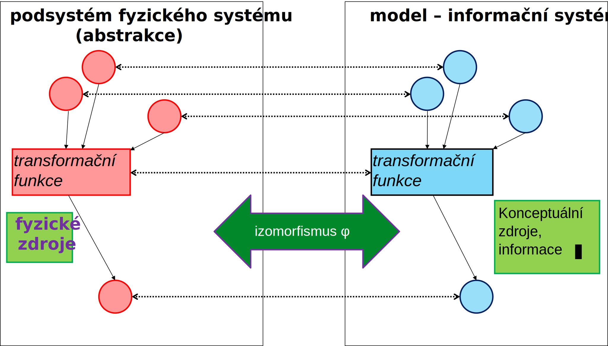
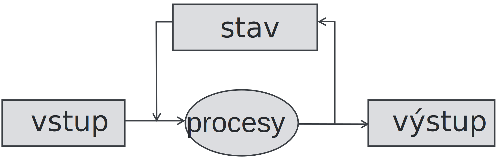

<!-- .slide: class="section" -->

<header>
	<h1>Návrh informačního systému</h1>
</header>

---

# Informační systém jako model

- Informace **modelují skutečné zdroje jiného** – obvykle **fyzického systému** (např. podniku) 
- Informační systém tedy na nehmotné – virtuální úrovni **modeluje** svůj fyzický vzor, pro jehož řízení je obvykle vytvářen. Vzhledem k tomu, že model nikdy **nemůže postihnout veškeré chování a vlastnosti svého vzoru**, je virtuální kopie pořizována vždy na vhodné úrovni **abstrakce**.

---

# Izomorfismus

- **Izomorfismus** je zobrazení mezi dvěma matematickými strukturami, které je vzájemně jednoznačné (bijektivní) a zachovává všechny vlastnosti touto strukturou definované. 
- Jinými slovy, každému prvku první struktury odpovídá právě jeden prvek struktury druhé a toto přiřazení zachovává vztahy k ostatním prvkům.

---

# OLTP jako model

<!-- .slide: class="normal centered fullspace" -->
 <!-- .element: style="height:800px;margin:0;" -->

---

# Nezbytnost abstrakce

- Není možné modelovat všechny zdroje i procesy fyzického systému. Vždy se vybírají jen ty, které jsou pro úroveň řízení, pro kterou OLTP budujeme, podstatné – modelujeme **podsystém** původního fyzického systému – **abstrahujeme**
- OLTP je proto vždy modelem jisté **abstrakce původního fyzického vzoru**.

---

# OLTP jako model
- Říkáme, že OLTP modeluje nějaký fyzický podsystém.
- Mezi OLTP a jeho fyzickým vzorem existuje izomorfismus *φ*. 
- Pokud je v původním systému funkce nad zdroji, potom v  OLTP existuje obraz této funkce pracující s obrazy zdrojů.
- Pokud funkce v původním systému má za parametry jisté zdroje a dává jistý výsledek, pak obraz funkce v OLTP mající za parametry obrazy původních zdrojů dává za výsledek obraz původního výsledku.

---

# Příklad OLTP systému

- Ve fyzickém systému se pracuje s peněžními zdroji, tj. **skutečnými penězi**, pak se v informačním systému pracuje s jejich **virtuálním obrazem**.
- Pokud ve fyzickém systému je provedena funkce, která na základě objednávky vytvoří skutečnou fakturu, pak v informačním systému je vytvořen její obraz.

---

# Návrh informačního systému

 <!-- .element: style="height:350px;margin:150px auto;display:block" -->

<ul>
<li><strong>S jakými daty pracujeme?</strong></li>
<li>Tzn. jak je reprezentován <b>stav IS</b>?</li>
<li>Analýza domény, model, persistence, konzistence, …</li>
</ul>

<ul>
<li><strong>Jaké jsou k dispozici vstupy?</strong></li>
<li>Jak se informace pořizují, kdo je zadává?</li>
</ul>

<ul>
<li><strong>Jak mají vypadat výstupy?</strong></li>
<li>Aby to odpovídalo účelu systému?</li>
</ul>

<ul>
<li><strong>Jak je třeba data transformovat?</strong></li>
<li>Jaké jsou procesy a postupy v cílové doméně?</li>
</ul>

