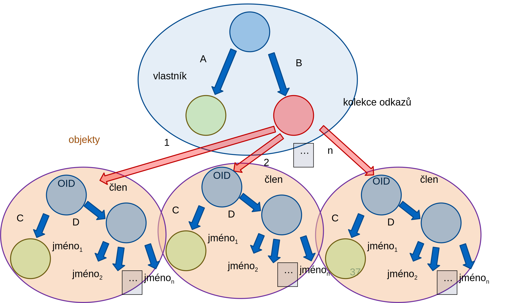

<!-- .slide: class="section" -->

<header>
	<h1>Datové modelování</h1>
</header>

---

# Databázové modely
- Modely, které je schopen interpretovat systém pro řízení databázového systému SŘBD
- Jinak též zvané **produkční modely**
- V jejich definičním jazyku musejí být zapsána **metadata** pro všechny datové struktury uložené v databázi
- Prozatím budeme uvažovat jako produkční **relační a objektový datový model**.

---

# Databázové modely
- Jednoduché (NoSQL)
	- Key-value (MUMPS, Redis, …)
	- Dokumentové (MongoDB, CouchDB, …)
	- Sloupcové (Apache HBase, ...)
- **Relační datový model**
	- Mnoho implementací
- **Objektový datový model**
	- Objektově-relační mapování (ORM)
- Grafové
	- Grafové databáze (Neo4J, OrientDB, …)
	- Sémantická úložiště (sémantický web, RDF)

---

# Konceptuální modely
- Slouží pro komunikaci mezi návrháři, případně se zákazníky
- Jsou formálně přesné a **převoditelné** na produkční modely
- Často jsou grafické pro větší přehlednost
- Nejběžnější konceptuální modely **diagram tříd (UML)**, **E-R diagram** a **CDL**.

---

# Transformace mezi datovými modely
- Slouží nejčastěji pro transformaci konceptuálních modelů na produkční.
- Transformace je tím složitější, čím jsou modely více sémanticky odlišné.
- Nejčastěji se uvažuje **transformace E-R diagramu na relační datový model**.

---

# Relační model dat
- Tabulka (= **relace**) v relačním modelu je _kolekcí struktur_, přičemž datové typy vlastností jsou _jednoduché_ (tedy především _ne odkazy/vztahy_)
- Srovnej: _Podmnožina kartézského součinu_

```vbnet
collection of
	structure
		properties
			jméno vlastnosti1: jednoduchý datový typ1
			jméno vlastnosti2: jednoduchý datový typ2
			…
			jméno vlastnostin: jednoduchý datový typn
	end structure
```

---

# Vztahy
- Umožňují odkazovat z jedné (strukturované) hodnoty (vlastníka) jinou (člen)
- Musí existovat datový typ _jednoznačné identifikující (odkazující) strukturovanou hodnotu_ (např. OID)
- Vztah je definován prvkem vlastníka typu odkaz (reference) a členem, který je hodnotou odkazu identifikován. 

---

# Vztahy
- Relační model dat vztahy přímo neobsahuje
	- Vytváří se až v okamžiku dotazování (JOIN apod.)
	- (Neplést s referenční integritou!)
- Objektový model
	- Vztahy lze tvořit pomocí OID

---

# Objektový model dat

- Základní typy + datový typ OID
- Objekt je vždy strukturou na nejvyšší úrovni
- Dva druhy neomezeně zanořených struktur
	- Kolekce (někdy omezení pouze na kolekce prostých struktur a OID)
	- Prosté struktury (ostatní)
- Další vlastnosti -- dědičnost apod.
- **Odpadá nutnost transformace objektového modelu na schéma relační databáze**

---

# Odkazované struktury (objekty)

```
structure VLASTNIK
   properties
      A: integer
      B: CLEN 
end structure

object CLEN
   properties
      C: integer
      D: structure
      …
end object
```

---

<!-- .slide: class="normal centered" -->
# Graf hodnoty odkazovaných typů

 <!-- .element: style="height:700px" -->

---

# Shrnutí
- Strukturovaná data modelujeme jako **kolekce** a **struktury**
- Metadata – popisují data, se kterými systém pracuje
- Konceptuální modely
	- Vyjádření metadat pro účely modelování
	- E-R diagram, Class diagram, CDL
- Produkční (databázové) modely
	- Definice metadat pro konkrétní databázi
	- Relační model, objektový model
	- Alternativní modely – dokumentové, grafové, …
