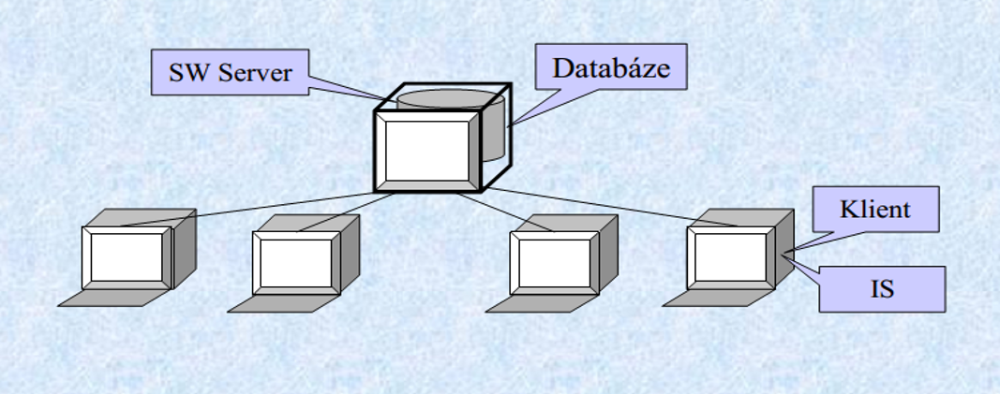
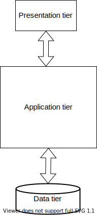
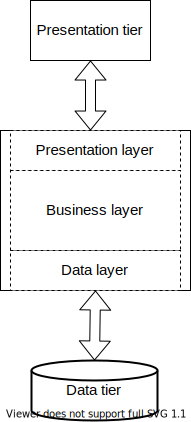

<!-- .slide: class="section" -->

<header>
	<h1>Architektury informačních systémů</h1>
</header>

---

# Architektura klient-server (dvouvrstvá)
- Užity dva druhy oddělených výpočetních systémů **klient** a **server**.
- **Tloušťka** klienta odpovídá jeho "**inteligenci**"

<!-- .element: style="text-align:center" -->

---

# Třívrstvá architektura
- _(three-tier architecture)_ 
- **Prezentační vrstva** – **vizualizuje** informace pro uživatele, většinou formou grafického uživatelského rozhraní, může kontrolovat zadávané vstupy, neobsahuje však zpracování dat
- **Aplikační vrstva** – jádro aplikace, logika a funkce, výpočty a zpracování dat
- **Datová vrstva** – nejčastěji databáze. Může zde být ale také (síťový) souborový systém, webová služba nebo jiná aplikace.

---

# Terminologická odbočka
- **Tier** – fyzická vrstva – jednotka nasazení (deployment)
	- Fyzické členění systému – klient, aplikační server, DB server
	- Tomu odpovídá volba technologií pro realizaci jednotlivých částí
- **Layer** – logická vrstva – jednotka organizace kódu
	- Obvykle řešena v rámci aplikační vrstvy
	- _Data_ _layer_ – část řešící komunikaci s databází
	- _Business_ _layer_ – část implementující logiku aplikace
	- _Presentation_ _layer_ – komunikace s klientem

---

# Schéma třívrstvé architektury
<!-- .slide: class="normal centered fullspace" data-transition="slide-in fade-out" -->

 <!-- .element: style="height:750px;margin:0;" -->

Database server 
(MySQL, Oracle, ...)

Web browser

Application server 
(Java, .NET, ...)

HTTP 
(přenos dat, serializace)

SQL 

---

# Schéma třívrstvé architektury (II)
<!-- .slide: class="normal centered fullspace" data-transition="fade-in slide-out" -->

 <!-- .element: style="height:750px;margin:0;" -->

Java, .NET, PHP ... 
Různá rámcová řešení (framework)

Tenčí nebo tlustší klient v prohlížeči

Datový model (objektový, relační, ...)

---

# Aplikační vrstva – Jakarta EE

Jakarta EE umožňuje (kromě jiného) implementovat _monolitický_ IS s _třívrstvou architekturou:_
1. Databázová vrstva
	- JPA – definice entit, persistence (_PersistenceManager_)
	- Alternativně: Relační databáze (JDBC), NoSQL (MongoDB), …
2. Logická (business) vrstva
	- Enterprise Java Beans (EJB) nebo CDI beans
	- Dependency injection – volné propojení
3. Prezentační vrstva
	- Webové rozhraní (JSF) nebo API (REST, JAX-RS)

---

# Další platformy – přehled
- Java
	- Existuje mnoho možností kromě „standardní“ J EE
- .NET (Core / Framework)
	- Mnoho řešení na všech vrstvách
- PHP
	- Různé frameworky, důraz na webovou vrstvu
- JavaScript
	- Node.js + frameworky, důraz na web a mikroslužby
- Python, Ruby, … - podobné principy

---

# Distribuované architektury
- Monolitický systém (typické pro třívrstvou architekturu)
	- Vyvíjí se a nasazuje jako jeden celek
	- \+ snáze zvládnutelný vývoj, testování
	- \- obtížnější a pomalejší nasazování nových verzí
- Distribuované architektury
	- Service-oriented architecture (SOA)
	- Microservices (mikroslužby)

---

<!-- .slide: class="section" -->

<header>
	<h1>Mikroslužby (Microservices)</h1>
</header>

---

# Monolitická architektura
- Jedna aplikace
	- Jedna databáze, webové (aplikační) rozhraní
	- Business moduly – např. objednávky, doprava, sklad, …
- Výhody
	- Jednotná technologie, sdílený popis dat
	- Testovatelnost
	- Rychlé nasazení – jeden balík
- Nevýhody
	- Rozměry aplikace mohou přerůst únosnou mez
	- Neumožňuje rychlé aktualizace částí, reakce na problémy
	- Pokud použité technologie zastarají, přepsání je téměř nemožné

---

# Mikroslužby
- Aplikace je rozdělena na malé části
	- Vlastní databáze (nepřístupná vně)
	- Business logika
	- Aplikační rozhraní (REST)
- Typicky malý tým vývojářů na každou část (2 pizzas rule)
- Výhody
	- Technologická nezávislost
	- Snadné aktualizace, kontinuální vývoj
- Nevýhody
	- Testovatelnost – závislosti na dalších službách
	- Režie komunikace, riziko nekompatibility, řetězové selhání, …

---

<!-- .slide: class="normal centered fullspace" -->

# Mikroslužby (příklad: Uber)

 <!-- .element: style="height:750px" -->

---

# Vlastnosti mikroslužby
- Vnější API
	- Dostatečně obecné – reprezentuje logiku, ne např. schéma databáze (která je skrytá)
- Externí konfigurace
- Logování
- Vzdálené sledování
	- Telemetrie – metriky (počty volání apod.), výjimky
	- Sledování živosti (Health check)

---

# Implementace mikroslužeb
- V čemkoliv – spojovacím bodem je pouze API
- Node.js (+ express + MongoDB)
	- Populární rychlé řešení
- Java
	- Spring Boot
	- Ultralehké frameworky
		- Např. Spark - https://github.com/perwendel/spark 
	- **Microprofile**
