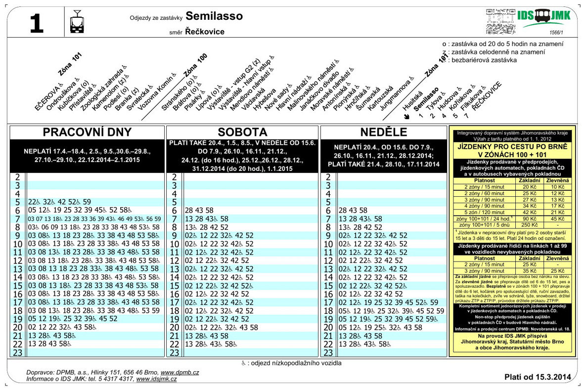

<!-- .slide: class="section" -->

<header>
	<h1>Data -- informace -- znalosti</h1>
</header>

---

# Data
- Hodnota schopná přenosu, uchování, interpretace či zpracování
- Z hlediska IT jde o _hodnoty_ různých _datových typů_
- Data sama o sobě _nemají sémantiku_ (význam), jsou to věty nějakého formálního jazyka
	- Viz pojem _databáze_
- Hodnoty dat obvykle udávají _stav_ nějakého systému

---

# Informace
- _Informace_ jsou interpretovaná data
- Mají _sémantiku_ (význam)
- Transformaci dat na informace neprovádí informační systém, ale _uživatel_
	- Systém ukládá a transformuje _data_
	- Pro uživatele výsledek znamená _informaci_
- Je nezbytné zajistit shodnou interpretaci dat u všech uživatelů informace
	- Vzdělání, školení, zavedení konvencí

---

# Příklad rozdílné interpretace dat
- Údaj 10-12-2005
	- V Evropě informace 10. prosince 2005
	- V USA informace 12. října 2005

- Pro totožná data vznikne _rozdílná informace_ jinou _interpretací_ dat
- Podobně např. jméno a příjmení

---

# Znalost
- Informace zařazená do souvislostí
- Jejich interpretace je však ještě hůře definovatelná, neboť může jít o celé shluky informací
- Znalosti chápeme často jako _sekundární odvozené_ _informace_ 
- Některé informační systémy se zabývají pouze _informacemi (transakční)_, některé pracují se _znalostmi (pro podporu rozhodování a plánování)_
- Problematika _získávání znalostí z dat_ (knowledge discovery, data mining)
	- Předmět [Získávání znalostí z databází](https://www.fit.vut.cz/study/course/ZZN/) (ZZN)

---

# Příklad: jízdní řád

<!-- .slide: class="normal centered fullspace" -->
 <!-- .element: style="height:800px;margin:0;" -->

---

# Správa informací
1. Sběr,
2. Uspořádání a příprava,
3. Užití,
4. Rušení a náhrada.

Správa probíhá dle základních funkcí _systému_
- stav, data (zpětná vazba)
- transformace a procesy
- vstup a výstup (komunikace)
