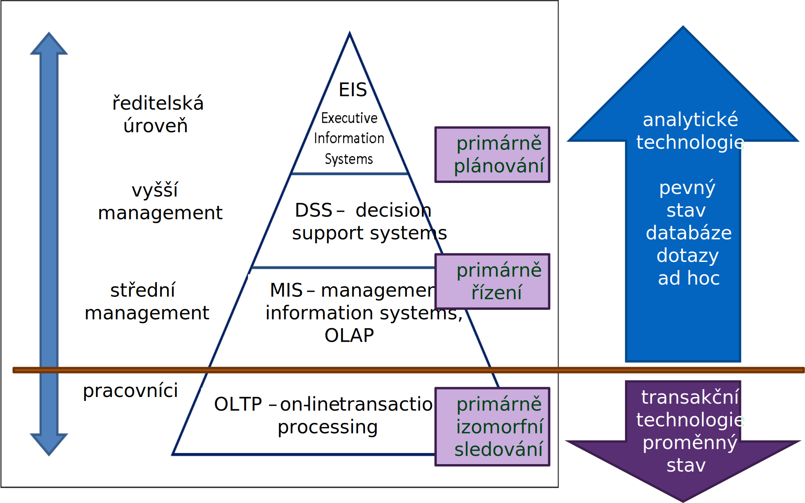

<!-- .slide: class="section" -->

<header>
	<h1>Informační systém</h1>
</header>

---

# Schéma informačního systému

 <!-- .element: style="height:350px;margin:1em auto;display:block" -->

- Modifikované schéma obecného systému 
- Data uchovávající _stav_ systému a
- _Procesy_ realizující transformace často ve formě _transakcí_

---

# Stav informačního systému
- Stavem informačního systému jsou hodnoty dat (typicky reprezentované pomocí nějakého _modelu_) a musíme se zabývat jejich 
	- _Persistencí_ (přetrváváním), 
	- _Konzistencí_ (splňování jistých pravidel o možných kombinacích hodnot údajů ve stavu) apod.

---

# IS podle úrovně rozhodování
- Klasické _pyramidové schéma_
- Odráží hierarchii úrovně rozhodování v organizaci:
	- Systém pro zpracování transakcí
	- Management information systems
	- Decision support systems
	- Executive information systems

---

# Pyramidové schéma

<!-- .slide: class="normal centered fullspace" -->
 <!-- .element: style="height:800px;margin:0;" -->

---

# OLTP – On-Line Transaction Processing

- Třída informačních systémů, které zpracovávají transakčně orientované aplikace
- Termín transakční je dvojznačný:
	- _databázové transakce_
	- _komerční (business) transakce_
- (mohou se ovšem překrývat)
- Systém odpovídá na požadavky uživatele okamžitě *změnou stavu*.

---

# MIS - Management Information Systems
- Překládáme _Informační systémy pro podporu řízení_
- Poskytují informace, které jsou potřebné pro efektivní řízení organizace
- MIS je obecně užívány pro skupinu metod zpracování informací určených k automatizaci a podpoře rozhodování
- Nemusejí nutně pracovat nad aktuálním modelem fyzického systému (povoleno zpoždění)
- Nejčastěji jde o:
	- Systémy pro podporu rozhodování (DSS)
	- Expertní systémy (ES)
	- Informační systémy pro exekutivu (EIS)
	- OLAP (Online Analytical Procesing)

