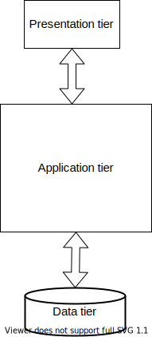
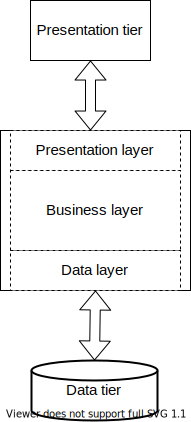
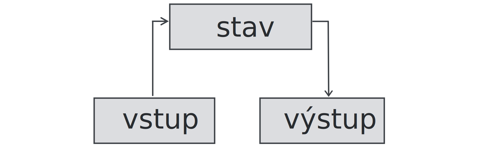
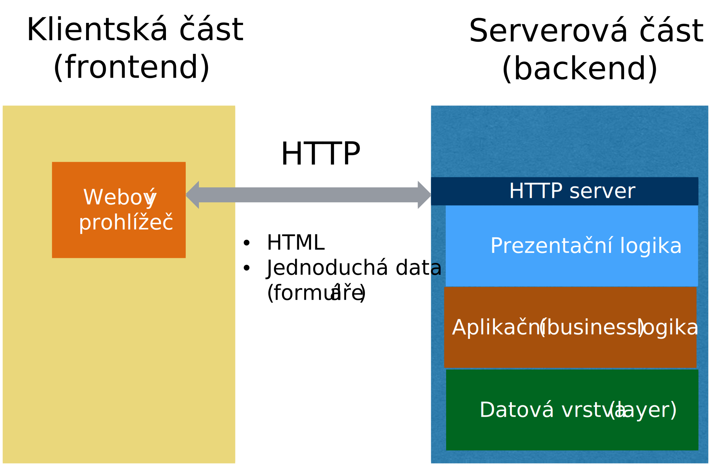

# Schéma třívrstvé architektury
<!-- .slide: class="normal centered fullspace" data-transition="slide-in fade-out" -->

 <!-- .element: style="height:750px;margin:0;" -->

Database server 
(MySQL, Oracle, ...)

Web browser

Application server 
(Java, .NET, ...)

HTTP 
(přenos dat, serializace)

SQL 

---

# Schéma třívrstvé architektury (II)
<!-- .slide: class="normal centered fullspace" data-transition="fade-in slide-out" -->

 <!-- .element: style="height:750px;margin:0;" -->

Java, .NET, PHP ... 
Různá rámcová řešení (framework)

Tenčí nebo tlustší klient v prohlížeči

Datový model (objektový, relační, ...)

---

# Informační systém a vrstvy

 <!-- .element: style="height:350px;margin:150px auto;display:block" -->

<ul>
<li><strong>Data layer</strong></li>
<li>Třídy reprezentující data, databázové operace</li>
</ul>

<ul>
<li><strong>Business vrstva</strong></li>
<li>Business funkce (transakce)</li>
</ul>

<ul>
<li><strong>Prezentační vrstva</strong></li>
<li>Vstupní prvky, <b>logika GUI</b></li>
</ul>

<ul>
<li><strong>Prezentační vrstva</strong></li>
<li>Zobrazení dat, <b>logika GUI</b></li>
</ul>

---

# Jiné aplikace

 <!-- .element: style="height:350px;margin:150px auto;display:block" -->

---

# Webový IS

<!-- .slide: class="normal centered fullspace" -->
 <!-- .element: style="height:800px;margin:0;" -->

---

# Webový IS s aplikačním rozhraním

<!-- .slide: class="normal centered fullspace" -->
 <!-- .element: style="height:800px;margin:0;" -->
