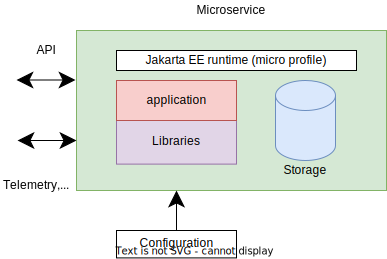

<!-- .slide: class="section" -->

<header>
	<h1>Jakarta EE</h1>
	
Serverová část informačního systému (backend)

</header>

---

# Java
- Programovací jazyk
	- Silně typovaný, objektově orientovaný
- Platforma pro vývoj a provoz aplikací
	- Virtuální stroj
	- Podpůrné nástroje
		- (překladač, debugger, dokumentace, …)
- Balík Java SE (JRE nebo **JDK**)
	- Alternativní implementace (i open source)

---

# Jakarta EE
- V současnosti [Jakarta EE 10](https://jakarta.ee/specifications/), většina implementací podporuje verzi 9.1.
	- Aka Enterprise Java (dříve Java EE)
- Platforma pro vývoj podnikových aplikací a IS v Javě
- Množina standardních technologií a API
	- Jakarta Enterprise Beans (EJB)
	- Jakarta Tansactions (JTA)
	- Jakarta Persistence API (JPA)
	- Jakarta Message Service (JMS)
	- Jakarta Server Faces (JSF)
	- … a další

---

# Vrstvy aplikace Java EE
- Databázová vrstva
	- Abstrakce nad db serverem
- Business vrstva
	- Implementace chování aplikace (transakce)
	- Potenciálně distribuovaná
- Webová vrstva
	- Webové API nebo komponentový serverový framework

---

# Nejdůležitější součásti specifikace
- **Datová vrstva**
	- Jakarta Persistence API (JPA)
- **Business vrstva**
	- Jakarta Transactions API (JTA)
	- Jakarta Enterprise Beans (EJB), Contexts and Dependency Injection (CDI)
	- Java Messaging Service (JMS)
- **Webová vrstva**
	- Jakarta Servlet
		- Jakarta RESTful Web Services (JAX-RS)
		- Jakarta Server Faces (JSF)

---

# Struktura aplikace Jakarta EE
- Moduly
	- EJB moduly (*.jar)
		- Chování + veřejná rozhraní (Java)
	- **Webové moduly** (*.war)
		- Chování + Webové rozhraní (REST nebo Web)
		- (*web.xml* -- deployment descriptor)
	- Lze je odděleně nasadit na aplikační server
- Enterprise aplikace
	- Více modulů, archiv EAR
	- *application.xml* 

---

# Běhové prostředí – Kontejnery 
- Prostředí pro běh aplikace na serveru
- EJB kontejner
	- Běh EJB modulů, volání funkcí
- Webový kontejner
	- Běh webové vrstvy, HTTP server
- Java EE kontejner
	- Webový + EJB kontejner

---

# Aplikace a knihovny
- Jakarta EE server full
	- Implementace všech standardů v runtime serveru
	- Aplikace obsahuje jen ``nadstandardní'' knihovny
- Odlehčený server (*micro edition* apod.)
	- Jen část knihoven na serveru
	- Zbytek musí být přibalen k aplikaci (např. JPA)
- Pouze webový server (web container)
	- Jen knihovny pro webovou vrstvu (Servlet, *JSP*)

---

# Profily
- [Jakarta EE Full](https://jakarta.ee/specifications/webprofile/9/jakarta-webprofile-spec-9.html#a43)
	- Všechny vlastnosti (features)
- [Jakarta EE Web Profile](https://jakarta.ee/specifications/webprofile/9/jakarta-webprofile-spec-9.html#a43)
	- Zaměření na webové aplikace (zahrnuje např. i JSF)
	- Profil zaměřený na webové aplikace
- [Microprofile](https://microprofile.io/)
	- Zaměření na mikroslužby (API)
	- Sada nových vlastností + některé z Jakarta EE

---

# Dostupné aplikační servery
- Jakarta EE kontejnery (aplikační servery)
	- [Eclipse GlassFish](https://projects.eclipse.org/projects/ee4j.glassfish)
		- **[Payara](https://www.payara.fish/)** 
	- WebSphere, **[Open Liberty](https://openliberty.io/)** (IBM)
	- [WildFly](https://www.wildfly.org/) (Red Hat, dříve JBoss AS)
	- [TomEE](https://tomee.apache.org/) (Apache)
- Pouze webové servery
	- Tomcat (Apache)
	- Jetty (Mort Bay Consulting)

---

# Nasazení - plný server

<!-- .slide: class="normal centered fullspace" -->
 <!-- .element: style="height:600px;margin:0;" -->

- Aplikace se nasazují za běhu serveru

---

# Nasazení - odlehčený server

<!-- .slide: class="normal centered fullspace" -->
 <!-- .element: style="height:600px;margin:0;" -->

- Server spouštěný spolu s aplikacemi

---

# Nasazení - mikroslužba

<!-- .slide: class="normal centered fullspace" -->
 <!-- .element: style="height:600px;margin:0;" -->

- Samostatná jednotka (vše v jednom) (embedded)

---

# Servery

- Open Liberty [openliberty.io](https://openliberty.io/)
	- Konfigurovatelný server
- Payara community edition [payara.fish](https://www.payara.fish/downloads/payara-platform-community-edition/)
	- Server (full, web profile), Payara Micro

---

# Konfigurace -- Open liberty
- Plný server
	- Konfigurovatelné *features* (`server.xml`)
- Maven plugin
	- [Building a web application with Maven](https://openliberty.io/guides/maven-intro.html)

---

# Konfigurace -- Payara
- Plný server (Payara full, Payara web profile)
- Payara micro
	- Jeden spustitelný JAR balík
- Payara micro maven plugin
	- Vytvoří spustitelný JAR s aplikací
	- Např. [payara-micro-javaee-crud-rest-starter-project](https://github.com/cicekhayri/payara-micro-javaee-crud-rest-starter-project)

