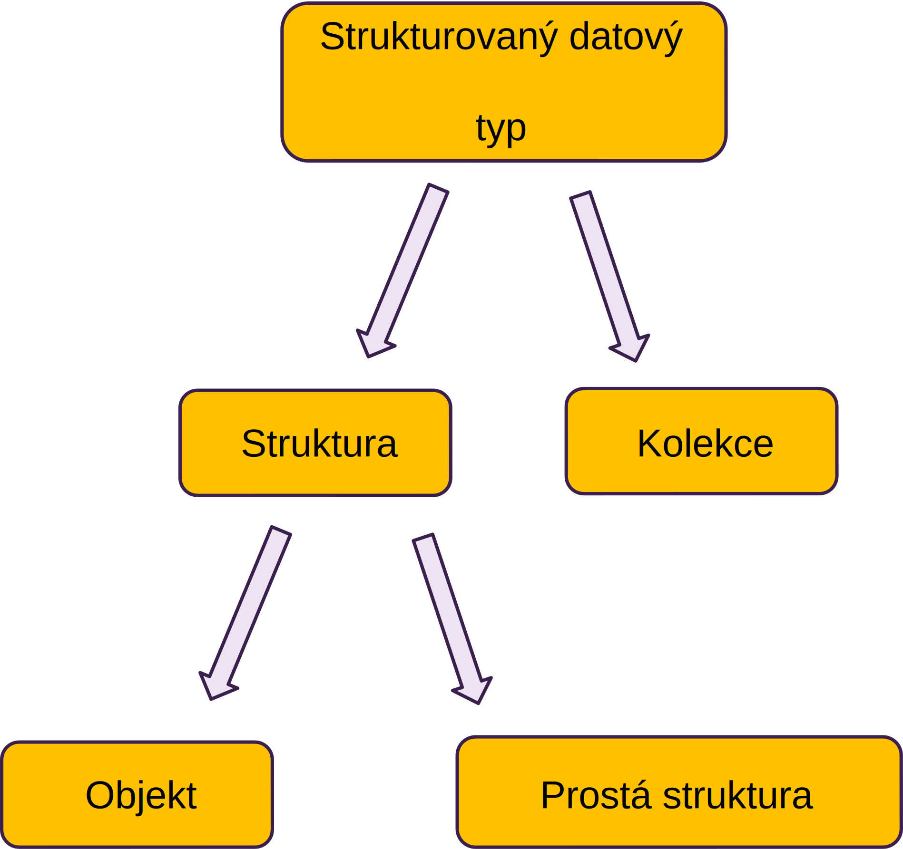

<!-- .slide: class="normal centered" -->

# Strukturované datové typy

 <!-- .element: style="height:700px" -->

---

# Databázové modely
- Jednoduché (NoSQL)
	- Key-value (MUMPS, Redis, …)
	- Dokumentové (MongoDB, CouchDB, …)
	- Sloupcové (Apache HBase, ...)
- **Relační datový model**
	- Mnoho implementací
- **Objektový datový model**
	- Objektově-relační mapování (ORM)
- Grafové
	- Grafové databáze (Neo4J, OrientDB, …)
	- Sémantická úložiště (sémantický web, RDF)

---

# Relační datový model
- Tabulka (= **relace**) v relačním modelu je _kolekcí struktur_, přičemž datové typy vlastností jsou _jednoduché_ (tedy především _ne odkazy/vztahy_)
- Srovnej: _Podmnožina kartézského součinu_

```vbnet
collection of
	structure
		properties
			jméno vlastnosti1: jednoduchý datový typ1
			jméno vlastnosti2: jednoduchý datový typ2
			…
			jméno vlastnostin: jednoduchý datový typn
	end structure
```

---

# Objektový datový model

- Motivace: v aplikacích obvykle modelujeme data objektově
	- Objektově-orientované modelování v návrhu IS, UML
- Data reprezentovaná pomocí konceptů objektově orientovaného modelování
	- Třídy, objekty (instance)
- Vztahy (reference)
	- Na rozdíl od relačních databází (nemluvě o NoSQL)

---

# Třídy a objekty jako datový model

- Dále řešené koncepty (třídy, objekty, dědičnost, apod.) jsou podobné OO návrhu SW
- Zde ale mluvíme o datovém modelu -- **modelujeme data**
- Třídu vnímáme jako **datový typ** (strukturovaný)
	- Množina hodnot (objektů), potenciálně nekonečná
	- Žádné procedurální metody
