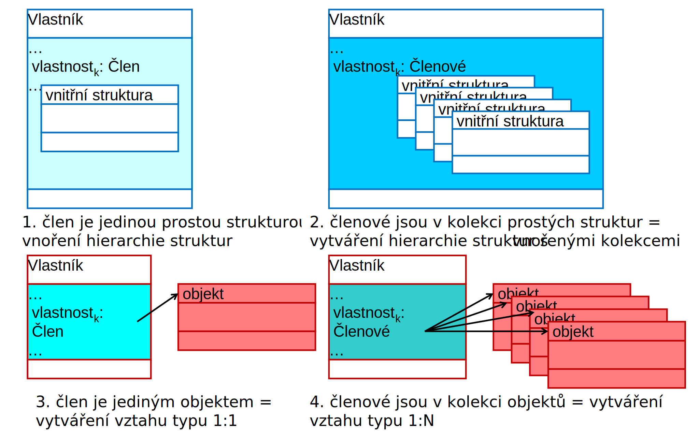
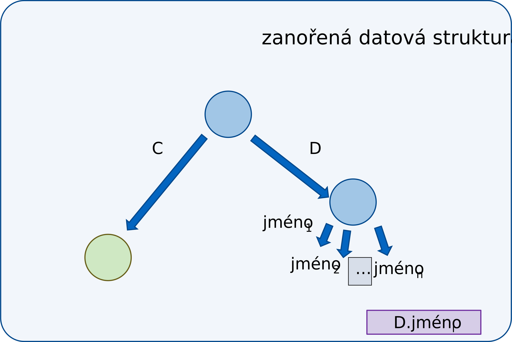
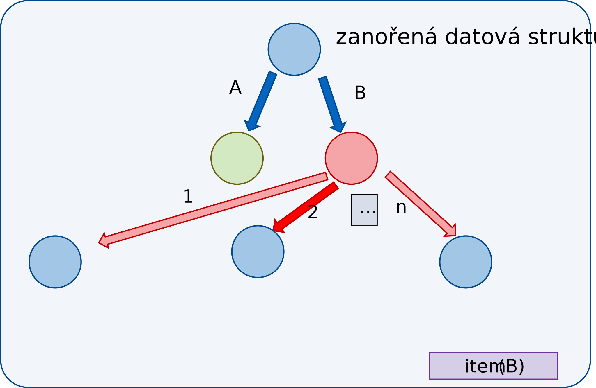
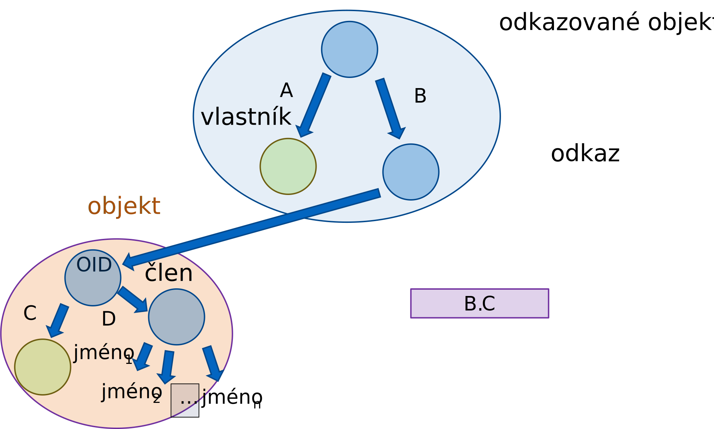
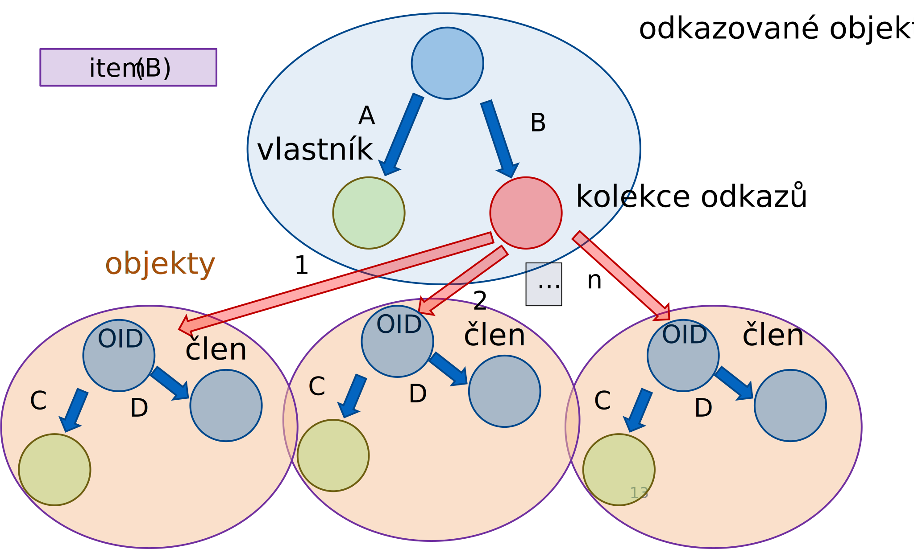
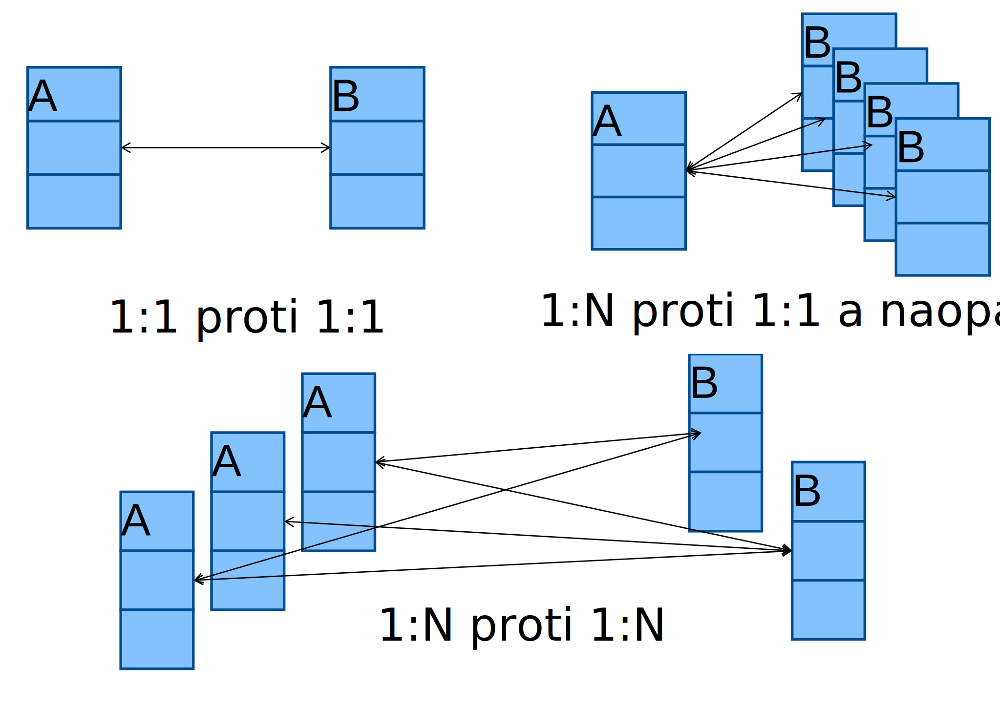
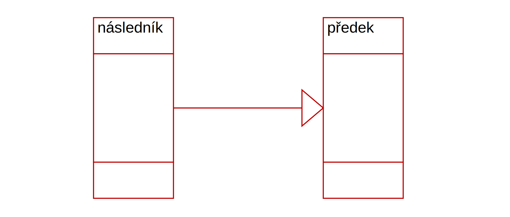
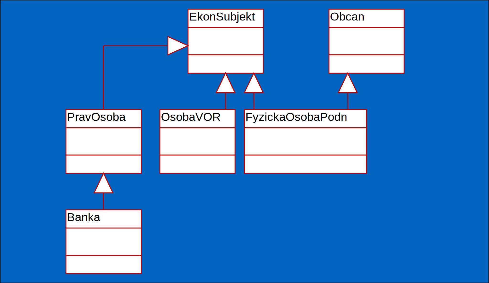
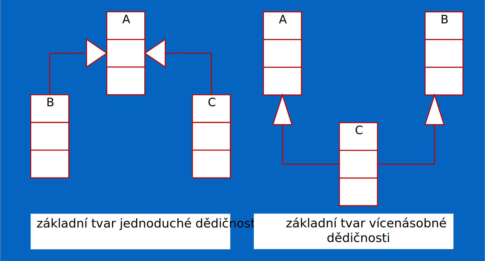
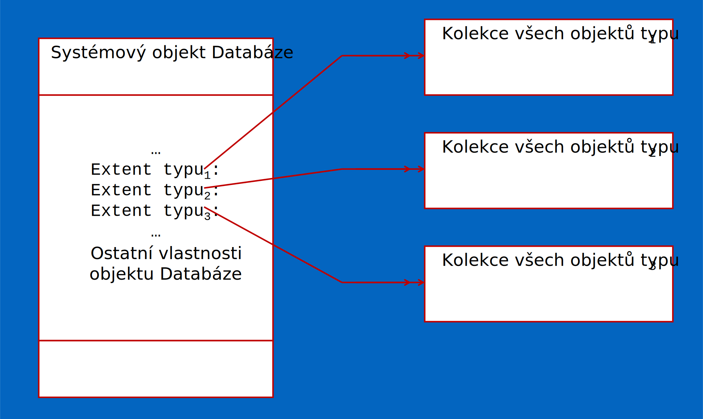

<!-- .slide: class="section" -->

<header>
	<h1>Struktura objektů, vztahy</h1>
</header>

---

# Vztahy
- Umožňují odkazovat z jedné (strukturované) hodnoty (vlastníka) jinou (člen)
- Musí existovat datový typ **jednoznačné identifikující (odkazující) strukturovanou hodnotu** (např. OID)

---

# Zanoření a vztahy

<!-- .slide: class="normal centered fullspace" -->
 <!-- .element: style="height:800px;margin:0;" -->

---

# Vztahy
- Relační model dat vztahy přímo neobsahuje
	- Vytváří se až v okamžiku dotazování (JOIN apod.)
	- (Neplést s referenční integritou!)
- Objektový model
	- Vztahy lze tvořit pomocí OID a/nebo vnořováním struktur

---

# Jmenný prostor nižší úrovně

<!-- .slide: class="normal centered fullspace" -->
 <!-- .element: style="height:800px;margin:0;" -->

---

# Jmenný prostor nižší úrovně

```vbnet
concept TYPD [Data=Value]
   …
end concept

concept TYPB 
  properties
    C: integer
    D: TYPD
end concept
```

---

# Prostor přístupný operacemi kolekce

<!-- .slide: class="normal centered fullspace" -->
 <!-- .element: style="height:800px;margin:0;" -->

---

# Prostor přístupný operacemi kolekce

```vbnet
concept TYPB/TYPYB [Data=Value]
   …
end concept

concept ZANORENA
  properties
    A: integer
    B: TYPYB 
end concept
```

---

# Vztah 1:1

<!-- .slide: class="normal centered fullspace" -->
 <!-- .element: style="height:800px;margin:0;" -->

---

# Vztah 1:1

```vbnet
concept TYPD [Data=Ref]
   …
end concept

concept TYPB 
  properties
    C: integer
    D: TYPD
end concept
```

---

# Vztah 1:N

<!-- .slide: class="normal centered fullspace" -->
 <!-- .element: style="height:800px;margin:0;" -->

---

# Vztah 1:N

```vbnet
concept TYPB/TYPYB [Data=Ref]
   …
end concept

concept ZANORENA
  properties
    A: integer
    B: TYPYB 
end concept
```

---

# Inverzní vztahy
- Častým modelovaným případem je situace, kdy je požadováno, aby **vytvoření vztahu _V_ z objektu _A_ na objekt _B_** vyvolalo rovněž **vytvoření vztahu _W_ z objektu _B_ na objekt _A_**.
- Podobně při zrušení vztahu V z objektu A na objekt B musí dojít i ke zrušení vztahu W z objektu B na objekt A.
- Tato skutečonst musí být vyjádřena u vztahů _V_ a _W_.

---

# Příklad inverzních vztahů

```vbnet
concept A
  properties
    …
    V: B [Inverse=W]
end concept

concept B
  properties
    …
    W: A
end concept
```

---

# Typy inverzních vztahů
- Inverzní vztahy mohou být jak typu 1:1, tak typu 1:N. 
- Je však potřeba si uvědomit poněkud rozdílné použití jména kolekce zde, v atributu Inverse, nežli při definici vztahu typu 1:N. 
- Je-li použit atribut Inverse u vztahu 1:N, znamená to, že **inverzní vztah bude vytvářen s každým prvkem příslušné kolekce**, nikoliv se vztahem, který by byl vlastností kolekce samotné. 

---

# Inverzní vztahy

<!-- .slide: class="normal centered fullspace" -->
 <!-- .element: style="height:800px;margin:0;" -->

---

# Příklad


```vbnet
concept PrvekSAdr/PrvkySAdr
  properties
    Adresat: string
    Adresy:  Adresy	[Inverse = CiAdresa]
end concept

concept Adresa/Adresy
  properties
    Ucel:       DruhAdr
    CiAdresa:   PrvekSAdr [Inverse = Adresy]
    Adresat:    string
    ObsahAdr:   ObsahAdr
end concept
```

---

<!-- .slide: class="section" -->
<header>
	<h1>Generalizace a specializace (dědičnost)</h1>
</header>

---

# Dědičnost – vazby mezi typy objektů
- Vazby **mezi typy** struktur. Všechny možné vazby diskutované zde se vyskytují pouze separátně mezi stejnými typy struktur, tedy mezi:
	- **objekty** a
	- **prostými strukturami**.
- Nebudeme uvažovat vazbu mezi typem prosté struktury a typem objektu. Rovněž vazby mezi výčtovými typy a kolekcemi neexistují.

---

# Dědění
- Uvažujme dva obecně různé typy struktur A a B.
- Vlastnosti struktury A a struktury B jsou **obecně různé**. To znamená, že jednou krajní situací je, že 
	- **obě struktury jsou typově zcela stejné** a druhou, že 
	- **jsou zcela různé**. 
- Mezi tím je možno nalézt mnoho situací, kdy se struktury částečně shodují co do některých vlastností, jmen vlastností apod.

---

# Diference
- Pokud **mají struktury společné rysy**, bývá často výhodné vyjádřit typ struktury B pomocí typu struktury A. K tomu můžeme použít tří druhů popisu **rozdílu typů** (**diferencí**):
	- **přidávání** nové vlastnosti ke stávajícím vlastnostem typu A,
	- **modifikaci** (upřesňování) stávající vlastnosti typu A a
	- **zrušení** (vypouštění) vlastnosti typu A.

---

# Definice typu B z A
- Definici typu struktury B z A můžeme potom provést výrokem: 
- Typ B **obsahuje všechny vlastnosti** typu A, avšak **jsou do něj přidány nové vlastnosti** D, E, F, **jsou upraveny vlastnosti** G,H,I následujícím způsobem a vlastnosti J,K,L **byly zrušeny**.
- Toto nazveme **děděním z A do B**.

---

# Předek a následník
- Pokud definujeme typ určením diferencí, pak tento způsob definice nazýváme **děděním**. Typ A nazýváme **předkem** a typ B **následníkem**. 
- Pokud vzájemné odvozování typů má více kroků, pak typ A, z něhož byl typ B přímo odvozen se nazývá **přímý předek** a typ B **přímý následník**. Pokud odvození proběhlo v několika krocích označujeme typ A pouze slovem předek a typ B následník.
- Jde o binární relace na množině typů struktur a relace předek a následník jsou **tranzitivními uzávěry relace** přímého předka a následníka.

---

# Více přímých předků
- Přímých následníků je obecně více vždy
- Podobně můžeme postupovat pokud je přímých předků více. Definice potom zní následujícím způsobem:
- Typ B obsahuje všechny vlastnosti **typů X, Y, Z**, …, avšak jsou do něj přidány nové vlastnosti D, E, F…, jsou upraveny vlastnosti G,H,I,… následujícím způsobem a vlastnosti J,K,L … byly zrušeny.

---

# Generalizace a specializace
- Při budování hierarchického uspořádání typů lze použít při návrhu modelu dvojí postup:
	- Výběrem a sdílením společných charakteristik do nadřízených typů dochází ke **generalizaci**.
	- Přidáváním nových tříd a doplňováním unikátních vlastností dochází ke **specializaci**.

---

# Zobrazení dědičnosti

<!-- .slide: class="normal centered fullspace" -->
 <!-- .element: style="height:600px;margin:0;" -->


- Ve schématu podle UML jde šipka ve směru generalizace.

---

# Přidávání vlastností
- Nejčastějším případem diference při dědění je přidávání nových vlastností. Ty budeme definovat tak, že je uvedeme do seznamu vlastností nového typu. Ten pak bude obsahovat nejen všechny vlastnosti **všech předků** (až na další diference), ale i všechny **nově definované vlastnosti**.

---

# Příklad z ekonomické oblasti

<!-- .slide: class="normal centered fullspace" -->
 <!-- .element: style="height:800px;margin:0;" -->

---

# Příklad
- Každá právnická osoba je ekonomickým subjektem,
- Každá fyzická osoba podnikatel je ekonomickým subjektem, 
- Každá osoba v obchodním rejstříku je ekonomickým subjektem,
- Každá fyzická osoba podnikatel je současně občanem a
- Každá banka je právnickou osobou.

---

# Jednoduchá a vícenásobná dědičnost 
- U jednoduché dědičnosti každý následník smí mít **pouze jediného** předka. V grafické podobě dědičnosti to znamená, že ze žádného typu nesmí vycházet více, nežli jedna šipka. Takto zakreslený graf je potom **stromem**.
- U vícenásobné dědičnosti není počet předků omezen. V grafické podobě dědičnosti to znamená, že z každého typu smí vycházet libovolný počet šipek. Takto zakreslený graf je **obecný acyklický graf**.
- V žádném případě se v grafu dědičnosti nesmí vyskytovat cyklus, tj. žádný typ nesmí být svým vlastním předchůdcem nebo následníkem.

---

# Jednoduchá a vícenásobná dědičnost

<!-- .slide: class="normal centered fullspace" -->
 <!-- .element: style="height:800px;margin:0;" -->

---

# Typová kompatibilita struktur
- Předkové v hierarchii modelují vždy obecnější (generálnější) pojmy a následníci pojmy speciálnější. 
- Proto, je-li následníkem osoby např. student, je logické, že každý student je osobou. Nikoliv ovšem naopak. Každá osoba není studentem. 
- Podobně, je-li banka následníkem ekonomického subjektu, je každá banka ekonomickým subjektem, ale každý ekonomický subjekt není bankou.

---

# Typová kompatibilita struktur
- **Každá struktura jistého typu je zároveň typu všech svých předků**. 
- Struktura není tedy jediného typu, ale **je současně více typů**, a to svého typu a jeho všech přímých i nepřímých předchůdců.  
- Tedy, pokud máme k dispozici strukturu typu B, která je instancí následníka typu A, pak se může **B vyskytovat všude tam, kde může být A**. Tj. v deklaracích proměnných, hodnotách vlastností, kolekcích, extentech apod.
- Říkáme, že typ **B je kompatibilní s typem A**, nikoliv naopak.

---

# Typová kompatibilita struktur
- Proto deklarujeme-li vlastnosti typu A, resp. kolekce prvků typu A, je třeba vidět, že se v ní budou vyskytovat nejen struktury typu A, ale rovněž všech možných následníků jeho typu. Podobně v kolekci budou nejen prvky typu A, ale i prvky všech následníků  typu A.
- Například v kolekci ekonomických subjektů se mohou vyskytovat i právnické osoby, banky, podnikající fyzické osoby i osoby v obchodním rejstříku.

---

# Obor hodnot, extent
- Podobně jako základní typy, jejichž možné hodnoty jsou předem známy, je potom možné znát **obor** **všech možných hodnot** i pro libovolný objekt v databázi.
- Oborem hodnot pro objekty jistého typu je hodnota kolekce nazývané **extent**. Představme si, že systém udržuje pro celou databázi jeden **systémovou strukturu – databázi**, ve které si ukládá hodnoty význačné pro tuto databázi.

---

# Obor hodnot, extent

<!-- .slide: class="normal centered fullspace" -->
 <!-- .element: style="height:800px;margin:0;" -->

---

# Extenty a navigace
- Na rozdíl od relačních databází, kde je nejčastějším prostředkem pro přístup k databázím **dotaz**, je nejčastějším **vstupním bodem** do objektové databáze extent. 
- Od něho potom pokračuje navigace po vztazích v databázi. Vytváření extentů je u objektových databází základním prostředkem pro vytváření uživatelské nabídky objektového prohlížeče.

---

# Abstraktní a konkrétní typy
- Při vytváření hierarchie dědičnosti se posléze definované typy struktur rozčlení na dvě kategorie:
	- Ty, které slouží jen jako **stavební kameny** (vzory) pro vyváření následníků; této kategorie použijeme rovněž, chceme-li **jednotným způsobem zacházet** s množinou následníků, které mají množinu společných vlastností
	- Ty, které skutečně **budou mít své instance** a budou skutečnými strukturami.

---

# Abstraktní a konkrétní typy
- Těm prvním v seznamu říkáme **abstraktní** typy. V systému nemůže existovat žádná struktura, která by měla všechny své typy abstraktní. Systém zabrání tomu, aby takovou strukturu bylo možné vytvořit.
- Těm druhým v seznamu říkáme **konkrétní** typy.

---

# Příklad
- Výše zmíněný typ modelující **ekonomický subjekt** je výhodné deklarovat jako abstraktní. Jeho následníci modelující banku, fyzickou osobu podnikatele apod., jsou již konkrétní. 
- Ekonomický subjekt jako takový je pouze stavebním kamenem a nemůže nikdy existovat samostatně. Na všechny konkrétní následníky ekonomického subjektu však můžeme pohlížet jednotným způsobem jako na ekonomický subjekt.
- Nicméně **abstraktní typ může mít** **extent**. Víme, že v extentu jsou i výskyty všech následníků daného datového typu (zde ekonomického subjektu), které již mohou být konkrétní.

---

# Extenty u děděných objektů 
- V extentu typu A se budou vyskytovat **všechny objekty typu A, ale i objekty všech následníků typu A**. 
- Naopak, při vzniku není objekt zařazen pouze do extentu  typu, který byl pro něj zvolen jako typ vzniku, ale rovněž do všech extentů jeho všech předchůdců.
- Musí platit, že pro každý objekt musí být deklarován alespoň jeden extent. Na druhé straně deklarace extentů pro všechny úrovně dědění může značně zneefektivnit operace vytváření a rušení objektu.
